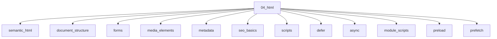

# HTML

## Scope

Document semantics, forms, SEO metadata, and resource hints

## Prerequisites

See the learning paths and each topic's prerequisites in the registry.

## Topics in order

- [Semantic HTML](/04-html/semantic-html/) — beginner, ~35 min
- [Document Structure](/04-html/document-structure/) — beginner, ~25 min
- [Forms](/04-html/forms/) — junior, ~40 min
- [Media Elements](/04-html/media-elements/) — junior, ~30 min
- [Metadata](/04-html/metadata/) — junior, ~25 min
- [SEO Basics](/04-html/seo-basics/) — junior, ~35 min
- [Scripts](/04-html/scripts/) — junior, ~30 min
- [defer](/04-html/defer/) — junior, ~20 min
- [async](/04-html/async/) — junior, ~20 min
- [Module Scripts](/04-html/module-scripts/) — junior, ~25 min
- [preload](/04-html/preload/) — mid, ~25 min
- [prefetch](/04-html/prefetch/) — mid, ~20 min
- [preconnect](/04-html/preconnect/) — mid, ~20 min
- [modulepreload](/04-html/modulepreload/) — mid, ~20 min
- [Templates and Slots](/04-html/templates-and-slots/) — mid, ~25 min

## Module knowledge graph

## Suggested learning paths

Browse [Learning Paths](/learning-paths/).
