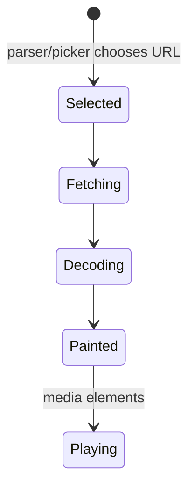
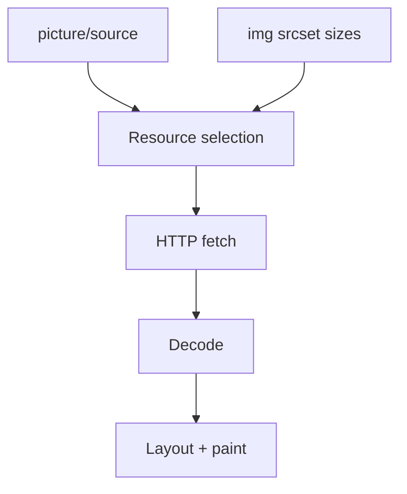

# Media Elements

<TopicMeta />

<Prerequisites />

::: tip Published
This page meets the handbook **published** bar: deep explanation, ≥10 common mistakes, and official references. Further engine-level errata welcome via PR.
:::

## Introduction

**Media elements** embed images and timed media in the document. `` / `<picture>` handle responsive stills; `<audio>` / `<video>` handle playback with tracks, buffering, and controls. They participate in layout, LCP, and accessibility (alt text, captions).

## Why does it exist?

Media dominates bytes on many sites. Correct elements enable lazy loading, responsive selection (`srcset`/`sizes`), hardware decoding, captions (`track`), and browser UI—without custom players for simple cases.

## Historical Background

`img` is ancient; `audio`/`video` arrived in HTML5 to replace plugins. `picture` and `srcset` followed for responsive images. Modern codecs (AVIF/WebP) layer via `source type`.

## Mental Model

Separate concerns:

- **Resource selection** — which URL/bytes (density, width, type)
- **Presentation** — CSS sizing, `object-fit`
- **Accessibility** — `alt`, captions/subtitles, transcripts
- **Loading strategy** — `eager`/`lazy`, preload, priority hints

## Internal Workflow

1. Choose element (`img` vs `picture` vs `video`).
2. Provide intrinsic dimensions (width/height) to reduce CLS.
3. Supply `srcset`/`sizes` or `source` media/type queries.
4. Write meaningful `alt` (or empty alt for decorative).
5. For video: `controls`, captions `track kind="captions"`, consider `preload` policy.

## Lifecycle



## Browser Perspective

Image decode and video demux often use specialized threads/processes. Media panel / Network waterfall show request priority. LCP frequently is a hero `img`.

## JavaScript Engine Perspective

JS can listen to `load`, `error`, `loadedmetadata`, `timeupdate`. Canvas/WebGL may consume video frames—mind cross-origin tainting.

## React Perspective

Set `width`/`height` or aspect-ratio boxes to avoid CLS. For Next.js `next/image`, understand it still compiles down to `img`/`picture` semantics.

## Next.js Perspective

`next/image` automates sizing and formats when configured; still write real `alt` and avoid lazy-loading LCP heroes.

## Server Perspective

CDN image pipelines (resize, format negotiation) pair with `srcset`. Authenticated media needs signed URLs and correct `Cross-Origin` headers if drawn to canvas.

## Network Perspective

Media requests compete with JS/CSS. Use priority hints / preload only for true LCP candidates. Range requests enable video seeking.

## Memory Perspective

Decoded bitmaps are large (width×height×4). Many huge images decoded offscreen pressure memory—lazy load and appropriately sized sources.

## Performance

Compress, size correctly, lazy-load below-fold, never lazy-load LCP. Prefer modern formats with fallbacks. Avoid autoplaying large videos with sound (policy + cost).

## Production Example

A news homepage cut LCP by serving a `picture` with AVIF/WebP/JPEG sources, explicit dimensions, and `fetchpriority="high"` on the hero only. Gallery images used `loading="lazy"`.

## Code Examples

```html
<picture>
  <source type="image/avif" srcset="/hero.avif" />
  <source type="image/webp" srcset="/hero.webp" />
  
</picture>

<video controls preload="metadata" poster="/poster.jpg">
  <source src="/talk.mp4" type="video/mp4" />
  <track kind="captions" srclang="en" src="/talk.vtt" default />
</video>
```

## Diagrams



## Common Mistakes

1. Missing alt on informative images
2. No width/height → layout shifts (CLS)
3. Lazy-loading the LCP image
4. Serving 4000px images to mobile
5. Autoplay video with audio (blocked + expensive)
6. Video without captions for speech content
7. Missing a production edge case for 04-html.media-elements (#1)
8. Missing a production edge case for 04-html.media-elements (#2)
9. Missing a production edge case for 04-html.media-elements (#3)
10. Missing a production edge case for 04-html.media-elements (#4)


## Best Practices

- Always include dimensions or CSS aspect-ratio
- Use `srcset`/`sizes` for responsive bitmaps
- Captions/subtitles for spoken video
- Decorative images: `alt=""`

## Anti-patterns

- Background-image for meaningful content (hurts a11y/SEO)
- Custom players that omit keyboard controls
- Unbounded carousels downloading every slide eagerly

## Comparison

| Element | Use when | Avoid when |
| --- | --- | --- |
| `img` | Single image, density/width variants | Art direction needs different crops |
| `picture` | Art direction / type switches | Simple one-file logos |
| `video` | Timed media | Tiny decorative loops better as GIF/WebM carefully |

## Interview Questions

### Easy

**Q:** What is `alt` for?

**A:** Text alternative when the image is not available or for AT; empty `alt` marks decorative images.

### Medium

**Q:** Difference between `srcset` and `picture`?

**A:** `srcset` picks among same-content variants (resolution/width). `picture`/`source` can change crop or file type via media/type.

### Hard

**Q:** How would you optimize a hero image for LCP?

**A:** Correctly sized modern format, preload or high fetch priority, not lazy, dimensions reserved, CDN near users, avoid competing render-blocking work.

## Summary

- Media elements encode resource selection + a11y
- Dimensions and sizing protect CLS
- Lazy-load carefully around LCP
- Captions and alt are not optional polish

## References

- [MDN: Responsive images](https://developer.mozilla.org/en-US/docs/Learn/HTML/Multimedia_and_embedding/Responsive_images)
- [HTML Living Standard — Embedded content](https://html.spec.whatwg.org/multipage/embedded-content.html)
- [web.dev: Optimize LCP](https://web.dev/articles/optimize-lcp)

<RelatedTopics />

Prev: [Forms](/04-html/forms/) · Next: [Metadata](/04-html/metadata/)
