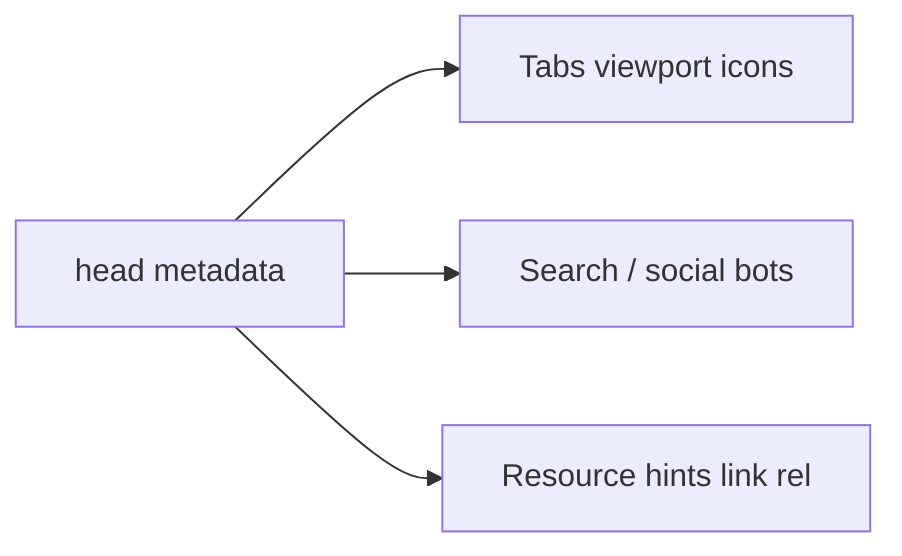

# Metadata

<TopicMeta />

<Prerequisites />

::: tip Published
This page meets the handbook **published** bar: deep explanation, ≥10 common mistakes, and official references. Further engine-level errata welcome via PR.
:::

## Introduction

**Metadata** is information about the document living primarily in `<head>`: charset, viewport, `title`, `meta` descriptions, canonical URLs, icons, theme color, and Open Graph/Twitter tags. It is not usually visible in the page body but drives browser chrome, SEO snippets, and link previews.

## Why does it exist?

Without correct metadata, mobile layout breaks, tabs show wrong titles, crawlers mis-summarize pages, and shared links look broken. Metadata is the cheapest high-leverage HTML you ship.

## Historical Background

`meta` and `link` existed early; mobile viewport meta became critical with smartphones. Social platforms popularized OG tags. Modern apps also use JSON-LD in body/head for structured data.

## Mental Model

Metadata answers: How to decode? How to lay out on mobile? What is this page called? Which URL is canonical? How should previews look? Which resources should the browser discover early?

## Internal Workflow

1. Charset + viewport first.
2. Unique `title` and useful description per route.
3. Canonical and robots directives as needed.
4. Icons / manifest / theme-color for PWA-ish polish.
5. OG/Twitter images with absolute URLs.

## Lifecycle

Metadata is parsed early; clients may update `document.title` and meta via JS on SPA navigations. Crawlers that do not execute JS only see initial HTML.

## Browser Perspective

Browsers apply viewport to layout viewport sizing, show title in tabs, and load icons. Some metas are ignored (obsolete `keywords` for ranking).

## JavaScript Engine Perspective

JS can query/update `document.head`. Framework head managers reconcile tags to avoid duplicates.

## React Perspective

Use a head manager (or framework Metadata API)—don’t sprinkle conflicting `<title>` tags from nested clients.

## Next.js Perspective

`export const metadata` / `generateMetadata` in App Router is the supported path; it merges correctly with layouts.

## Server Perspective

SSR must emit correct meta per URL. Stale CDN caches of HTML can freeze wrong titles—cache keys must include variant.

## Network Perspective

OG crawlers fetch the HTML (and image URLs). Absolute HTTPS image URLs matter. `Link` headers can complement head links.

## Memory Perspective

Negligible; icons and OG images are separate fetches.

## Performance

Keep head free of huge inline scripts. Preconnect only to critical origins. Excess meta does not speed the page.

## Production Example

A docs site generated unique titles “{Page} · Handbook”, canonical URLs, and OG images per section. Slack/Twitter previews stopped showing the homepage title on deep links.

## Code Examples

```html
<head>
  <meta charset="utf-8" />
  <meta name="viewport" content="width=device-width, initial-scale=1" />
  <title>Cascade · CSS · Handbook</title>
  <meta name="description" content="How CSS cascade origin and layers resolve conflicts." />
  <link rel="canonical" href="https://example.com/05-css/cascade/" />
  <meta property="og:title" content="Cascade" />
  <meta property="og:image" content="https://example.com/og/cascade.png" />
</head>
```

## Diagrams



## Common Mistakes

1. Duplicate or missing titles across routes
2. Relative OG image URLs that scrapers cannot resolve
3. Forgetting viewport on responsive sites
4. Relying on meta keywords for SEO
5. Client-only meta updates invisible to non-JS crawlers
6. Conflicting canonical tags from multiple plugins
7. Missing a production edge case for 04-html.metadata (#1)
8. Missing a production edge case for 04-html.metadata (#2)
9. Missing a production edge case for 04-html.metadata (#3)
10. Missing a production edge case for 04-html.metadata (#4)


## Best Practices

- One clear title formula for the product
- Absolute URLs for canonical and OG images
- Generate metadata on the server per route
- Keep descriptions human and specific

## Anti-patterns

- Same title/description on every page
- Keyword stuffing descriptions
- Three competing head managers fighting in the DOM

## Comparison

| Mechanism | Strength | Weakness |
| --- | --- | --- |
| Static meta in HTML | Works for all crawlers | Manual per page |
| Framework Metadata API | Per-route, merged | Framework-specific |
| Client `document.title` | Instant SPA updates | Not enough alone for SEO |

## Interview Questions

### Easy

**Q:** Name three important `head` tags.

**A:** `charset`, `viewport`, and `title` (plus description/canonical as common fourth/fifth).

### Medium

**Q:** Why do Open Graph tags need absolute image URLs?

**A:** External scrapers resolve the HTML URL; relative paths often break outside the site’s browsing context.

### Hard

**Q:** How do you handle metadata in an SSR app with client navigations?

**A:** Emit correct tags in SSR HTML; on client route change update title/meta via the framework’s head manager; keep canonical in sync; don’t rely solely on client for crawlers that skip JS.

## Summary

- Metadata configures decoding, mobile layout, and discovery
- Titles/canonicals/OG must be per-URL
- Server-rendered meta remains critical
- Head managers prevent duplicate tags

## References

- [MDN: The head element](https://developer.mozilla.org/en-US/docs/Web/HTML/Element/head)
- [Open Graph protocol](https://ogp.me/)
- [HTML Living Standard — Document metadata](https://html.spec.whatwg.org/multipage/semantics.html#document-metadata)

<RelatedTopics />

Prev: [Media Elements](/04-html/media-elements/) · Next: [SEO Basics](/04-html/seo-basics/)
