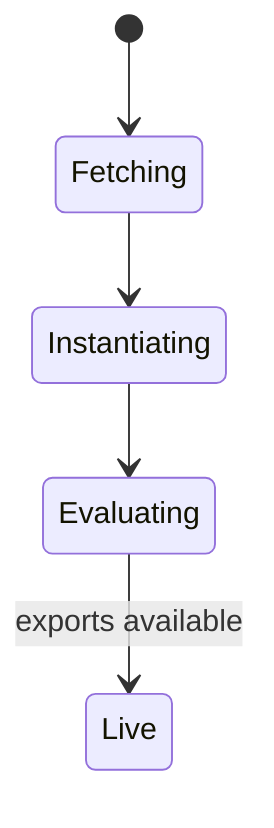
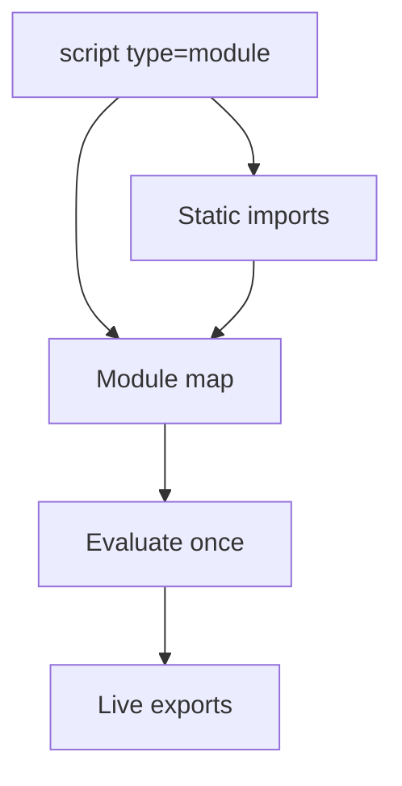

# Module Scripts

<TopicMeta />

<Prerequisites />

::: tip Published
This page meets the handbook **published** bar: deep explanation, ≥10 common mistakes, and official references. Further engine-level errata welcome via PR.
:::

## Introduction

**Module scripts** (`<script type="module">`) load JavaScript modules with `import`/`export`. They run in strict mode, are deferred by default (execute after document parse, respecting dependency order), and are fetched with CORS semantics for cross-origin URLs.

## Why does it exist?

Classic scripts share one global scope and need bundlers for dependencies. Modules give native encapsulation, deduplication via the module map, and clearer loading semantics for modern apps.

## Historical Background

ES modules landed in ECMAScript 2015; browsers shipped `type="module"` later. Import maps (and earlier import-maps polyfills) improved bare specifier story. Bundlers still optimize for production, but the mental model matches the platform.

## Mental Model

A module graph: entry → static imports → evaluated once → exports live bindings. HTML entry points kick off the graph; `modulepreload` warms critical nodes.

## Internal Workflow

1. Point an entry `type="module"` at your graph.
2. Use relative/URL imports (or import maps for bare specifiers).
3. `modulepreload` critical dependencies.
4. Use dynamic `import()` for route-level code splits.
5. Remember classic + module scopes do not share `var` globals the same way.

## Lifecycle



## Browser Perspective

Module map caches modules by URL. DevTools Network shows each module file in dev; production often one/few bundles still emitted as module or classic depending on tooling.

## JavaScript Engine Perspective

V8 parses modules with module goal; circular imports have defined live-binding semantics. Top-level await is supported in modules.

## React Perspective

Vite/Next emit native ESM in dev; production may bundle. Thinking in modules still clarifies boundaries and SSR/client splits.

## Next.js Perspective

Respect `"use client"` boundaries; server and client module graphs differ. Don’t import Node-only modules into client entries.

## Server Perspective

Serve `.js` modules with correct MIME `text/javascript`. CORS headers required for cross-origin module scripts.

## Network Perspective

Waterfalls of tiny modules hurt without bundling or `modulepreload`. HTTP/2 helps but doesn’t erase graph latency.

## Memory Perspective

Module instances stay in the module map for the document lifetime (navigation clears).

## Performance

Dev unbundled ESM can be chatty—use preload/bundling in prod. Dynamic import for rarely used routes.

## Production Example

A design-system site shipped native ESM with import maps in modern browsers and a bundled fallback. Critical path used `modulepreload` for the entry and layout module to avoid waterfalls.

## Code Examples

```html
<script type="importmap">
{ "imports": { "lodash-es/": "/vendor/lodash-es/" } }
</script>
<script type="module" src="/app.js"></script>
```

```js
// app.js
import { init } from './init.js'
init()
```

## Diagrams



## Common Mistakes

1. Expecting modules to share `var` globals with classic scripts freely
2. Serving modules without CORS on other origins
3. Huge unpreloaded module waterfalls in production without a bundler
4. Using `async` on modules without understanding it alters execution relative to order of discovery
5. Forgetting browsers need full URLs/relative paths without import maps
6. Top-level await blocking dependent module evaluation unexpectedly
7. Missing a production edge case for 04-html.module-scripts (#1)
8. Missing a production edge case for 04-html.module-scripts (#2)
9. Missing a production edge case for 04-html.module-scripts (#3)
10. Missing a production edge case for 04-html.module-scripts (#4)


## Best Practices

- One clear entry module per page/app shell
- modulepreload critical graph edges
- Bundle for production when graphs are deep
- Use dynamic import for optional features

## Anti-patterns

- Mixing many competing module entries that duplicate deps without caching strategy
- Bare specifiers without import maps/bundler
- Blocking classic scripts beside modules without a plan

## Comparison

| | Classic | Module |
| --- | --- | --- |
| Scope | Shared global | Module scope |
| Strict | Optional | Always |
| Deps | Manual / globals | `import` |
| Default timing | Blocking unless defer/async | Deferred |

## Interview Questions

### Easy

**Q:** Are module scripts deferred by default?

**A:** Yes—they execute after the document is parsed (and after dependencies are loaded), similar in spirit to defer.

### Medium

**Q:** What is the module map?

**A:** The browser’s cache of module records keyed by URL so a module is fetched/evaluated once per document.

### Hard

**Q:** How does top-level await affect module evaluation order?

**A:** A module with TLA waits during evaluation; importers wait on that evaluation. It can extend the critical path if used in entry modules.

## Summary

- Modules bring native dependency graphs and strict mode
- Deferred by default; CORS for cross-origin
- Preload or bundle to avoid waterfalls
- Classic and module worlds differ in scoping

## References

- [MDN: JavaScript modules](https://developer.mozilla.org/en-US/docs/Web/JavaScript/Guide/Modules)
- [HTML Living Standard — module scripts](https://html.spec.whatwg.org/multipage/webappapis.html#integration-with-the-javascript-module-system)

<RelatedTopics />

Prev: [async](/04-html/async/) · Next: [preload](/04-html/preload/)
