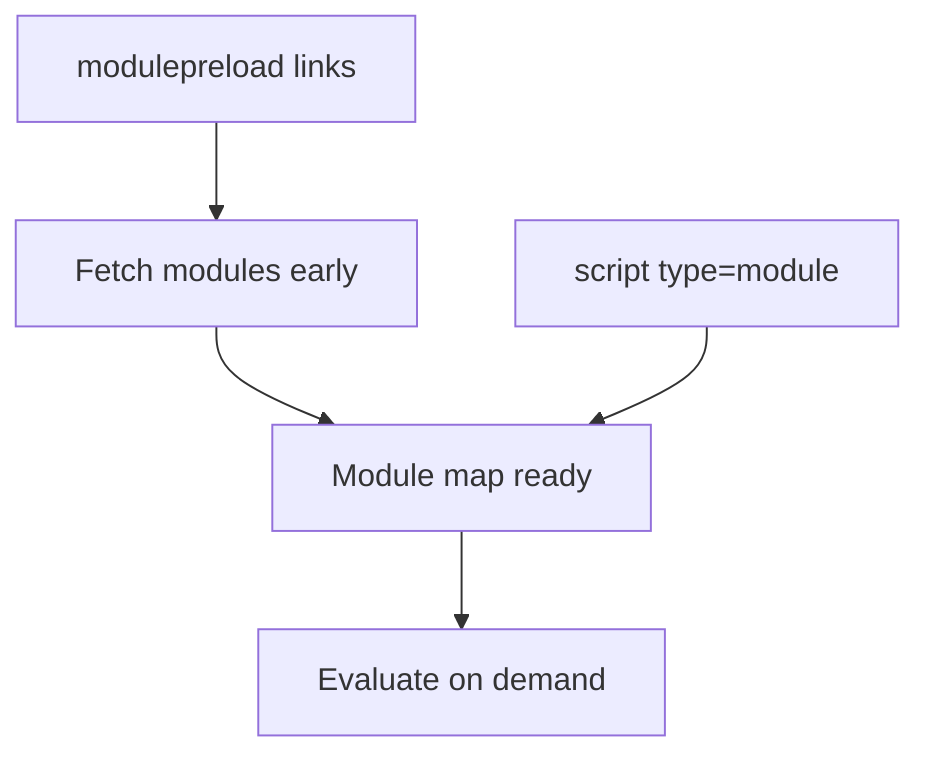

# modulepreload

<TopicMeta />

<Prerequisites />

::: tip Published
This page meets the handbook **published** bar: deep explanation, ≥10 common mistakes, and official references. Further engine-level errata welcome via PR.
:::

## Introduction

**`<link rel="modulepreload">`** preloads an ES module **and** encourages the browser to fetch its dependency tree / prepare the module map earlier than waiting for discovery via `import` from a running entry.

## Why does it exist?

Unbundled or partially bundled ESM graphs create sequential discovery latency. `modulepreload` turns known critical modules into early parallel fetches.

## Historical Background

Arrived as modules spread in browsers; complements `preload as="script"` with module-specific processing.

## Mental Model

Think of `modulepreload` as **preload for the module map**: URL must match the module specifier the graph will request.

## Internal Workflow

1. Trace the critical module graph for first interaction.
2. modulepreload the entry and top critical dependencies.
3. Keep list short; let dynamic import handle deep routes.
4. Align with bundler emitted URLs (hashes).

## Lifecycle

Link seen → fetch module (+deps per browser) → module map primed → `import` hits warm cache → evaluate when needed.

## Browser Perspective

Support is modern-evergreen. DevTools shows early module fetches. Wrong URL = wasted work.

## JavaScript Engine Perspective

Preparation may include compile; still evaluates on demand when the module graph needs it.

## React Perspective

Vite can inject modulepreload for entry chunks in build output—inspect index.html.

## Next.js Perspective

Production bundles often reduce need; still relevant for ESM-heavy setups.

## Server Perspective

Correct MIME and caching headers for module URLs; CORS if cross-origin.

## Network Perspective

Parallelizes graph fetch; still limited by bandwidth—don’t preload the world.

## Memory Perspective

Primed modules occupy memory/module map sooner.

## Performance

Cuts ESM waterfalls on critical path; pair with sensible splitting.

## Production Example

A Vite app’s entry + router + UI kit modules were modulepreloaded; first interaction JS ready earlier without inlining everything.

## Code Examples

```html
<link rel="modulepreload" href="/assets/entry.js" />
<link rel="modulepreload" href="/assets/router.js" />
<script type="module" src="/assets/entry.js"></script>
```

## Diagrams



## Common Mistakes

1. modulepreload URLs that do not match real imports (hash mismatch)
2. Preloading entire app graph including rarely used routes
3. Using preload as=script instead of modulepreload for modules (semantics differ)
4. Forgetting CORS on cross-origin modules
5. Duplicating huge lists in every page variant
6. Assuming evaluation already happened (it may only be fetched/prepared)
7. Missing a production edge case for 04-html.modulepreload (#1)
8. Missing a production edge case for 04-html.modulepreload (#2)
9. Missing a production edge case for 04-html.modulepreload (#3)
10. Missing a production edge case for 04-html.modulepreload (#4)


## Best Practices

- Preload only critical graph nodes
- Generate hints from the bundler
- Re-verify after deploying hashed assets
- Combine with HTTP cache forever for immutable modules

## Anti-patterns

- Hand-maintained stale modulepreload lists
- Modulepreload as a substitute for reducing graph depth forever
- Warming admin-only modules on public marketing pages

## Comparison

| | preload as=script | modulepreload |
| --- | --- | --- |
| Purpose | Generic script bytes | ES module graph priming |
| Module map | Not specialized | Yes |
| Best for | Classic scripts | `type=module` graphs |

## Interview Questions

### Easy

**Q:** What is `modulepreload` for?

**A:** Early fetch/prepare of ES modules so the module graph does not waterfall on first use.

### Medium

**Q:** Why not only use `rel=preload as=script`?

**A:** `modulepreload` is tailored to modules (module map / dependency handling) rather than classic script semantics.

### Hard

**Q:** How do you keep modulepreload correct with content hashes?

**A:** Emit hints from the build; never hardcode hashed names; fail CI if HTML references missing assets.

## Summary

- modulepreload primes critical ESM nodes
- URLs must match the real graph
- Keep the list small and build-generated
- Complements—not replaces—bundling strategy

## References

- [MDN: modulepreload](https://developer.mozilla.org/en-US/docs/Web/HTML/Attributes/rel/modulepreload)
- [HTML Living Standard — modulepreload](https://html.spec.whatwg.org/multipage/links.html#link-type-modulepreload)

<RelatedTopics />

Prev: [preconnect](/04-html/preconnect/) · Next: [Templates and Slots](/04-html/templates-and-slots/)
