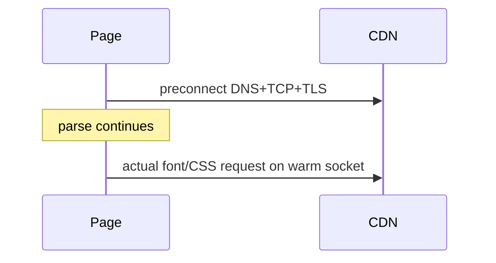

# preconnect

<TopicMeta />

<Prerequisites />

::: tip Published
This page meets the handbook **published** bar: deep explanation, ≥10 common mistakes, and official references. Further engine-level errata welcome via PR.
:::

## Introduction

**`<link rel="preconnect">`** performs early DNS + TCP (+ TLS) to an origin you know you will use soon. **`dns-prefetch`** is a lighter hint that mainly resolves DNS. These save round-trips before the first real request to that origin.

## Why does it exist?

Third-party fonts, APIs, and CDNs add connection setup latency (often 100ms+). Warming the critical origin early reduces the wait when the real request starts.

## Historical Background

`dns-prefetch` appeared first; `preconnect` added full connection warming. Overuse opens unused sockets—browsers and guides recommend few preconnects.

## Mental Model

Preconnect spends resources to buy RTT later. Budget **~2–4** critical origins max on a page. If you won’t request soon, don’t preconnect.

## Internal Workflow

1. Trace waterfall: which origins are on LCP/critical path?
2. Preconnect those (e.g. font CDN, API).
3. Use `crossorigin` when the eventual request is CORS mode.
4. Fall back to `dns-prefetch` for less critical hosts.

## Lifecycle

Head parsed → connection warmed → later request reuses connection → sockets idle-close if unused.

## Browser Perspective

DevTools Network shows early connections. Unused preconnects waste CPU/battery—Chrome may warn.

## JavaScript Engine Perspective

Not a JS feature; networking stack owned by the browser.

## React Perspective

Place preconnects in the document head/layout, not deep in components that mount late.

## Next.js Perspective

Use metadata `other`/`alternates` carefully or a root layout `<link rel="preconnect">`. Next font hosting can reduce third-party font origins entirely.

## Server Perspective

Self-hosting assets can eliminate the need to preconnect to a font CDN.

## Network Perspective

TLS 1.3 / HTTP/2/3 reduce some costs but early warm-up still helps multi-origin pages.

## Memory Perspective

Negligible vs media; socket resources are the concern.

## Performance

Best ROI on LCP-critical third parties. Measure before/after.

## Production Example

Preconnecting to `https://cdn.fonts.example` shaving ~120ms off first font request improved LCP on a content site; a second unused preconnect was removed after audit.

## Code Examples

```html
<link rel="preconnect" href="https://cdn.example.com" crossorigin />
<link rel="dns-prefetch" href="https://analytics.example.com" />
```

## Diagrams



## Common Mistakes

1. Preconnecting to many origins (diminishing returns / harm)
2. Forgetting `crossorigin` when the real request is CORS
3. Preconnecting to origins never used on that route
4. Using preconnect instead of removing a third party
5. Duplicating preconnect across every layout nested level
6. Assuming dns-prefetch equals full TLS warm-up
7. Missing a production edge case for 04-html.preconnect (#1)
8. Missing a production edge case for 04-html.preconnect (#2)
9. Missing a production edge case for 04-html.preconnect (#3)
10. Missing a production edge case for 04-html.preconnect (#4)


## Best Practices

- Only critical origins
- Match CORS mode with `crossorigin` when needed
- Prefer fewer origins (self-host) over more preconnects
- Re-audit quarterly as vendors change

## Anti-patterns

- Spray preconnect for every SaaS on the marketing site
- Preconnect + unused forever
- Warming tracking domains before consent when policy forbids

## Comparison

| Hint | Work done |
| --- | --- |
| dns-prefetch | DNS |
| preconnect | DNS+TCP+TLS |
| preload | Full resource body |

## Interview Questions

### Easy

**Q:** What does preconnect do?

**A:** It early-establishes a connection to an origin so later requests skip DNS/TCP/TLS setup time.

### Medium

**Q:** When do you need `crossorigin` on preconnect?

**A:** When the eventual request uses CORS (e.g. fonts), the warmed connection must match that mode.

### Hard

**Q:** How many preconnects should a page have?

**A:** Typically a very small number of proven critical origins; each has cost. Prefer consolidating origins.

## Summary

- preconnect warms critical third-party origins
- Budget carefully—sockets are not free
- Match CORS expectations
- Self-hosting can remove the need

## References

- [MDN: rel=preconnect](https://developer.mozilla.org/en-US/docs/Web/HTML/Attributes/rel/preconnect)
- [web.dev: Preconnect to required origins](https://web.dev/articles/preconnect-and-dns-prefetch)

<RelatedTopics />

Prev: [prefetch](/04-html/prefetch/) · Next: [modulepreload](/04-html/modulepreload/)
