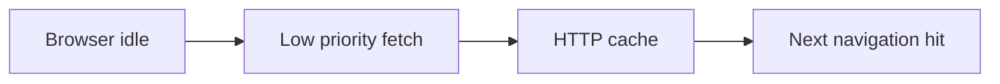

# prefetch

<TopicMeta />

<Prerequisites />

::: tip Published
This page meets the handbook **published** bar: deep explanation, ≥10 common mistakes, and official references. Further engine-level errata welcome via PR.
:::

## Introduction

**`<link rel="prefetch">`** suggests the browser fetch a resource at **low priority** that will probably be needed for a **future** navigation. It is speculative: the browser may ignore it under bandwidth/CPU constraints.

## Why does it exist?

Multi-page or multi-route apps can hide next-page latency by warming JS/CSS/HTML while the user reads. Prefetch is softer than preload and less likely to fight the critical path when used carefully.

## Historical Background

Prefetch existed in various proprietary forms; standardized resource hints clarified intent vs preload. Frameworks (Next.js `<Link>` prefetch, speculation rules) automate similar ideas.

## Mental Model

Prefetch = **maybe next**. Preload = **definitely now**. Never prefetch huge authenticated payloads blindly; respect data/battery.

## Internal Workflow

1. Identify high-probability next routes from analytics.
2. Prefetch their critical bundles/HTML on idle.
3. Cancel or avoid on slow networks (`navigator.connection`) when appropriate.
4. Prefer framework prefetch that understands route graphs.

## Lifecycle

Idle/low priority fetch → HTTP cache → next navigation uses cache → faster subsequent load.

## Browser Perspective

Implementation strength varies; treat as progressive enhancement. Speculation Rules API is a newer declarative approach for document prefetch/prerender.

## JavaScript Engine Perspective

Prefetched JS is not executed until used (unlike prerender).

## React Perspective

Router-level prefetch on viewport hover/link visibility is common; ensure it doesn’t stampede APIs.

## Next.js Perspective

`next/link` prefetches route payloads in production by default for in-viewport links—disable for low-probability expensive routes.

## Server Perspective

Prefetch traffic hits origin/CDN; cache aggressively for static assets. Beware stampedes on personalized HTML.

## Network Perspective

Use carefully on cellular. Prefetch should yield to critical requests.

## Memory Perspective

HTTP cache entries occupy disk/memory cache budgets.

## Performance

Good for predictable funnels (docs next chapter). Bad when users rarely follow the guessed path.

## Production Example

Docs “Next page” links prefetched the next MDX chunk after idle. Bounce paths skipped prefetch via `data-no-prefetch` to protect search result pages.

## Code Examples

```html
<link rel="prefetch" href="/assets/chapter-2.js" as="script" />
```

```js
if (document.querySelector('link[rel=prefetch]') == null) {
  const l = document.createElement('link')
  l.rel = 'prefetch'
  l.href = '/pricing'
  document.head.append(l)
}
```

## Diagrams



## Common Mistakes

1. Prefetching enormous videos or authenticated JSON dumps
2. Using prefetch when you meant preload for LCP
3. Prefetch storms from rendering hundreds of Link components
4. Assuming prefetch always runs
5. Prefetching personalized pages that bypass CDN caches
6. Ignoring Save-Data / slow connection constraints
7. Missing a production edge case for 04-html.prefetch (#1)
8. Missing a production edge case for 04-html.prefetch (#2)
9. Missing a production edge case for 04-html.prefetch (#3)
10. Missing a production edge case for 04-html.prefetch (#4)


## Best Practices

- Prefetch high-probability next routes only
- Prefer immutable hashed assets
- Coordinate with framework link prefetch
- Watch CDN logs for prefetch amplification

## Anti-patterns

- Prefetch everything in the sitemap
- Prerendering sensitive pages without auth awareness
- Competing with checkout critical requests

## Comparison

| Hint | Priority | Navigation |
| --- | --- | --- |
| preload | High | Current |
| prefetch | Low | Future |
| prerender | High cost | Future (more speculative) |

## Interview Questions

### Easy

**Q:** Prefetch vs preload?

**A:** Preload is for critical current-page assets; prefetch is low-priority future navigation speculation.

### Medium

**Q:** Why might a browser ignore prefetch?

**A:** Data saver, busy network, memory pressure, or implementation policy—hints are not guarantees.

### Hard

**Q:** How would you prefetch responsibly in a large Next app?

**A:** Rely on viewport-based link prefetch, disable on heavy/personalized routes, respect connection, cache static shells, measure navigation latency and bandwidth.

## Summary

- prefetch warms likely next navigations at low priority
- Not a guarantee—progressive enhancement
- Avoid stampedes and huge payloads
- Frameworks often automate this

## References

- [MDN: rel=prefetch](https://developer.mozilla.org/en-US/docs/Web/HTML/Attributes/rel/prefetch)
- [MDN: Speculation Rules](https://developer.mozilla.org/en-US/docs/Web/API/Speculation_Rules_API)

<RelatedTopics />

Prev: [preload](/04-html/preload/) · Next: [preconnect](/04-html/preconnect/)
