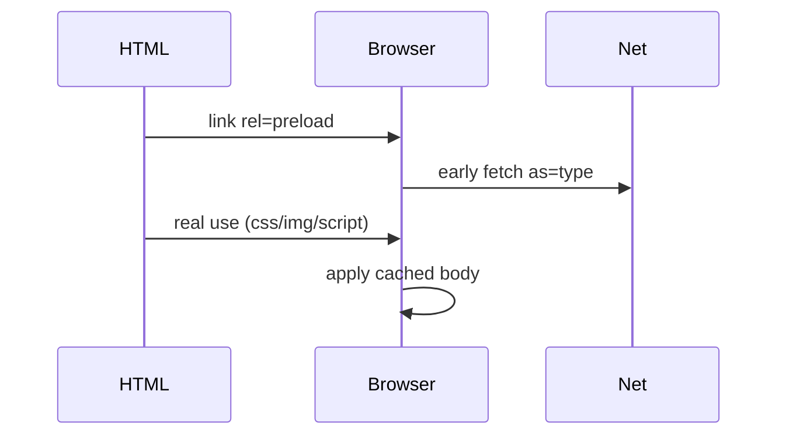

# preload

<TopicMeta />

<Prerequisites />

::: tip Published
This page meets the handbook **published** bar: deep explanation, ≥10 common mistakes, and official references. Further engine-level errata welcome via PR.
:::

## Introduction

**`<link rel="preload">`** tells the browser to fetch a resource **now** because you know it will be needed soon for the current navigation. You must set `as` (e.g. `style`, `script`, `font`, `image`) so the browser applies the correct priority and accepts headers.

## Why does it exist?

Late-discovered critical assets (font in CSS, hero image in CSS background, JS chunk after HTML) create waterfalls. Preload promotes them to early discovery without executing/applying until used.

## Historical Background

Resource hints evolved from `prefetch`/`dns-prefetch` to `preload`/`preconnect`/`modulepreload`. Overuse taught teams that preload is a scalpel, not a spray.

## Mental Model

Preload = **high-confidence, current-navigation need**. If you might not use it, prefer `prefetch`. Match `as` + `type` + CORS mode (`crossorigin` for fonts) exactly to the real request.

## Internal Workflow

1. Identify LCP image / critical font / critical script from a trace.
2. Add one preload per true critical asset.
3. Ensure the actual use matches URL, CORS, and type.
4. Remove unused preloads (they waste bandwidth and trigger console warnings).

## Lifecycle

Discover in head → fetch early → cache/memory → apply when CSS/JS/DOM consumes the resource.

## Browser Perspective

Unused preload warnings appear in DevTools. Wrong `as` can cause double download. Fonts typically need `crossorigin`.

## JavaScript Engine Perspective

Preload does not execute JS; it only fetches. Execution still waits for a script element or import.

## React Perspective

Frameworks may inject preloads for entry chunks and LCP images—dedupe manually added tags.

## Next.js Perspective

`next/font` and image integrations often emit preloads. Prefer framework mechanisms before hand-rolling.

## Server Perspective

HTTP `Link: </app.css>; rel=preload; as=style` can mirror head hints; Early Hints (103) can start fetches before HTML arrives.

## Network Perspective

Preloads compete with other critical bytes—budget them. Prioritize LCP and render-blocking CSS.

## Memory Perspective

Fetched bodies occupy cache/memory until used; unused preloads waste both.

## Performance

Correct preload improves LCP/FCP; shotgun preloads hurt. Always verify in a waterfall.

## Production Example

Preloading a WOFF2 with `as="font" crossorigin` removed a font CSS discovery delay; CLS from fallback swap dropped when combined with `font-display` strategy.

## Code Examples

```html
<link rel="preload" href="/fonts/Inter.woff2" as="font" type="font/woff2" crossorigin />
<link rel="preload" href="/hero.avif" as="image" />
<link rel="preload" href="/app.css" as="style" />
```

## Diagrams



## Common Mistakes

1. Preloading without matching `as` / CORS → duplicate fetches
2. Preloading everything “just in case”
3. Preloading a resource never used on the page
4. Forgetting `crossorigin` on font preloads
5. Preloading low-priority images that steal bandwidth from LCP
6. Mismatching query strings/hashes so preload ≠ real request
7. Missing a production edge case for 04-html.preload (#1)
8. Missing a production edge case for 04-html.preload (#2)
9. Missing a production edge case for 04-html.preload (#3)
10. Missing a production edge case for 04-html.preload (#4)


## Best Practices

- One preload per proven critical asset
- Match URL and CORS mode exactly
- Prefer Early Hints/Link headers when HTML is slow
- Re-audit preloads after each release

## Anti-patterns

- Copy-pasting preload lists across unrelated routes
- Preload + prefetch the same URL without intent
- Using preload as a substitute for fixing late CSS discovery architecture

## Comparison

| Hint | Intent |
| --- | --- |
| `preload` | Critical for current navigation |
| `prefetch` | Likely for next navigation |
| `preconnect` | Warm connection, not bytes |
| `modulepreload` | ES module graph nodes |

## Interview Questions

### Easy

**Q:** What does `rel="preload"` do?

**A:** It fetches a resource early for the current page with a declared `as` type, without applying it until used.

### Medium

**Q:** Why do font preloads need `crossorigin`?

**A:** Font requests use CORS mode; preload must match or the browser treats them as different requests.

### Hard

**Q:** How do you decide between preload and fixing discovery?

**A:** Prefer putting critical CSS/images in early HTML when possible; use preload for unavoidable late discovery; measure so you don’t over-subscribe bandwidth.

## Summary

- preload is for critical current-navigation assets
- `as` + CORS must match the real request
- Unused preloads waste bandwidth
- Validate with waterfalls

## References

- [MDN: rel=preload](https://developer.mozilla.org/en-US/docs/Web/HTML/Attributes/rel/preload)
- [web.dev: Preload critical assets](https://web.dev/articles/preload-critical-assets)

<RelatedTopics />

Prev: [Module Scripts](/04-html/module-scripts/) · Next: [prefetch](/04-html/prefetch/)
