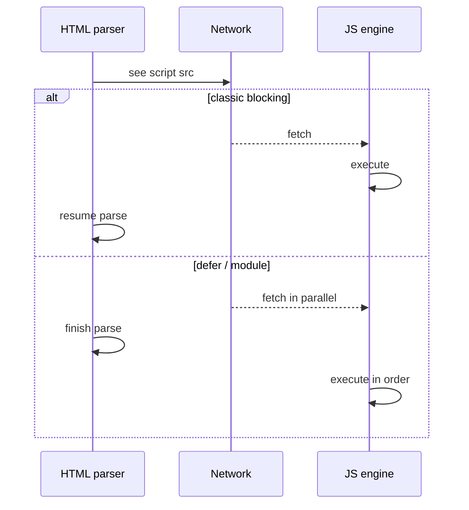
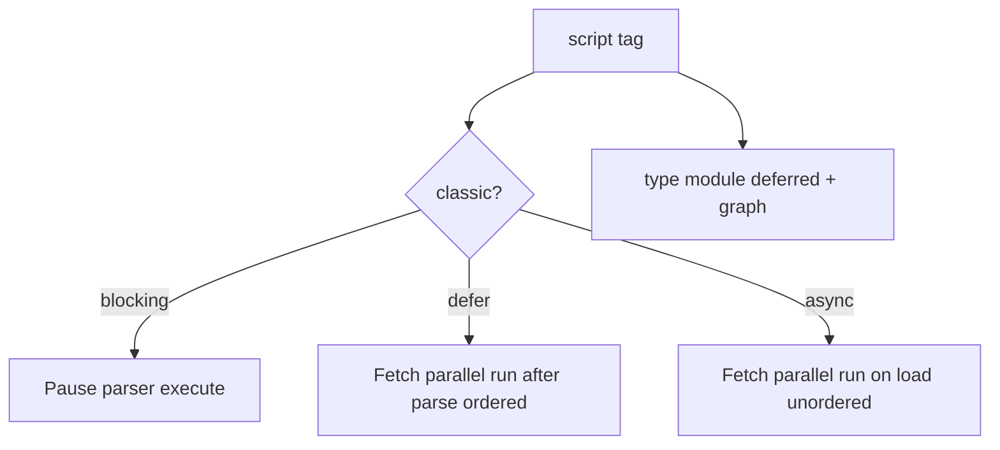

# Scripts

<TopicMeta />

<Prerequisites />

::: tip Published
This page meets the handbook **published** bar: deep explanation, ≥10 common mistakes, and official references. Further engine-level errata welcome via PR.
:::

## Introduction

The **`<script>`** element inserts JavaScript into a page. By default, a classic script without `async`/`defer` is **parser-blocking**: the HTML parser fetches (if external) and executes it before continuing to build the DOM. Understanding that default is the foundation for `defer`, `async`, and module scripts.

## Why does it exist?

Script scheduling controls Time to Interactive and whether `document.querySelector` sees later nodes. Wrong loading strategy causes FOUC-like UI bugs, race conditions, and long tasks on the critical path.

## Historical Background

Inline and external classic scripts predate modules. `async` (HTML5) and `defer` addressed blocking. `type="module"` brought dependency graphs and strict mode by default. Import maps and `modulepreload` refined production loading.

## Mental Model

Three questions for every script tag:

1. **When is it fetched?** (immediately, priority)
2. **When does it run relative to parsing?** (block, after document parse, on load order)
3. **Does order among scripts matter?** (classic defer preserves order; async does not)

## Internal Workflow

1. Inventory scripts: critical, enhancement, third-party.
2. Prefer `type="module"` for app code (deferred by default).
3. Use `defer` for classic scripts that need order after DOM ready.
4. Use `async` for independent classic scripts (analytics) where order does not matter.
5. Keep inline scripts small; avoid `document.write`.

## Lifecycle



## Browser Perspective

Preload scanners find `script src` early and start fetches even when the parser is blocked. Execution still obeys classic/async/defer/module rules on the main thread.

## JavaScript Engine Perspective

Execution means parse/compile/run on the JS runtime. Large bundles create long tasks; modules may be deferred and depend on graph instantiation.

## React Perspective

Bundlers inject script tags into the HTML shell. Hydration scripts are critical path—code-split wisely.

## Next.js Perspective

Next injects chunked scripts with strategy (`beforeInteractive`, `afterInteractive`, `lazyOnload` via `next/script`). Prefer framework strategies over ad-hoc tags.

## Server Perspective

HTML must reference correct hashed asset URLs. SRI (`integrity`) for third-party scripts.

## Network Perspective

Scripts compete for bandwidth. HTTP/2 multiplexing helps; still prioritize critical chunks. Cache immutable hashed files forever.

## Memory Perspective

Parsed JS and retained closures cost heap. Removing script tags does not unload modules already evaluated.

## Performance

Reduce bytes, defer non-critical, break up long tasks. Third-party scripts often dominate—load them async and late.

## Production Example

A storefront moved vendor analytics from blocking head scripts to `async` and app code to modules. LCP improved because CSS/DOM parsing resumed sooner; checkout breakage from racey `async` order was avoided by keeping payment SDK ordered via `defer`.

## Code Examples

```html
<!-- classic blocking (avoid on critical path) -->
<script src="/legacy.js"></script>

<!-- ordered after document parsed -->
<script src="/app.js" defer></script>

<!-- independent -->
<script src="https://example.com/analytics.js" async></script>

<!-- modern default for apps -->
<script type="module" src="/main.js"></script>
```

## Diagrams



## Common Mistakes

1. Blocking scripts in `<head>` without need
2. Assuming `async` scripts run in DOM order
3. Reading DOM nodes that appear after a blocking script without waiting
4. `document.write` from async/deferred scripts (unreliable)
5. Mixing many third-party blocking tags
6. Forgetting that modules are deferred even without the defer attribute
7. Missing a production edge case for 04-html.scripts (#1)
8. Missing a production edge case for 04-html.scripts (#2)
9. Missing a production edge case for 04-html.scripts (#3)
10. Missing a production edge case for 04-html.scripts (#4)


## Best Practices

- Modules for first-party app code
- defer for ordered classic scripts
- async only when order does not matter
- Measure third-party impact separately

## Anti-patterns

- Synchronously injecting scripts in a loop during parse
- Huge inline bundles in HTML
- Relying on script order accidents

## Comparison

| Mode | Parse blocking? | Order preserved? |
| --- | --- | --- |
| Classic default | Yes | In document order |
| `defer` | No | Yes (classic) |
| `async` | No | No |
| `type=module` | No | Yes (dependency order) |

## Interview Questions

### Easy

**Q:** What does a default external `<script src>` do to parsing?

**A:** It blocks the HTML parser until the script is fetched and executed.

### Medium

**Q:** Contrast `async` vs `defer`.

**A:** Both download without blocking parse; `defer` runs after document parse in order; `async` runs when ready, unordered.

### Hard

**Q:** Why are module scripts deferred by default?

**A:** Modules need dependency loading/instantiation; the platform aligns them with after-parse execution and strict ordering via the module map.

## Summary

- Default classic scripts block parsing
- defer/async/modules change fetch and execute timing
- Order matters for dependent classic scripts
- Treat third-party scripts as performance risks

## References

- [MDN: `<script>`](https://developer.mozilla.org/en-US/docs/Web/HTML/Element/script)
- [HTML Living Standard — Scripting](https://html.spec.whatwg.org/multipage/scripting.html)

<RelatedTopics />

Prev: [SEO Basics](/04-html/seo-basics/) · Next: [defer](/04-html/defer/)
