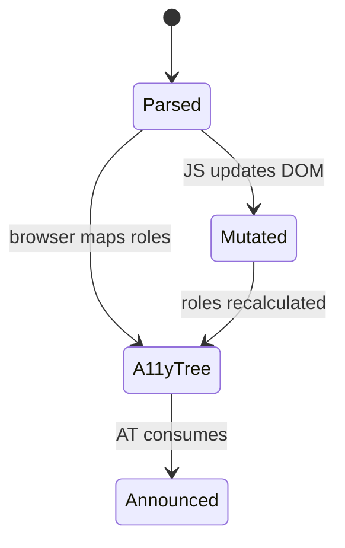
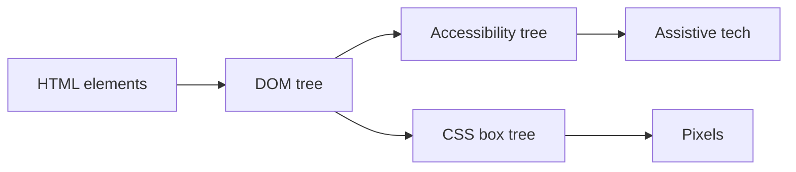

# Semantic HTML

<TopicMeta />

<Prerequisites />

::: tip Published
This page meets the handbook **published** bar: deep explanation, ≥10 common mistakes, and official references. Further engine-level errata welcome via PR.
:::

## Introduction

**Semantic HTML** means choosing elements for their meaning (`<nav>`, `<article>`, `<button>`, `<table>`) rather than wrapping everything in `<div>`/`<span>` and reconstructing meaning with CSS and ARIA. Screen readers, search engines, and browser features (reader mode, outlines, keyboard focus) read that meaning from the tree.

## Why does it exist?

Browsers and assistive tech already know how to announce landmarks, headings, lists, and form controls. When markup is semantic, you get keyboard focus, default roles, and document outlines for free. Div soup forces you to re-implement those contracts with ARIA—easy to get wrong and harder to maintain.

## Historical Background

Early HTML was mostly document structure (`h1`–`h6`, `p`, `ul`, tables). HTML5 (and the Living Standard) added sectioning content (`section`, `article`, `nav`, `aside`, `main`) and media elements so apps could express UI structure without Flash or pure-div layouts. Accessibility APIs matured alongside; semantics became the bridge between DOM and the accessibility tree.

## Mental Model

Treat the DOM as a **communication surface**, not a CSS hook farm:

1. Ask “what is this *for*?” (navigation, primary content, a submit control).
2. Pick the element whose default role matches that purpose.
3. Nest headings and landmarks so the outline is scannable.
4. Use ARIA only to fill gaps the native element cannot express.

If removing all CSS still leaves a readable document outline, the semantics are doing their job.

## Internal Workflow

1. Sketch content regions: header, nav, main, complementary, footer.
2. Assign landmark elements; ensure a single `<main>` per page (or per browsing context).
3. Structure prose with headings in order (do not skip levels for styling).
4. Prefer `<button>` for actions, `<a href>` for navigation, `<label>` + controls for forms.
5. Validate with accessibility tree / screen reader smoke pass, not only visual QA.

## Lifecycle

Document meaning is established at parse time and updated when the DOM mutates.



- **Parsed** — HTML tokens become elements with default roles
- **A11y tree** — browser exposes name, role, state
- **Mutated** — SPA updates must preserve semantics under client routing

## Browser Perspective

Chromium, Firefox, and WebKit map HTML elements to platform accessibility APIs (IA2/UIA/AX). Landmarks and heading navigation in AT depend on this mapping. DevTools Accessibility pane shows computed role/name—use it when a “pretty” div is silent to screen readers.

## JavaScript Engine Perspective

Semantics are not a JS-engine feature; they live in the DOM and HTML parser. Script that builds UI with `createElement('div')` for everything bypasses default roles unless you set ARIA correctly.

## React Perspective

In React, component names are irrelevant to AT—only the host elements matter. Prefer `<button>` over `<div onClick>`. For lists of interactive rows, ensure focusable controls and names. Server Components still emit HTML; semantics apply equally to SSR markup.

## Next.js Perspective

App Router pages should ship correct landmarks in the initial HTML for SEO and first paint AT. Client navigations that replace `<main>` content should keep a stable document outline (don’t remount random heading levels).

## Server Perspective

SSR/SSG templates are the first chance to get semantics right. CMS content that emits bare `<div>` for every block undermines both SEO and a11y—constrain the rich-text allowlist.

## Network Perspective

Semantic structure ships in the HTML response. It does not require extra round-trips; crawlers and social scrapers that only read the first HTML payload benefit immediately.

## Memory Perspective

Semantic elements are ordinary DOM nodes. Memory cost matches divs; the win is correctness, not allocation. Large accessibility trees from over-nested landmarks can slow AT traversal—prefer a clear outline over landmark spam.

## Performance

Correct semantics rarely hurt runtime performance. They can improve perceived UX (skip links, focus, reader mode). Avoid dozens of redundant landmarks; keep heading levels honest rather than styling `h1` as body text.

## Production Example

A marketing site replaced a mega-menu of `div`+`click` with `nav`/`ul`/`a` and native disclosure patterns. Keyboard users could tab predictably; Lighthouse a11y and SEO “crawlable links” issues dropped without changing visual design.

## Code Examples

```html
<header>
  <a href="#main">Skip to content</a>
  <nav aria-label="Primary">
    <ul>
      <li><a href="/docs">Docs</a></li>
      <li><a href="/blog">Blog</a></li>
    </ul>
  </nav>
</header>
<main id="main">
  <article>
    <h1>Shipping semantic HTML</h1>
    <p>Meaning first, presentation second.</p>
  </article>
</main>
```

```tsx
// Prefer native controls in React
export function SaveButton({ onSave }: { onSave: () => void }) {
  return <button type="button" onClick={onSave}>Save</button>
}
```

## Diagrams



## Common Mistakes

1. Using `<div onClick>` / `<span role="button">` instead of `<button>` (keyboard and form semantics break)
2. Multiple `<h1>` or skipped heading levels purely for visual size
3. Wrapping the whole page in `<section>` with no heading (empty sectioning)
4. Relying on CSS order while DOM order is wrong for tab and screen readers
5. Adding `role="main"` on a `<div>` when `<main>` already exists (duplicate landmarks)
6. Using tables for layout instead of CSS Grid/Flexbox
7. Missing a production edge case for 04-html.semantic-html (#1)
8. Missing a production edge case for 04-html.semantic-html (#2)
9. Missing a production edge case for 04-html.semantic-html (#3)
10. Missing a production edge case for 04-html.semantic-html (#4)


## Best Practices

- One primary `<main>` landmark per page
- Visible focus styles on interactive elements
- Label every landmark that appears more than once (`aria-label` on navs)
- Test with keyboard-only and one screen reader path before release
- Prefer native HTML before ARIA

## Anti-patterns

- Div soup + heavy ARIA as the default architecture
- Icon-only buttons with no accessible name
- Clickable cards that are not focusable or operable with Enter/Space
- Hiding content with `display:none` while leaving focusable children tabbable incorrectly

## Comparison

| Choice | Strength | Weakness |
| --- | --- | --- |
| Semantic element | Default role, keyboard, AT | Must learn the vocabulary |
| `div` + ARIA | Flexible | Easy to miss states/keyboard |
| Presentational only | Fast visually | Fragile for a11y/SEO |

## Interview Questions

### Easy

**Q:** What is semantic HTML?

**A:** Markup that uses elements for their meaning (e.g. `nav`, `button`, `article`) so browsers and assistive technologies understand structure without custom ARIA.

### Medium

**Q:** When is ARIA appropriate vs a native element?

**A:** Prefer native elements first. Use ARIA when no native element fits (complex widgets) or to add names/relationships. Never replace a working native control with a div+ARIA without implementing keyboard and states.

### Hard

**Q:** How do SPAs keep semantics correct across client-side navigations?

**A:** Update document title, manage focus to the new main content, preserve a sensible heading outline, announce route changes (e.g. live region), and ensure landmarks remain unique and labeled.

## Summary

- Semantics are the default contract between HTML, CSS, and accessibility
- Choose elements by purpose; style afterward
- ARIA fills gaps—it does not replace native controls
- Validate with the accessibility tree and real keyboard use

## References

- [MDN: HTML elements reference](https://developer.mozilla.org/en-US/docs/Web/HTML/Element)
- [HTML Living Standard — Sections](https://html.spec.whatwg.org/multipage/sections.html)
- [WAI-ARIA Authoring Practices](https://www.w3.org/WAI/ARIA/apg/)

<RelatedTopics />
Next: [Document Structure](/04-html/document-structure/)
