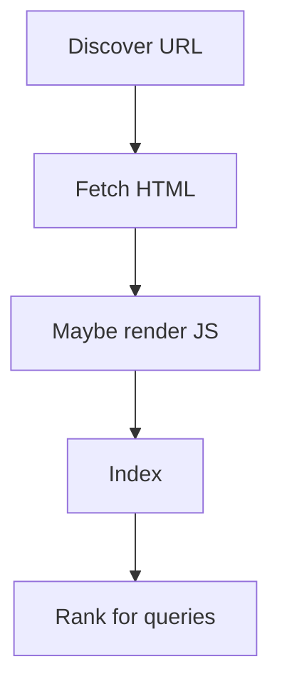
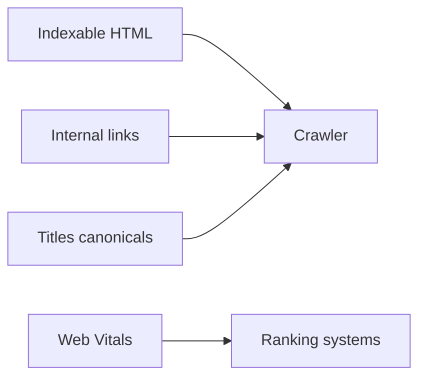

# SEO Basics

<TopicMeta />

<Prerequisites />

::: tip Published
This page meets the handbook **published** bar: deep explanation, ≥10 common mistakes, and official references. Further engine-level errata welcome via PR.
:::

## Introduction

**SEO basics** for frontend work means shipping HTML that crawlers can discover, understand, and index: clear titles/headings, real links, canonical URLs, meaningful content in the first response, and solid performance. Fancy SPA tricks that hide content behind JS-only renders risk invisibility.

## Why does it exist?

Organic discovery depends on crawl + render + index. Engineers control much of the HTML quality, internal linking, and Core Web Vitals. Marketing cannot fix a client-only empty shell.

## Historical Background

Search engines began with static HTML. As JS apps grew, Google invested in rendering; others vary. Best practice remains: critical content in HTML, progressive enhancement, structured data when useful.

## Mental Model

SEO loop: **Discover** (links/sitemaps) → **Fetch** (HTTP) → **Understand** (HTML/semantics/structured data) → **Rank** (relevance + UX signals). Frontend owns fetchable content and UX metrics.

## Internal Workflow

1. Ensure each indexable route has unique title/description and an `h1`.
2. Use real `<a href>` navigation for crawl paths.
3. SSR/SSG or prerender important content.
4. Add canonical, robots, sitemap as needed.
5. Track CWV and crawl errors in Search Console.

## Lifecycle



## Browser Perspective

SEO is not a browser feature, but browser-rendered UX (LCP, INP, CLS) feeds ranking systems. View the page as Googlebot might: disable JS smoke test for critical text.

## JavaScript Engine Perspective

Heavy JS delaying content can hurt renderability. Prefer shipping HTML text nodes, not empty roots waiting for bundles.

## React Perspective

CSR-only routes need prerender or SSR for indexable content. Avoid locking primary copy behind `useEffect` fetches.

## Next.js Perspective

App Router RSC/SSR and static generation are SEO-friendly defaults when data is available at request/build time. Configure metadata and `sitemap.ts`/`robots.ts`.

## Server Perspective

Status codes matter (200/301/404/410). Soft-404 HTML with 200 confuses indexing. Fast TTFB helps crawl budget.

## Network Perspective

Redirect chains, blocked resources, and geo/paywall inconsistencies between bot and user create indexing bugs.

## Memory Perspective

Not central; huge client bundles indirectly hurt by delaying content.

## Performance

Core Web Vitals are SEO-adjacent. Optimize LCP images, reduce JS, stabilize layout. Performance is necessary but not sufficient without content quality.

## Production Example

A product migrated docs from CSR to static HTML with proper titles and internal links. Impressions rose after crawl; “Discovered – currently not indexed” declined as thin empty shells disappeared.

## Code Examples

```html
<article>
  <h1>Understanding CSS containment</h1>
  <p>Containment lets browsers isolate layout/paint work…</p>
  <p>Related: <a href="/05-css/compositing/">Compositing</a></p>
</article>
```

```ts
// next.js app/sitemap.ts (sketch)
export default function sitemap() {
  return [{ url: 'https://example.com/05-css/cascade/', lastModified: new Date() }]
}
```

## Diagrams



## Common Mistakes

1. Empty SSR shell with all copy fetched client-side
2. Links implemented as buttons without `href`
3. Duplicate titles across thousands of routes
4. Blocking crawlers from CSS/JS needed to understand layout (when you rely on rendering)
5. Infinite redirect / parameter duplicate URLs without canonical
6. Soft 404 pages returning HTTP 200
7. Missing a production edge case for 04-html.seo-basics (#1)
8. Missing a production edge case for 04-html.seo-basics (#2)
9. Missing a production edge case for 04-html.seo-basics (#3)
10. Missing a production edge case for 04-html.seo-basics (#4)


## Best Practices

- Meaningful HTML content in the first response for indexable routes
- Crawlable `<a href>` information architecture
- Unique titles and one clear H1
- Monitor Search Console + CWV field data

## Anti-patterns

- Cloaking different content to bots vs users
- Keyword stuffing and hidden text
- Relying solely on a JS router with no prerender for marketing pages

## Comparison

| Rendering | SEO default | Trade-off |
| --- | --- | --- |
| Static/SSR HTML | Strong | Infra complexity |
| CSR only | Weak unless prerendered | Simple hosting |
| Hybrid | Balanced | Must know which routes need HTML |

## Interview Questions

### Easy

**Q:** Why do real links matter for SEO?

**A:** Crawlers discover URLs primarily through `href` links and sitemaps; click-only handlers without URLs are hard or impossible to crawl.

### Medium

**Q:** What is a canonical URL?

**A:** A signal choosing the preferred URL when duplicates/parameters exist, consolidating indexing signals.

### Hard

**Q:** How would you SEO-review a React SPA?

**A:** Check view-source for content, status codes, titles, internal links, rendering strategy, CWV, robots/sitemap, and Search Console coverage; propose SSR/prerender for indexable routes.

## Summary

- SEO needs discoverable, understandable HTML
- Performance supports ranking but content must exist
- Framework rendering mode is an SEO decision
- Measure with Search Console, not folklore

## References

- [Google Search Central — SEO starter guide](https://developers.google.com/search/docs/fundamentals/seo-starter-guide)
- [web.dev: SEO](https://web.dev/learn/seo)
- [MDN: meta name="description"](https://developer.mozilla.org/en-US/docs/Web/HTML/Element/meta/name/description)

<RelatedTopics />

Prev: [Metadata](/04-html/metadata/) · Next: [Scripts](/04-html/scripts/)
