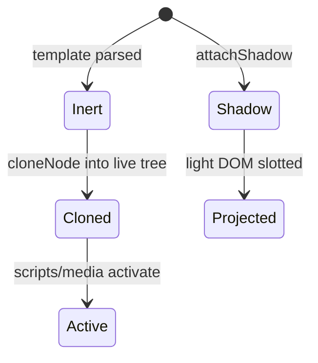
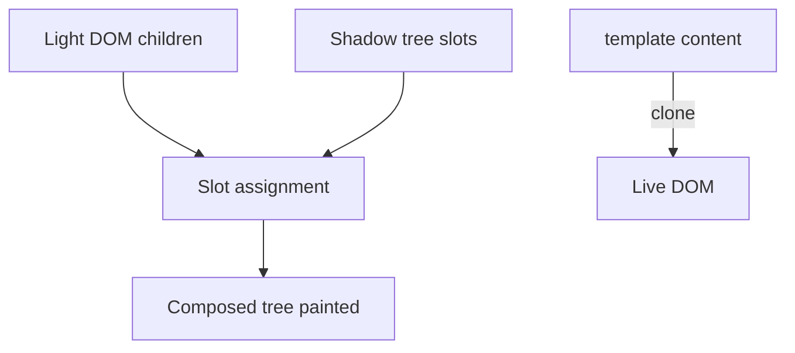

# Templates and Slots

<TopicMeta />

<Prerequisites />

::: tip Published
This page meets the handbook **published** bar: deep explanation, ≥10 common mistakes, and official references. Further engine-level errata welcome via PR.
:::

## Introduction

**`<template>`** holds inert DOM that is not rendered until cloned. **Slots** (`<slot>` in shadow trees, plus light-DOM children) project user content into component shadow structures. Together they underpin Web Components composition.

## Why does it exist?

You need reusable markup fragments without executing scripts/images until used, and a composition model where component consumers pass children into named places—like React children, but in platform HTML.

## Historical Background

`<template>` standardized inert document fragments (older pages abused hidden DOM). Shadow DOM slots arrived with Web Components so authors could compose light-DOM children into encapsulated trees without string HTML concatenation.

## Mental Model

`template.content` is a `DocumentFragment` that is **inert**: scripts do not run, images do not load, until you `cloneNode(true)` into a live tree. Slots are **projection points**: children with `slot="name"` appear where `<slot name="name">` lives in the shadow tree; unnamed children fill the default slot.

## Internal Workflow

1. Author markup inside `<template>` for repeated UI.
2. Clone into the document or into a shadow root when needed.
3. For components: attach shadow, define `<slot>` placeholders, let consumers pass light-DOM children.
4. Listen to `slotchange` when projected content matters for layout logic.
5. Prefer declarative Shadow DOM / custom elements when building design-system primitives.

## Lifecycle



## Browser Perspective

Templates exist in the DOM but their contents are not rendered. Slotted nodes remain in light DOM for a11y/retargeting; the composed tree is what you see. DevTools can show “composed” views.

## JavaScript Engine Perspective

Cloning large templates allocates many nodes—batch carefully. Slot assignment is maintained by the browser as children change.

## React Perspective

React children composition is the usual model; `template`/slots matter when wrapping Web Components or shipping pure HTML partials. React does not use HTML slots for function components.

## Next.js Perspective

Most Next/React apps won’t need slots; relevant when embedding design-system custom elements in RSC/client islands.

## Server Perspective

SSR of declarative shadow DOM / custom elements has evolving support—verify your target browsers and polyfill strategy.

## Network Perspective

Templates in HTML arrive with the document (no extra fetch). External template fragments via `fetch` + parse are a pattern for partials.

## Memory Perspective

Keeping many large `<template>` nodes is cheaper than live trees (inert), but cloning duplicates memory—pool/reuse when animating lists if needed.

## Performance

Clone + insert is faster and safer than `innerHTML` for repeated structures when you can stamp known trees. Avoid re-parsing HTML strings in hot loops.

## Production Example

A legacy dashboard stamped rows from a `<template id="row">` instead of string concat. XSS surface dropped (no HTML parse of data), and row creation stayed predictable under keyboard filtering.

## Code Examples

```html
<template id="item">
  <li><span class="label"></span></li>
</template>

<script type="module">
  const tpl = document.getElementById('item')
  const node = tpl.content.cloneNode(true)
  node.querySelector('.label').textContent = 'Hello'
  document.querySelector('ul').append(node)
</script>

<user-card>
  <h2 slot="title">Pricing</h2>
  <p>Starts at $0</p>
</user-card>
```

## Diagrams



## Common Mistakes

1. Expecting scripts inside `<template>` to run before cloning
2. Using `innerHTML` on template incorrectly instead of `template.content`
3. Assuming slotted nodes move out of light DOM (they are projected, not relocated as parent change in the flat tree sense)
4. Forgetting fallback content inside `<slot>` when nothing is provided
5. Cloning once and reusing the same node without cloning again
6. Building XSS via string HTML when template + textContent would suffice
7. Missing a production edge case for 04-html.templates-and-slots (#1)
8. Missing a production edge case for 04-html.templates-and-slots (#2)
9. Missing a production edge case for 04-html.templates-and-slots (#3)
10. Missing a production edge case for 04-html.templates-and-slots (#4)


## Best Practices

- Stamp from `template.content.cloneNode(true)`
- Put user data through `textContent` / typed properties
- Name slots explicitly for multi-region components
- Use `slotchange` for measuring projected content

## Anti-patterns

- Hidden live DOM as a fake template (scripts/images activate)
- String-building component trees with untrusted HTML
- Deep slot renames without documenting the public API

## Comparison

| Mechanism | Strength | Weakness |
| --- | --- | --- |
| `<template>` | Inert, cloneable | Manual stamping |
| Shadow slots | Native composition | Web Component learning curve |
| React children | Ergonomic in React | Not platform HTML |

## Interview Questions

### Easy

**Q:** Is content inside `<template>` rendered?

**A:** No. It is inert until cloned into a live document.

### Medium

**Q:** What is slot projection?

**A:** Light-DOM children are displayed at `<slot>` locations in a shadow tree while remaining light-DOM nodes for the host’s children list.

### Hard

**Q:** How do events behave across shadow boundaries with slots?

**A:** Events retarget when crossing shadow boundaries; composed paths differ from the flat light tree. Understand `composedPath()` when debugging.

## Summary

- Templates store inert DOM fragments
- Slots project light DOM into shadow trees
- Clone before use; do not expect inert scripts to run
- Prefer textContent when stamping user data

## References

- [MDN: `<template>`](https://developer.mozilla.org/en-US/docs/Web/HTML/Element/template)
- [MDN: `<slot>`](https://developer.mozilla.org/en-US/docs/Web/HTML/Element/slot)
- [HTML Living Standard — Template](https://html.spec.whatwg.org/multipage/scripting.html#the-template-element)

<RelatedTopics />

Prev: [modulepreload](/04-html/modulepreload/)
