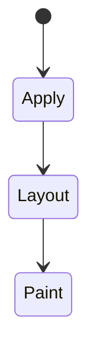
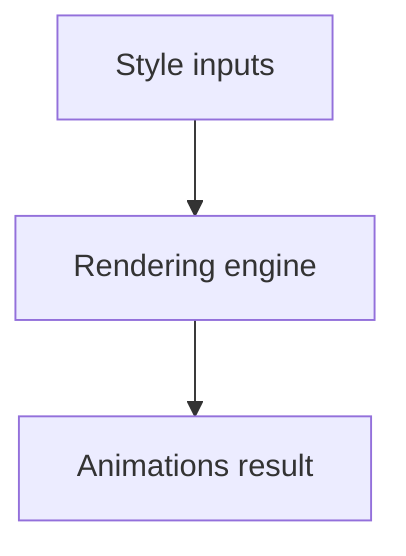

# Animations

<TopicMeta />

<Prerequisites />

::: tip Published
This page meets the handbook **published** bar: deep explanation, ≥10 common mistakes, and official references. Further engine-level errata welcome via PR.
:::

## Introduction

**CSS animations** use `@keyframes` plus `animation-*` properties to interpolate styles over time on the element’s own timeline (distinct from transitions triggered by state changes).

## Why does it exist?

Declarative motion for loaders, emphasis, and looping indicators without JS timers—compositor-friendly when animating transform/opacity.

## Historical Background

Vendor-prefixed animations preceded unprefixed syntax; Web Animations API later unified JS control.

## Mental Model

Keyframes define milestones; duration/easing/iteration control playback. Prefer transform/opacity. Respect `prefers-reduced-motion`.

## Internal Workflow

1. Define keyframes.
2. Attach animation to selector.
3. Choose fill-mode/iteration.
4. Pause offscreen when possible.
5. Provide reduced-motion alternative.

## Lifecycle

Lifecycle for Animations:



## Browser Perspective

Rendering engines apply Animations during style/layout/paint as relevant. Debug with Elements + Performance.

## JavaScript Engine Perspective

CSS is applied by the rendering engine; JS only changes inputs (classes, style, attributes).

## React Perspective

React toggles class names/styles that exercise Animations; prefer CSS for visual states when possible.

## Next.js Perspective

Works the same in Next.js apps; watch global CSS import order and CSS Modules.

## Server Perspective

SSR emits HTML/CSS classes; critical CSS strategies may inline rules involving this topic.

## Network Perspective

Stylesheets and font/image URLs related to this topic still load over HTTP caches.

## Memory Perspective

Layerized/composited results may consume GPU memory; prefer releasing unused large textures/images.

## Performance

Animating `top/left/width` forces layout; use `transform`.

## Production Example

Skeleton shimmer used opacity animation on a composited layer; layout properties avoided to keep INP stable.

## Code Examples

```css
@keyframes pulse {
  from { transform: scale(1); }
  to { transform: scale(1.05); }
}
.badge { animation: pulse 1.2s ease-in-out infinite alternate; }
@media (prefers-reduced-motion: reduce) { .badge { animation: none; } }
```

## Diagrams



## Common Mistakes

1. Misunderstanding when Animations triggers layout vs paint vs composite
2. Copying snippets without checking browser support for edge features
3. Over-specifying selectors that make overrides brittle
4. Ignoring accessibility implications (motion, contrast, focus)
5. Optimizing visuals before measuring jank
6. Animating width/height continuously
7. Ignoring reduced motion
8. Missing a production edge case for 05-css.animations (#1)
9. Missing a production edge case for 05-css.animations (#2)
10. Missing a production edge case for 05-css.animations (#3)


## Best Practices

- Learn the mental model for Animations before memorizing properties
- Verify in target browsers
- Keep fallbacks for progressive enhancement
- Document team conventions

## Anti-patterns

- Fighting the platform with !important and inline styles
- Animating layout properties without need
- Shipping unscoped experimental CSS to all browsers without testing

## Comparison

| | Animation | Transition |
| --- | --- | --- |
| Trigger | Implicit/loop capable | Property change |
| Keyframes | Yes | No |

## Interview Questions

### Easy

**Q:** What is CSS animations?

**A:** Declarative timed style changes defined with `@keyframes` and `animation` properties.

### Medium

**Q:** Which properties are safest to animate?

**A:** Transform and opacity—typically compositor-only; avoid layout-triggering properties.

### Hard

**Q:** Animation vs transition?

**A:** Animations can run multi-step/loop independently; transitions interpolate when a property’s value changes.

## Summary

- Animations has a concrete layout/paint meaning in CSS
- Measure rendering impact
- Prefer simple, layered architecture
- Know official references

## References

- [MDN: CSS animations](https://developer.mozilla.org/en-US/docs/Web/CSS/CSS_animations)
- [CSS Animations](https://www.w3.org/TR/css-animations-1/)

<RelatedTopics />

Prev: [Container Queries](/05-css/container-queries/) · Next: [Transitions](/05-css/transitions/)
