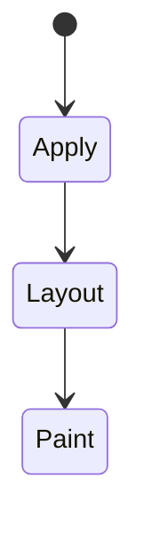
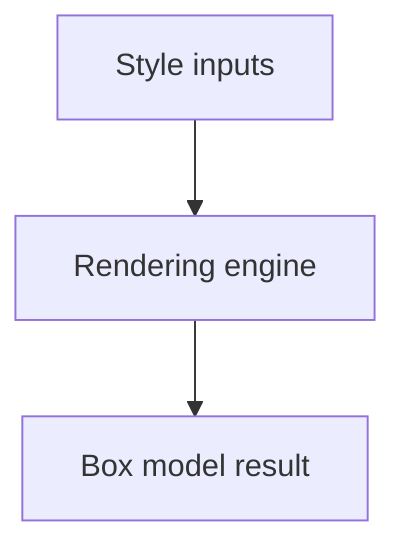

# Box Model

<TopicMeta />

<Prerequisites />

::: tip Published
This page meets the handbook **published** bar: deep explanation, ≥10 common mistakes, and official references. Further engine-level errata welcome via PR.
:::

## Introduction

The **box model** defines how element dimensions are calculated from content, padding, border, and margin. `box-sizing: content-box` (default) sizes the content area; `border-box` includes padding and border in the declared `width`/`height`.

## Why does it exist?

Almost every layout bug (“why is this 20px wider?”) is box-model arithmetic. Consistent `border-box` makes component sizing predictable.

## Historical Background

CSS2 box model quirks differed in old IE. Modern resets almost universally set `*, *::before, *::after { box-sizing: border-box; }`.

## Mental Model

Margin is outside the border edge (collapses vertically between siblings in flow). Padding is inside. Borders add to outer size unless `border-box`. Outline does not take layout space.

## Internal Workflow

1. Set global `border-box`.
2. Size components with width/height knowing what is included.
3. Use `gap` in flex/grid instead of margin hacks when possible.
4. Remember margin collapse in normal flow.

## Lifecycle

Lifecycle for Box model:



## Browser Perspective

Rendering engines apply Box model during style/layout/paint as relevant. Debug with Elements + Performance.

## JavaScript Engine Perspective

CSS is applied by the rendering engine; JS only changes inputs (classes, style, attributes).

## React Perspective

React toggles class names/styles that exercise Box model; prefer CSS for visual states when possible.

## Next.js Perspective

Works the same in Next.js apps; watch global CSS import order and CSS Modules.

## Server Perspective

SSR emits HTML/CSS classes; critical CSS strategies may inline rules involving this topic.

## Network Perspective

Stylesheets and font/image URLs related to this topic still load over HTTP caches.

## Memory Perspective

Layerized/composited results may consume GPU memory; prefer releasing unused large textures/images.

## Performance

Box model calculations are part of layout; avoid reading `offsetWidth` in loops (layout thrashing).

## Production Example

Adopting global `border-box` removed a class of “card is overflowing by 2×padding” bugs across a component library.

## Code Examples

```css
*, *::before, *::after { box-sizing: border-box; }
.card { width: 320px; padding: 16px; border: 2px solid; }
```

## Diagrams



## Common Mistakes

1. Misunderstanding when Box model triggers layout vs paint vs composite
2. Copying snippets without checking browser support for edge features
3. Over-specifying selectors that make overrides brittle
4. Ignoring accessibility implications (motion, contrast, focus)
5. Optimizing visuals before measuring jank
6. Forgetting vertical margin collapse
7. Mixing content-box mental math after a global border-box reset
8. Missing a production edge case for 05-css.box-model (#1)
9. Missing a production edge case for 05-css.box-model (#2)
10. Missing a production edge case for 05-css.box-model (#3)


## Best Practices

- Learn the mental model for Box model before memorizing properties
- Verify in target browsers
- Keep fallbacks for progressive enhancement
- Document team conventions

## Anti-patterns

- Fighting the platform with !important and inline styles
- Animating layout properties without need
- Shipping unscoped experimental CSS to all browsers without testing

## Comparison

| `box-sizing` | Width includes |
| --- | --- |
| `content-box` | Content only |
| `border-box` | Content + padding + border |

## Interview Questions

### Easy

**Q:** What is the CSS box model?

**A:** The rectangular model of content, padding, border, and margin used to size and space elements.

### Medium

**Q:** What does border-box change?

**A:** Declared width/height include padding and border, so the border box matches the declared size (margins still outside).

### Hard

**Q:** Explain margin collapse.

**A:** Adjacent vertical margins in normal flow can combine into one margin equal to the larger of the two (with detailed rules for parents/children).

## Summary

- Box model has a concrete layout/paint meaning in CSS
- Measure rendering impact
- Prefer simple, layered architecture
- Know official references

## References

- [MDN: Box model](https://developer.mozilla.org/en-US/docs/Web/CSS/CSS_box_model)
- [CSS Box Model](https://www.w3.org/TR/css-box-3/)

<RelatedTopics />

Prev: [Inheritance](/05-css/inheritance/) · Next: [Positioning](/05-css/positioning/)
