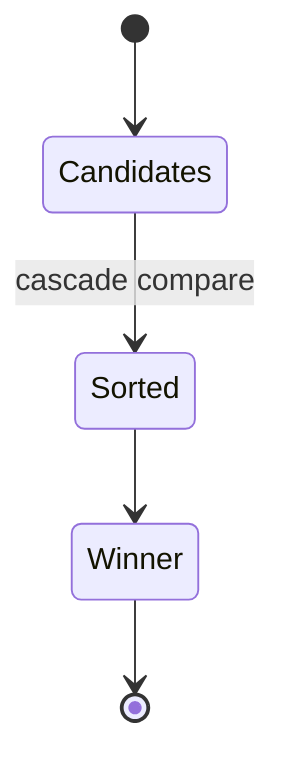

# Cascade

<TopicMeta />

<Prerequisites />

::: tip Published
This page meets the handbook **published** bar: deep explanation, ≥10 common mistakes, and official references. Further engine-level errata welcome via PR.
:::

## Introduction

The **cascade** decides which CSS declaration applies when several rules set the same property on the same element. It compares origin & importance, cascade layers, specificity, then source order.

## Why does it exist?

Authors, users, and the user agent all contribute styles. Without a deterministic algorithm, component libraries, resets, and utilities could not coexist predictably.

## Historical Background

CSS1 defined cascade and specificity. `!important`, animation/transition origins, and `@layer` cascade layers later gave teams stronger architectural control than specificity wars.

## Mental Model

Conflict resolution order (simplified): (1) origin & importance, (2) `@layer` order, (3) specificity, (4) source order. Inheritance fills properties that were never specified—different from cascade winning.

## Internal Workflow

1. Collect matching declarations for a property.
2. Filter by media/supports.
3. Sort by cascade criteria.
4. Winner becomes the specified value; compute used values during layout.

## Lifecycle

Lifecycle for cascade:



## Browser Perspective

DevTools Computed shows the winner and struck-through losers. Use it before guessing with `!important`.

## JavaScript Engine Perspective

Style resolution runs in the rendering engine (Blink/WebKit/Gecko), not the JS heap—except when JS toggles classes/styles.

## React Perspective

CSS Modules/CSS-in-JS still emit CSS that participates in the cascade. Naming reduces collisions; it does not delete cascade rules.

## Next.js Perspective

Root layout CSS plus route CSS: establish `@layer` order or a utility strategy so later imports do not randomly win.

## Server Perspective

Critical CSS inlined in HTML is author CSS and can override linked sheets depending on order/layers.

## Network Perspective

Late-loading stylesheets can change winners after first paint (FOUC).

## Memory Perspective

Huge rule sets increase style recalc cost; deep specificity is a maintainability tax more than a memory one.

## Performance

Prefer layers and low specificity over `!important`. Measure style recalc in Performance panel when UI janks on class toggles.

## Production Example

A design system ordered `@layer reset, tokens, components, utilities` so utilities beat components without IDs or `!important`.

## Code Examples

```css
@layer reset, components, utilities;
@layer components { .btn { background: navy; } }
@layer utilities { .bg-red { background: crimson; } }
```

## Diagrams

```mermaid
flowchart TD
  Cands[Candidates] --> Origin[Origin/importance]
  Origin --> Layer[@layer]
  Layer --> Spec[Specificity]
  Spec --> Order[Source order]
  Order --> Win[Winner]
```

## Common Mistakes

1. Reaching for `!important` instead of fixing layer/specificity architecture
2. Assuming CSS Modules escape the cascade entirely
3. Confusing inheritance with cascade winning
4. Fighting only with specificity while ignoring `@layer`
5. Relying on accidental stylesheet order across bundles
6. Using IDs in app CSS that trap future overrides
7. Missing a production edge case for 05-css.cascade (#1)
8. Missing a production edge case for 05-css.cascade (#2)
9. Missing a production edge case for 05-css.cascade (#3)
10. Missing a production edge case for 05-css.cascade (#4)


## Best Practices

- Document a product-wide layer order
- Keep selectors flat (single class when possible)
- Debug winners in Computed styles
- Treat `!important` as an escape hatch with an owner comment

## Anti-patterns

- `!important` as a library default
- Inline styles everywhere to “always win”
- Shadow-piercing hacks instead of theming tokens

## Comparison

| Factor | Role |
| --- | --- |
| Origin/importance | Who wrote it / `!important` |
| `@layer` | Group ordering before specificity |
| Specificity | Selector weight |
| Order | Final tie-breaker |

## Interview Questions

### Easy

**Q:** What is the CSS cascade?

**A:** The algorithm that picks the winning declaration for a property when multiple rules match.

### Medium

**Q:** Where do cascade layers sit vs specificity?

**A:** Layer order is compared before specificity, so a later layer can win with lower specificity.

### Hard

**Q:** How do animations interact with the cascade?

**A:** Animated values occupy special cascade positions so they can override normal author styles while still respecting importance rules.

## Summary

- Cascade is deterministic conflict resolution
- Layers beat specificity wars for architecture
- Inheritance ≠ cascade
- DevTools Computed is the source of truth while debugging

## References

- [MDN: Cascade](https://developer.mozilla.org/en-US/docs/Web/CSS/Cascade)
- [CSS Cascade Level 5](https://www.w3.org/TR/css-cascade-5/)

<RelatedTopics />
Next: [Specificity](/05-css/specificity/)
