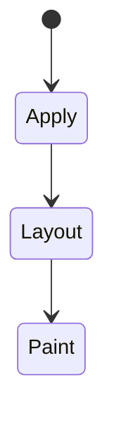
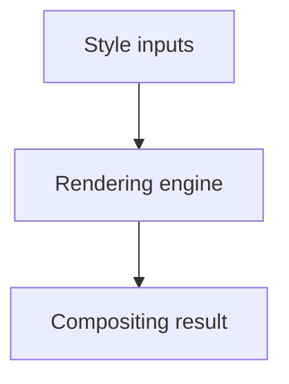

# Compositing

<TopicMeta />

<Prerequisites />

::: tip Published
This page meets the handbook **published** bar: deep explanation, ≥10 common mistakes, and official references. Further engine-level errata welcome via PR.
:::

## Introduction

**Compositing** is the stage where painted layers are combined into the final frame. CSS that promotes layers (`transform`, `opacity`, `filter`, etc.) can move animation off the main-thread layout path—or waste memory if overused.

## Why does it exist?

Smooth 60fps UI depends on understanding paint vs composite. Engineers choose properties that avoid per-frame layout.

## Historical Background

Browser engines evolved layer trees and tiled compositing; DevTools “Layers” / “Paint flashing” expose them.

## Mental Model

Layout → Paint → Composite. Change transform/opacity when possible. Each layer costs memory; don’t `will-change: transform` the whole page.

## Internal Workflow

1. Profile jank.
2. Identify layout-bound animations.
3. Refactor to transform/opacity.
4. Limit layer count.
5. Re-measure.

## Lifecycle

Lifecycle for Compositing:



## Browser Perspective

Use Layers panel and paint flashing; behaviors differ slightly per engine but principles hold.

## JavaScript Engine Perspective

CSS is applied by the rendering engine; JS only changes inputs (classes, style, attributes).

## React Perspective

React toggles class names/styles that exercise Compositing; prefer CSS for visual states when possible.

## Next.js Perspective

Works the same in Next.js apps; watch global CSS import order and CSS Modules.

## Server Perspective

SSR emits HTML/CSS classes; critical CSS strategies may inline rules involving this topic.

## Network Perspective

Stylesheets and font/image URLs related to this topic still load over HTTP caches.

## Memory Perspective

Layerized/composited results may consume GPU memory; prefer releasing unused large textures/images.

## Performance

Understand whether Compositing triggers layout, paint, or composite-only work.

## Production Example

A parallax hero moved from top animation to translateZ/transform; main-thread time dropped in Performance traces.

## Code Examples

```css
.layer-friendly {
  transform: translateZ(0); /* prefer real transforms you need, not cargo-cult */
  will-change: transform;   /* temporary, remove when idle */
}
```

## Diagrams



## Common Mistakes

1. Misunderstanding when Compositing triggers layout vs paint vs composite
2. Copying snippets without checking browser support for edge features
3. Over-specifying selectors that make overrides brittle
4. Ignoring accessibility implications (motion, contrast, focus)
5. Optimizing visuals before measuring jank
6. will-change on everything
7. Assuming translateZ(0) is a free speedup forever
8. Missing a production edge case for 05-css.compositing (#1)
9. Missing a production edge case for 05-css.compositing (#2)
10. Missing a production edge case for 05-css.compositing (#3)


## Best Practices

- Learn the mental model for Compositing before memorizing properties
- Verify in target browsers
- Keep fallbacks for progressive enhancement
- Document team conventions

## Anti-patterns

- Fighting the platform with !important and inline styles
- Animating layout properties without need
- Shipping unscoped experimental CSS to all browsers without testing

## Comparison

| Change | Typical cost |
| --- | --- |
| width/left | Layout + paint |
| background-color | Paint |
| transform/opacity | Composite |

## Interview Questions

### Easy

**Q:** What is compositing in CSS/rendering?

**A:** Combining painted layers into frames; certain CSS properties promote elements to layers that can be moved cheaply.

### Medium

**Q:** What is a stacking context?

**A:** A stacking context is a local z-order space created by certain CSS (opacity<1, transform, etc.); z-index compares within it.

### Hard

**Q:** How do you verify compositor animations?

**A:** Performance panel: look for running on compositor / avoid layout & paint on each frame; Layers panel for layer counts.

## Summary

- Compositing has a concrete layout/paint meaning in CSS
- Measure rendering impact
- Prefer simple, layered architecture
- Know official references

## References

- [web.dev: Stick to compositor-only properties](https://web.dev/articles/stick-to-compositor-only-properties)
- [MDN: CSS painting order / stacking](https://developer.mozilla.org/en-US/docs/Web/CSS/CSS_positioned_layout/Understanding_z-index/Stacking_context)

<RelatedTopics />

Prev: [Transforms](/05-css/transforms/) · Next: [Containment](/05-css/containment/)
