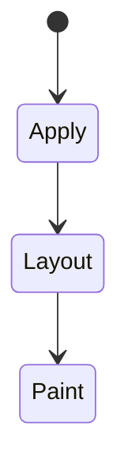
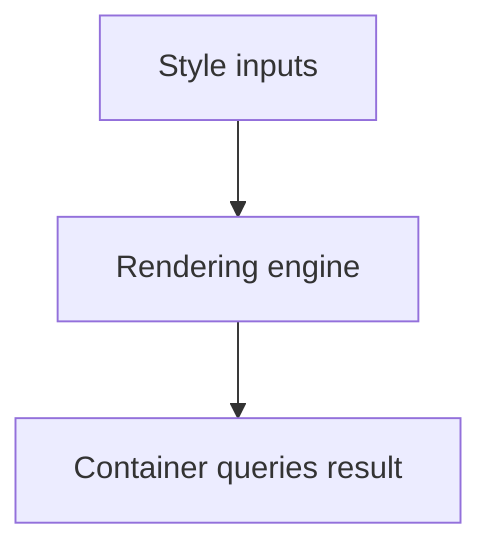

# Container Queries

<TopicMeta />

<Prerequisites />

::: tip Published
This page meets the handbook **published** bar: deep explanation, ≥10 common mistakes, and official references. Further engine-level errata welcome via PR.
:::

## Introduction

**Container queries** let descendants respond to a container’s inline size (or other container features) via `container-type` / `container-name` and `@container` rules—component-level responsiveness.

## Why does it exist?

A card in a narrow sidebar should not use the same breakpoint as the viewport. Container queries fix reusable components in different parents.

## Historical Background

Long-requested; shipped in modern browsers after containment primitives matured.

## Mental Model

Establish a containment context on a parent (`container-type: inline-size`), then query it. The component cares about available space, not the device.

## Internal Workflow

1. Mark container.
2. Write `@container` rules for child layouts.
3. Keep viewport media queries for page chrome.
4. Provide fallbacks if needed for ancient browsers.

## Lifecycle

Lifecycle for Container queries:



## Browser Perspective

Supported in current evergreen browsers; check your baseline policy.

## JavaScript Engine Perspective

CSS is applied by the rendering engine; JS only changes inputs (classes, style, attributes).

## React Perspective

React toggles class names/styles that exercise Container queries; prefer CSS for visual states when possible.

## Next.js Perspective

Works the same in Next.js apps; watch global CSS import order and CSS Modules.

## Server Perspective

SSR emits HTML/CSS classes; critical CSS strategies may inline rules involving this topic.

## Network Perspective

Stylesheets and font/image URLs related to this topic still load over HTTP caches.

## Memory Perspective

Layerized/composited results may consume GPU memory; prefer releasing unused large textures/images.

## Performance

Understand whether Container queries triggers layout, paint, or composite-only work.

## Production Example

Product card used `@container (min-width: 28rem)` to switch horizontal media layout; same component worked in grid and drawer.

## Code Examples

```css
.card { container-type: inline-size; }
@container (min-width: 28rem) {
  .card__body { display: flex; gap: 1rem; }
}
```

## Diagrams



## Common Mistakes

1. Misunderstanding when Container queries triggers layout vs paint vs composite
2. Copying snippets without checking browser support for edge features
3. Over-specifying selectors that make overrides brittle
4. Ignoring accessibility implications (motion, contrast, focus)
5. Optimizing visuals before measuring jank
6. Querying without setting container-type
7. Replacing all page breakpoints with containers unnecessarily
8. Missing a production edge case for 05-css.container-queries (#1)
9. Missing a production edge case for 05-css.container-queries (#2)
10. Missing a production edge case for 05-css.container-queries (#3)


## Best Practices

- Learn the mental model for Container queries before memorizing properties
- Verify in target browsers
- Keep fallbacks for progressive enhancement
- Document team conventions

## Anti-patterns

- Fighting the platform with !important and inline styles
- Animating layout properties without need
- Shipping unscoped experimental CSS to all browsers without testing

## Comparison

| Tool | Responds to |
| --- | --- |
| Media query | Viewport/device |
| Container query | Parent container |

## Interview Questions

### Easy

**Q:** What is container queries?

**A:** CSS rules that apply based on a containing element’s size rather than the viewport.

### Medium

**Q:** What does container-type: inline-size do?

**A:** It creates a size query container for the inline axis so `@container` can respond to width-like size.

### Hard

**Q:** How do they relate to containment?

**A:** Size queries require containment so the browser can resolve container sizes without circular layout dependencies.

## Summary

- Container queries has a concrete layout/paint meaning in CSS
- Measure rendering impact
- Prefer simple, layered architecture
- Know official references

## References

- [MDN: Container queries](https://developer.mozilla.org/en-US/docs/Web/CSS/CSS_containment/Container_queries)
- [CSS Containment](https://www.w3.org/TR/css-contain-3/)

<RelatedTopics />

Prev: [Media Queries](/05-css/media-queries/) · Next: [Animations](/05-css/animations/)
