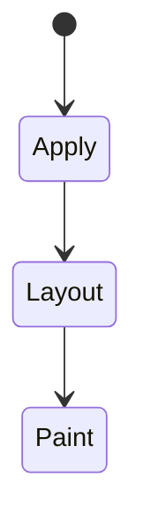
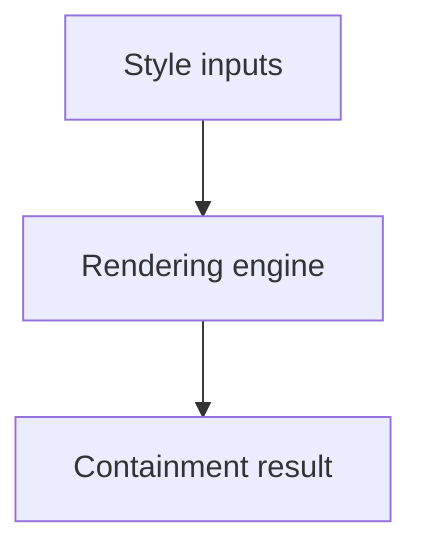

# Containment

<TopicMeta />

<Prerequisites />

::: tip Published
This page meets the handbook **published** bar: deep explanation, ≥10 common mistakes, and official references. Further engine-level errata welcome via PR.
:::

## Introduction

**CSS containment** (`contain: layout paint size style`) tells the browser that a subtree is independent for certain calculations. **`content-visibility`** can skip rendering work for offscreen content.

## Why does it exist?

Large DOMs (tables, feeds) pay style/layout costs globally. Containment scopes invalidation; `content-visibility: auto` improves scroll performance.

## Historical Background

Containment evolved to enable container queries and performance optimizations.

## Mental Model

Stronger containment = stronger promises to the engine. Wrong containment can clip or break nested sticky/positioning expectations—test UI.

## Internal Workflow

1. Identify large independent widgets.
2. Apply appropriate `contain`.
3. Consider `content-visibility: auto` + `contain-intrinsic-size` for long lists.
4. Verify a11y/find-in-page behavior.

## Lifecycle

Lifecycle for Containment:



## Browser Perspective

Rendering engines apply Containment during style/layout/paint as relevant. Debug with Elements + Performance.

## JavaScript Engine Perspective

CSS is applied by the rendering engine; JS only changes inputs (classes, style, attributes).

## React Perspective

React toggles class names/styles that exercise Containment; prefer CSS for visual states when possible.

## Next.js Perspective

Works the same in Next.js apps; watch global CSS import order and CSS Modules.

## Server Perspective

SSR emits HTML/CSS classes; critical CSS strategies may inline rules involving this topic.

## Network Perspective

Stylesheets and font/image URLs related to this topic still load over HTTP caches.

## Memory Perspective

Layerized/composited results may consume GPU memory; prefer releasing unused large textures/images.

## Performance

Understand whether Containment triggers layout, paint, or composite-only work.

## Production Example

A log viewer applied `content-visibility: auto` on row chunks; scroll FPS improved without virtualizing in JS yet.

## Code Examples

```css
.panel { contain: layout paint; }
.row { content-visibility: auto; contain-intrinsic-size: 48px; }
```

## Diagrams



## Common Mistakes

1. Misunderstanding when Containment triggers layout vs paint vs composite
2. Copying snippets without checking browser support for edge features
3. Over-specifying selectors that make overrides brittle
4. Ignoring accessibility implications (motion, contrast, focus)
5. Optimizing visuals before measuring jank
6. contain: strict breaking descendant positioning unexpectedly
7. content-visibility without intrinsic size causing scroll jumps
8. Missing a production edge case for 05-css.containment (#1)
9. Missing a production edge case for 05-css.containment (#2)
10. Missing a production edge case for 05-css.containment (#3)


## Best Practices

- Learn the mental model for Containment before memorizing properties
- Verify in target browsers
- Keep fallbacks for progressive enhancement
- Document team conventions

## Anti-patterns

- Fighting the platform with !important and inline styles
- Animating layout properties without need
- Shipping unscoped experimental CSS to all browsers without testing

## Comparison

| Tool | Benefit |
| --- | --- |
| `contain` | Scope recalculation |
| `content-visibility` | Skip offscreen render work |
| Virtualization | Fewer DOM nodes |

## Interview Questions

### Easy

**Q:** What is CSS containment?

**A:** Hints that limit how a subtree affects the rest of the page’s layout/paint/style calculations.

### Medium

**Q:** Why contain-intrinsic-size with content-visibility?

**A:** Reserved size prevents scrollbars from jumping when offscreen content is skipped.

### Hard

**Q:** contain vs overflow hidden?

**A:** Overflow clips visually; contain makes stronger independence promises for engine optimizations and is not a visual substitute.

## Summary

- Containment has a concrete layout/paint meaning in CSS
- Measure rendering impact
- Prefer simple, layered architecture
- Know official references

## References

- [MDN: contain](https://developer.mozilla.org/en-US/docs/Web/CSS/contain)
- [MDN: content-visibility](https://developer.mozilla.org/en-US/docs/Web/CSS/content-visibility)

<RelatedTopics />

Prev: [Compositing](/05-css/compositing/) · Next: [Layers](/05-css/layers/)
