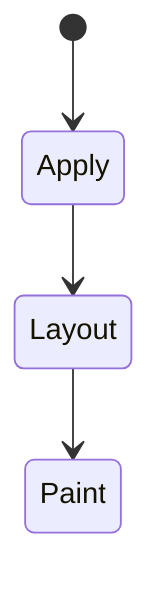
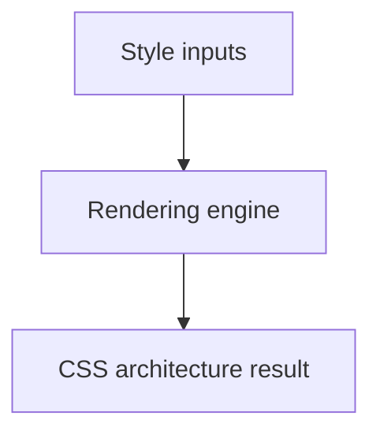

# CSS Architecture

<TopicMeta />

<Prerequisites />

::: tip Published
This page meets the handbook **published** bar: deep explanation, ≥10 common mistakes, and official references. Further engine-level errata welcome via PR.
:::

## Introduction

**CSS architecture** is how teams structure styles so features stay decoupable: naming (BEM), modules, layers, tokens, and clear ownership between global foundation and local components.

## Why does it exist?

Without architecture, specificity wars, dead CSS, and accidental regressions dominate. Architecture is a social + technical contract.

## Historical Background

OOCSS/SMACSS/BEM → CSS Modules/CSS-in-JS → utility-first → cascade layers returning power to plain CSS.

## Mental Model

Separate tokens (values), reset/base, components, utilities, and app overrides. Prefer local by default; global by exception.

## Internal Workflow

1. Define tokens.
2. Choose module strategy.
3. Enforce layer order / naming lint.
4. Delete unused CSS with tooling.
5. Review visual changes in CI (optional).

## Lifecycle

Lifecycle for CSS architecture:



## Browser Perspective

Rendering engines apply CSS architecture during style/layout/paint as relevant. Debug with Elements + Performance.

## JavaScript Engine Perspective

CSS is applied by the rendering engine; JS only changes inputs (classes, style, attributes).

## React Perspective

React toggles class names/styles that exercise CSS architecture; prefer CSS for visual states when possible.

## Next.js Perspective

Works the same in Next.js apps; watch global CSS import order and CSS Modules.

## Server Perspective

SSR emits HTML/CSS classes; critical CSS strategies may inline rules involving this topic.

## Network Perspective

Stylesheets and font/image URLs related to this topic still load over HTTP caches.

## Memory Perspective

Layerized/composited results may consume GPU memory; prefer releasing unused large textures/images.

## Performance

Understand whether CSS architecture triggers layout, paint, or composite-only work.

## Production Example

A monorepo standardized on CSS Modules + `@layer` tokens package; cross-app visual drift decreased and bundle CSS shrank after purging globals.

## Code Examples

```css
/* tokens.css */
@layer tokens {
  :root { --space-2: 0.5rem; --color-fg: #111; }
}
/* button.module.css */
.button { padding: var(--space-2); color: var(--color-fg); }
```

## Diagrams



## Common Mistakes

1. Misunderstanding when CSS architecture triggers layout vs paint vs composite
2. Copying snippets without checking browser support for edge features
3. Over-specifying selectors that make overrides brittle
4. Ignoring accessibility implications (motion, contrast, focus)
5. Optimizing visuals before measuring jank
6. Global class names without conventions
7. Three competing styling systems in one app
8. Missing a production edge case for 05-css.css-architecture (#1)
9. Missing a production edge case for 05-css.css-architecture (#2)
10. Missing a production edge case for 05-css.css-architecture (#3)


## Best Practices

- Learn the mental model for CSS architecture before memorizing properties
- Verify in target browsers
- Keep fallbacks for progressive enhancement
- Document team conventions

## Anti-patterns

- Fighting the platform with !important and inline styles
- Animating layout properties without need
- Shipping unscoped experimental CSS to all browsers without testing

## Comparison

| Approach | Locality |
| --- | --- |
| CSS Modules | High |
| Utility-first | High reuse, low custom CSS |
| Global BEM | Medium with discipline |

## Interview Questions

### Easy

**Q:** What is CSS architecture?

**A:** Conventions and structures that keep styles scalable: ownership, naming, layers/tokens, and tooling.

### Medium

**Q:** Modules vs utilities?

**A:** Modules encapsulate component styles; utilities accelerate repeated atomic looks. Many teams combine tokens + one primary approach.

### Hard

**Q:** How do layers fit architecture?

**A:** They encode the priority of resets/components/utilities explicitly so teams stop escalating specificity.

## Summary

- CSS architecture has a concrete layout/paint meaning in CSS
- Measure rendering impact
- Prefer simple, layered architecture
- Know official references

## References

- [MDN: CSS organization tips](https://developer.mozilla.org/en-US/docs/Learn/CSS/Building_blocks/Organizing)
- [CUBE CSS](https://cube.fyi/)

<RelatedTopics />

Prev: [Modern CSS](/05-css/modern-css/)
