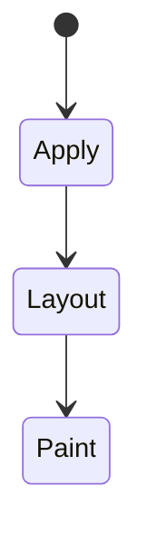
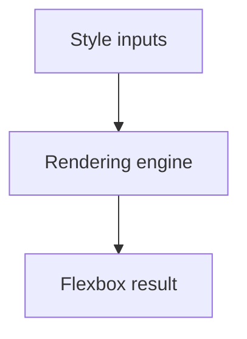

# Flexbox

<TopicMeta />

<Prerequisites />

::: tip Published
This page meets the handbook **published** bar: deep explanation, ≥10 common mistakes, and official references. Further engine-level errata welcome via PR.
:::

## Introduction

**Flexbox** lays out items in a row or column. The container sets direction, wrap, alignment (`justify-content`, `align-items`), and items control growth/shrink/basis (`flex`).

## Why does it exist?

Horizontal toolbars, vertical stacks, and space distribution are painful with floats. Flexbox is the modern one-dimensional primitive.

## Historical Background

Replaced float/inline-block hacks. Spec matured through buggy early prefixes to stable modern behavior; `gap` for flex arrived later.

## Mental Model

Main axis vs cross axis. `flex: 1` ≈ grow/shrink from 0 basis (depending on shorthand). Min-content sizing (`min-width: auto`) often causes overflow surprises.

## Internal Workflow

1. `display: flex` on parent.
2. Set `flex-direction` / `gap`.
3. Align on main/cross axes.
4. Tune `flex` on children.
5. Use wrapping + `flex-basis` for responsiveness.

## Lifecycle

Lifecycle for Flexbox:



## Browser Perspective

Rendering engines apply Flexbox during style/layout/paint as relevant. Debug with Elements + Performance.

## JavaScript Engine Perspective

CSS is applied by the rendering engine; JS only changes inputs (classes, style, attributes).

## React Perspective

React toggles class names/styles that exercise Flexbox; prefer CSS for visual states when possible.

## Next.js Perspective

Works the same in Next.js apps; watch global CSS import order and CSS Modules.

## Server Perspective

SSR emits HTML/CSS classes; critical CSS strategies may inline rules involving this topic.

## Network Perspective

Stylesheets and font/image URLs related to this topic still load over HTTP caches.

## Memory Perspective

Layerized/composited results may consume GPU memory; prefer releasing unused large textures/images.

## Performance

Flex layout is cheaper than nested table hacks; still avoid thrashing geometry reads during animations.

## Production Example

Nav switched from floats to `display: flex; gap: 1rem; align-items: center`—removed clearfix hacks and uneven spacing.

## Code Examples

```css
.row { display: flex; gap: 1rem; align-items: center; }
.row > .grow { flex: 1 1 0; min-width: 0; } /* allow shrink/truncate */
```

## Diagrams



## Common Mistakes

1. Misunderstanding when Flexbox triggers layout vs paint vs composite
2. Copying snippets without checking browser support for edge features
3. Over-specifying selectors that make overrides brittle
4. Ignoring accessibility implications (motion, contrast, focus)
5. Optimizing visuals before measuring jank
6. Forgetting `min-width: 0` on flex children that should truncate
7. Using flex for two-dimensional grids instead of Grid
8. Missing a production edge case for 05-css.flexbox (#1)
9. Missing a production edge case for 05-css.flexbox (#2)
10. Missing a production edge case for 05-css.flexbox (#3)


## Best Practices

- Learn the mental model for Flexbox before memorizing properties
- Verify in target browsers
- Keep fallbacks for progressive enhancement
- Document team conventions

## Anti-patterns

- Fighting the platform with !important and inline styles
- Animating layout properties without need
- Shipping unscoped experimental CSS to all browsers without testing

## Comparison

| Tool | Dimension |
| --- | --- |
| Flexbox | 1D |
| Grid | 2D |
| Flow | Document default |

## Interview Questions

### Easy

**Q:** What is Flexbox?

**A:** A one-dimensional CSS layout model for distributing and aligning items in a row or column.

### Medium

**Q:** What does `flex: 1` mean?

**A:** Shorthand typically enabling growth/shrink with a basis—commonly used so items share space; know the exact expansion (`flex-grow flex-shrink flex-basis`).

### Hard

**Q:** Why won’t text truncate inside a flex item?

**A:** Default `min-width: auto` prevents shrinking below content size; set `min-width: 0` (or similar) and use overflow/ellipsis.

## Summary

- Flexbox has a concrete layout/paint meaning in CSS
- Measure rendering impact
- Prefer simple, layered architecture
- Know official references

## References

- [MDN: Flexbox](https://developer.mozilla.org/en-US/docs/Web/CSS/CSS_flexible_box_layout)
- [CSS Flexbox](https://www.w3.org/TR/css-flexbox-1/)

<RelatedTopics />

Prev: [Positioning](/05-css/positioning/) · Next: [Grid](/05-css/grid/)
