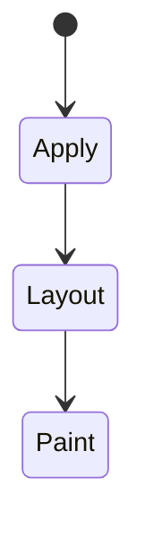
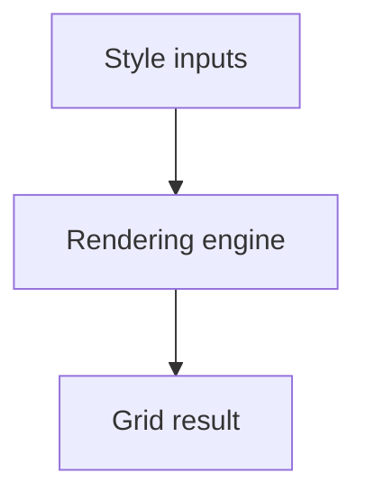

# Grid

<TopicMeta />

<Prerequisites />

::: tip Published
This page meets the handbook **published** bar: deep explanation, ≥10 common mistakes, and official references. Further engine-level errata welcome via PR.
:::

## Introduction

**CSS Grid** creates two-dimensional layouts with rows and columns (`grid-template-*`), placement (`grid-column`/`grid-area`), and alignment. Fr units and `minmax` power responsive tracks without many media queries.

## Why does it exist?

Page shells, card matrices, and overlapping editorial layouts need simultaneous row+column control that Flexbox alone fakes awkwardly.

## Historical Background

After years of drafts, Grid shipped widely ~2017. Subgrid followed for nested alignment.

## Mental Model

Define the grid on the container; place items into cells/areas. Implicit tracks appear when items overflow definitions. `fr` shares free space after intrinsic sizing.

## Internal Workflow

1. Sketch rows/columns.
2. `display: grid` + templates.
3. Place items or use auto-flow.
4. Use `gap`.
5. Add subgrid when children must align to parent tracks.

## Lifecycle

Lifecycle for Grid:



## Browser Perspective

Rendering engines apply Grid during style/layout/paint as relevant. Debug with Elements + Performance.

## JavaScript Engine Perspective

CSS is applied by the rendering engine; JS only changes inputs (classes, style, attributes).

## React Perspective

React toggles class names/styles that exercise Grid; prefer CSS for visual states when possible.

## Next.js Perspective

Works the same in Next.js apps; watch global CSS import order and CSS Modules.

## Server Perspective

SSR emits HTML/CSS classes; critical CSS strategies may inline rules involving this topic.

## Network Perspective

Stylesheets and font/image URLs related to this topic still load over HTTP caches.

## Memory Perspective

Layerized/composited results may consume GPU memory; prefer releasing unused large textures/images.

## Performance

Understand whether Grid triggers layout, paint, or composite-only work.

## Production Example

Dashboard used `grid-template-columns: 240px 1fr` and areas for side/main; collapsed to one column via media query on the template.

## Code Examples

```css
.page {
  display: grid;
  grid-template-columns: 240px 1fr;
  grid-template-areas: "side main";
  gap: 1.5rem;
}
.side { grid-area: side; }
.main { grid-area: main; }
```

## Diagrams



## Common Mistakes

1. Misunderstanding when Grid triggers layout vs paint vs composite
2. Copying snippets without checking browser support for edge features
3. Over-specifying selectors that make overrides brittle
4. Ignoring accessibility implications (motion, contrast, focus)
5. Optimizing visuals before measuring jank
6. Nesting flex hacks instead of defining columns
7. Confusing Grid with tables for data semantics
8. Missing a production edge case for 05-css.grid (#1)
9. Missing a production edge case for 05-css.grid (#2)
10. Missing a production edge case for 05-css.grid (#3)


## Best Practices

- Learn the mental model for Grid before memorizing properties
- Verify in target browsers
- Keep fallbacks for progressive enhancement
- Document team conventions

## Anti-patterns

- Fighting the platform with !important and inline styles
- Animating layout properties without need
- Shipping unscoped experimental CSS to all browsers without testing

## Comparison

| Feature | Grid | Flex |
| --- | --- | --- |
| Axes | 2D | 1D |
| Areas | Yes | No |
| Content-first lines | Strong | Strong along one axis |

## Interview Questions

### Easy

**Q:** What is CSS Grid?

**A:** A two-dimensional layout system for rows and columns with explicit placement and flexible tracks.

### Medium

**Q:** When prefer Grid over Flexbox?

**A:** When you need alignment control in both dimensions or a page-level template; Flex for one-dimensional components.

### Hard

**Q:** What does `minmax(0, 1fr)` help with?

**A:** It allows tracks/items to shrink below intrinsic minimums more predictably, fixing many overflow issues.

## Summary

- Grid has a concrete layout/paint meaning in CSS
- Measure rendering impact
- Prefer simple, layered architecture
- Know official references

## References

- [MDN: Grid](https://developer.mozilla.org/en-US/docs/Web/CSS/CSS_grid_layout)
- [CSS Grid Layout](https://www.w3.org/TR/css-grid-2/)

<RelatedTopics />

Prev: [Flexbox](/05-css/flexbox/) · Next: [Responsive Design](/05-css/responsive-design/)
