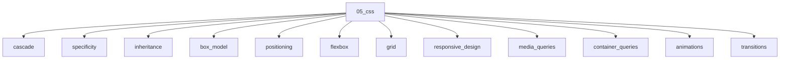

# CSS

## Scope

Cascade, layout systems, responsive design, and compositing

## Prerequisites

See the learning paths and each topic's prerequisites in the registry.

## Topics in order

- [Cascade](/05-css/cascade/) — junior, ~35 min
- [Specificity](/05-css/specificity/) — junior, ~30 min
- [Inheritance](/05-css/inheritance/) — beginner, ~20 min
- [Box Model](/05-css/box-model/) — beginner, ~30 min
- [Positioning](/05-css/positioning/) — junior, ~35 min
- [Flexbox](/05-css/flexbox/) — junior, ~40 min
- [Grid](/05-css/grid/) — junior, ~45 min
- [Responsive Design](/05-css/responsive-design/) — junior, ~35 min
- [Media Queries](/05-css/media-queries/) — junior, ~30 min
- [Container Queries](/05-css/container-queries/) — mid, ~30 min
- [Animations](/05-css/animations/) — mid, ~35 min
- [Transitions](/05-css/transitions/) — junior, ~25 min
- [Transforms](/05-css/transforms/) — junior, ~25 min
- [Compositing](/05-css/compositing/) — mid, ~35 min
- [Containment](/05-css/containment/) — senior, ~30 min
- [Layers](/05-css/layers/) — mid, ~25 min
- [Modern CSS](/05-css/modern-css/) — mid, ~40 min
- [CSS Architecture](/05-css/css-architecture/) — mid, ~35 min

## Module knowledge graph

## Suggested learning paths

Browse [Learning Paths](/learning-paths/).
