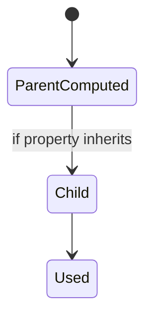
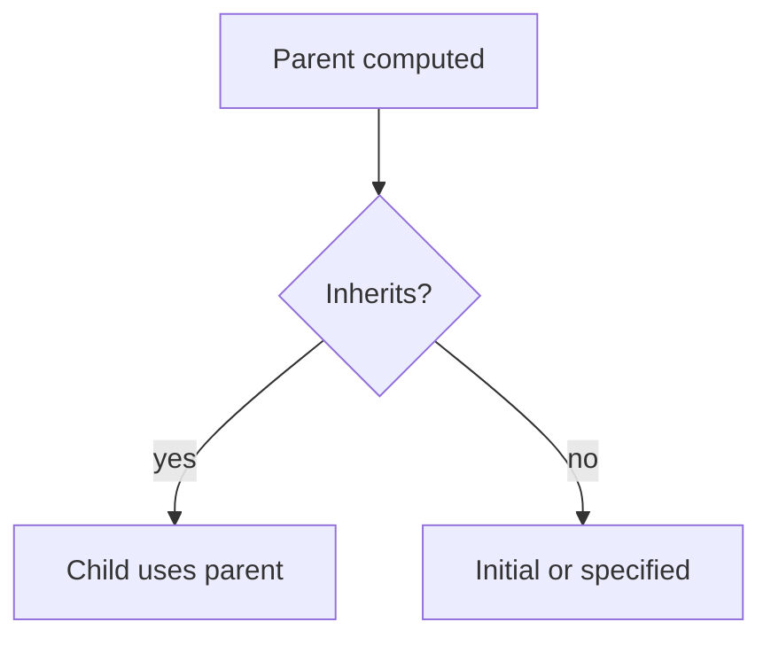

# Inheritance

<TopicMeta />

<Prerequisites />

::: tip Published
This page meets the handbook **published** bar: deep explanation, ≥10 common mistakes, and official references. Further engine-level errata welcome via PR.
:::

## Introduction

**Inheritance** passes computed values from parent to child for certain properties (e.g. `color`, `font-family`, `line-height`). Non-inherited properties (e.g. `margin`, `display`) use their initial value unless set. Keywords like `inherit`, `initial`, `unset`, and `revert` control that explicitly.

## Why does it exist?

Typography and many text properties would be unusable if every element needed its own `font-family`. Inheritance makes document-wide design tokens practical.

## Historical Background

Inherited properties were part of CSS from early versions. CSS Cascade clarified `unset`/`revert` and how they interact with origin.

## Mental Model

Ask: does this property inherit? If yes, set it on a parent (`body`, `.prose`). If not, set it where needed or use `inherit` deliberately (e.g. `a { color: inherit; }`).

## Internal Workflow

1. Set document defaults on `html`/`body`.
2. Let text properties flow into components.
3. Reset non-inherited layout props in component roots.
4. Use `unset`/`revert` carefully in design-system resets.

## Lifecycle

Lifecycle for inheritance:



## Browser Perspective

Computed styles show inherited values as inherited entries from parents.

## JavaScript Engine Perspective

Not applicable.

## React Perspective

Component roots often reset margins; remember children still inherit font/color unless stopped.

## Next.js Perspective

Not applicable.

## Server Perspective

Not applicable.

## Network Perspective

Not applicable.

## Memory Perspective

Negligible.

## Performance

Inheritance reduces CSS size vs repeating font rules everywhere.

## Production Example

A prose class set font metrics once; nested cards stopped hard-coding `font-family` on every `<p>`.

## Code Examples

```css
body { color: #222; font-family: Georgia, serif; }
a { color: inherit; text-decoration: underline; }
.modal { all: revert; } /* careful: big hammer */
```

## Diagrams



## Common Mistakes

1. Expecting `margin`/`padding` to inherit
2. Using `all: unset` without understanding inherited vs non-inherited
3. Fighting link colors instead of `color: inherit`
4. Assuming `em` inheritance quirks incorrectly for font-size chains
5. Reset styles that accidentally break inheritance of direction/language-sensitive props
6. Confusing inherited computed values with cascaded winners
7. Missing a production edge case for 05-css.inheritance (#1)
8. Missing a production edge case for 05-css.inheritance (#2)
9. Missing a production edge case for 05-css.inheritance (#3)
10. Missing a production edge case for 05-css.inheritance (#4)


## Best Practices

- Set typography on high ancestors
- Know the inherited property list for text
- Prefer targeted resets over `all`
- Document design-system inheritance expectations

## Anti-patterns

- Repeating font-size on every node
- Nuclear `*` resets that harm usability
- Silent inheritance surprises in nested portals/modals without a base font

## Comparison

| Keyword | Meaning |
| --- | --- |
| `inherit` | Take parent’s computed value |
| `initial` | Property’s initial value |
| `unset` | `inherit` if inheritable else `initial` |
| `revert` | Roll back to previous origin |

## Interview Questions

### Easy

**Q:** What is CSS inheritance?

**A:** A mechanism where certain properties’ computed values pass from parent to child unless overridden.

### Medium

**Q:** Difference between inheritance and cascade?

**A:** Cascade picks a winning specified value among declarations; inheritance fills in when no declaration applied for an inheritable property.

### Hard

**Q:** What does `revert` do in an author stylesheet?

**A:** It rolls the declaration back to the previous cascade origin (e.g., toward user/UA styles), useful in careful resets.

## Summary

- Inherited props flow; layout props usually do not
- Keywords give precise control
- Set fonts high in the tree
- Don’t confuse inheritance with specificity

## References

- [MDN: Inheritance](https://developer.mozilla.org/en-US/docs/Web/CSS/Inheritance)
- [CSS Cascade — inheritance](https://www.w3.org/TR/css-cascade-5/#inheritance)

<RelatedTopics />

Prev: [Specificity](/05-css/specificity/) · Next: [Box Model](/05-css/box-model/)
