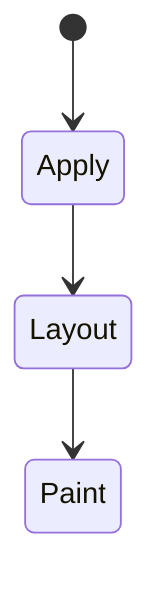
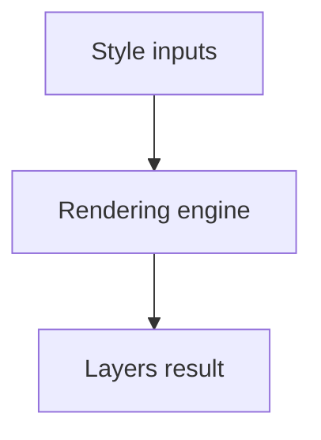

# Layers

<TopicMeta />

<Prerequisites />

::: tip Published
This page meets the handbook **published** bar: deep explanation, ≥10 common mistakes, and official references. Further engine-level errata welcome via PR.
:::

## Introduction

**Cascade layers** (`@layer`) let teams order whole groups of rules explicitly. Later layers win over earlier ones regardless of specificity (before unlayered styles, which are highest among author layers).

## Why does it exist?

Design systems need resets < components < utilities without ID/`!important` escalation.

## Historical Background

Standardized after years of specificity pain; now supported in evergreen browsers.

## Mental Model

Declare layer order once: `@layer reset, components, utilities;`. Unlayered CSS beats layered—know that footgun.

## Internal Workflow

1. Define layer order in a single entry file.
2. Put all library CSS inside layers.
3. Keep app overrides intentional (layer or documented unlayered).
4. Avoid accidental unlayered snippets.

## Lifecycle

Lifecycle for Layers:



## Browser Perspective

Rendering engines apply Layers during style/layout/paint as relevant. Debug with Elements + Performance.

## JavaScript Engine Perspective

CSS is applied by the rendering engine; JS only changes inputs (classes, style, attributes).

## React Perspective

React toggles class names/styles that exercise Layers; prefer CSS for visual states when possible.

## Next.js Perspective

Works the same in Next.js apps; watch global CSS import order and CSS Modules.

## Server Perspective

SSR emits HTML/CSS classes; critical CSS strategies may inline rules involving this topic.

## Network Perspective

Stylesheets and font/image URLs related to this topic still load over HTTP caches.

## Memory Perspective

Layerized/composited results may consume GPU memory; prefer releasing unused large textures/images.

## Performance

Understand whether Layers triggers layout, paint, or composite-only work.

## Production Example

Migrating a UI kit into layers removed most `!important` utilities; product overrides used a final `overrides` layer.

## Code Examples

```css
@layer reset, components, utilities, overrides;
@import url(reset.css) layer(reset);
@layer utilities { .mt-2 { margin-top: 0.5rem; } }
```

## Diagrams



## Common Mistakes

1. Misunderstanding when Layers triggers layout vs paint vs composite
2. Copying snippets without checking browser support for edge features
3. Over-specifying selectors that make overrides brittle
4. Ignoring accessibility implications (motion, contrast, focus)
5. Optimizing visuals before measuring jank
6. Leaving random unlayered CSS that silently beats layers
7. Re-declaring conflicting layer orders
8. Missing a production edge case for 05-css.layers (#1)
9. Missing a production edge case for 05-css.layers (#2)
10. Missing a production edge case for 05-css.layers (#3)


## Best Practices

- Learn the mental model for Layers before memorizing properties
- Verify in target browsers
- Keep fallbacks for progressive enhancement
- Document team conventions

## Anti-patterns

- Fighting the platform with !important and inline styles
- Animating layout properties without need
- Shipping unscoped experimental CSS to all browsers without testing

## Comparison

| Approach | Predictability |
| --- | --- |
| `@layer` | High if disciplined |
| Specificity only | Medium |
| `!important` | Low long-term |

## Interview Questions

### Easy

**Q:** What is @layer cascade layers?

**A:** A cascade feature that orders groups of style rules before specificity comparisons.

### Medium

**Q:** Do unlayered styles beat layered ones?

**A:** Yes—in the author origin, unlayered declarations have higher priority than layered ones.

### Hard

**Q:** How to adopt layers in an existing app?

**A:** Declare order, wrap existing bundles gradually, eliminate stray unlayered rules, test overrides.

## Summary

- Layers has a concrete layout/paint meaning in CSS
- Measure rendering impact
- Prefer simple, layered architecture
- Know official references

## References

- [MDN: @layer](https://developer.mozilla.org/en-US/docs/Web/CSS/@layer)
- [CSS Cascade — layers](https://www.w3.org/TR/css-cascade-5/#layering)

<RelatedTopics />

Prev: [Containment](/05-css/containment/) · Next: [Modern CSS](/05-css/modern-css/)
