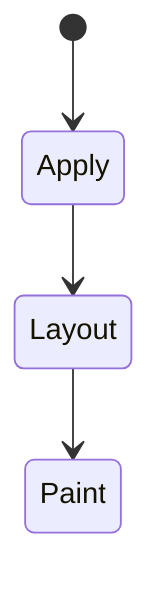
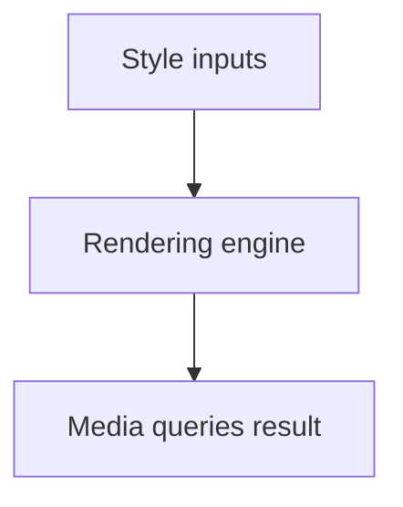

# Media Queries

<TopicMeta />

<Prerequisites />

::: tip Published
This page meets the handbook **published** bar: deep explanation, ≥10 common mistakes, and official references. Further engine-level errata welcome via PR.
:::

## Introduction

**Media queries** apply CSS when conditions match: width/height, orientation, hover capability, and user preferences (`prefers-color-scheme`, `prefers-reduced-motion`).

## Why does it exist?

Layout and motion should adapt to environment and accessibility preferences—not only to “mobile vs desktop” stereotypes.

## Historical Background

From CSS3 media queries to Level 4 features and range syntax (`(width >= 600px)`).

## Mental Model

Feature queries for capability/preference. Keep mobile-first: base styles, then `min-width` enhancements. Respect reduced motion.

## Internal Workflow

1. Write base CSS.
2. Add `min-width` breakpoints where structure changes.
3. Add preference queries for theme/motion.
4. Avoid conflicting max/min spaghetti.

## Lifecycle

Lifecycle for Media queries:



## Browser Perspective

Rendering engines apply Media queries during style/layout/paint as relevant. Debug with Elements + Performance.

## JavaScript Engine Perspective

CSS is applied by the rendering engine; JS only changes inputs (classes, style, attributes).

## React Perspective

React toggles class names/styles that exercise Media queries; prefer CSS for visual states when possible.

## Next.js Perspective

Works the same in Next.js apps; watch global CSS import order and CSS Modules.

## Server Perspective

SSR emits HTML/CSS classes; critical CSS strategies may inline rules involving this topic.

## Network Perspective

Stylesheets and font/image URLs related to this topic still load over HTTP caches.

## Memory Perspective

Layerized/composited results may consume GPU memory; prefer releasing unused large textures/images.

## Performance

Understand whether Media queries triggers layout, paint, or composite-only work.

## Production Example

Animations wrapped in `@media (prefers-reduced-motion: no-preference)` fixed vestibular issues reported by users.

## Code Examples

```css
.card { grid-template-columns: 1fr; }
@media (width >= 48rem) { .card { grid-template-columns: 1fr 1fr; } }
@media (prefers-reduced-motion: reduce) {
  * { animation: none !important; transition: none !important; }
}
```

## Diagrams



## Common Mistakes

1. Misunderstanding when Media queries triggers layout vs paint vs composite
2. Copying snippets without checking browser support for edge features
3. Over-specifying selectors that make overrides brittle
4. Ignoring accessibility implications (motion, contrast, focus)
5. Optimizing visuals before measuring jank
6. Device-specific queries for iPhone X only
7. Ignoring prefers-reduced-motion
8. Missing a production edge case for 05-css.media-queries (#1)
9. Missing a production edge case for 05-css.media-queries (#2)
10. Missing a production edge case for 05-css.media-queries (#3)


## Best Practices

- Learn the mental model for Media queries before memorizing properties
- Verify in target browsers
- Keep fallbacks for progressive enhancement
- Document team conventions

## Anti-patterns

- Fighting the platform with !important and inline styles
- Animating layout properties without need
- Shipping unscoped experimental CSS to all browsers without testing

## Comparison

| Query | Use |
| --- | --- |
| `width` | Layout breakpoints |
| `prefers-color-scheme` | Theme |
| `prefers-reduced-motion` | A11y motion |
| `hover` | Fine vs coarse pointer |

## Interview Questions

### Easy

**Q:** What is media queries?

**A:** CSS conditions that apply rules based on viewport/device/user preference features.

### Medium

**Q:** Mobile-first meaning?

**A:** Base styles target small viewports; `min-width` queries layer enhancements as space grows.

### Hard

**Q:** Why reduced motion matters?

**A:** Users opt into fewer animations; ignoring it can cause harm and fails a11y expectations.

## Summary

- Media queries has a concrete layout/paint meaning in CSS
- Measure rendering impact
- Prefer simple, layered architecture
- Know official references

## References

- [MDN: Media queries](https://developer.mozilla.org/en-US/docs/Web/CSS/CSS_media_queries)
- [Media Queries Level 5](https://www.w3.org/TR/mediaqueries-5/)

<RelatedTopics />

Prev: [Responsive Design](/05-css/responsive-design/) · Next: [Container Queries](/05-css/container-queries/)
