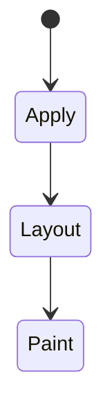
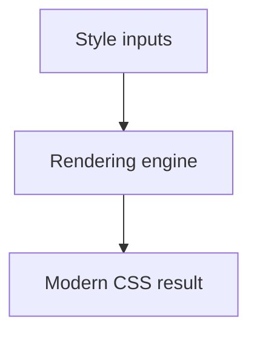

# Modern CSS

<TopicMeta />

<Prerequisites />

::: tip Published
This page meets the handbook **published** bar: deep explanation, ≥10 common mistakes, and official references. Further engine-level errata welcome via PR.
:::

## Introduction

**Modern CSS** covers recently stabilized features that replace tooling workarounds: native nesting, `:has()`, `color-mix()`, logical properties (`margin-inline`), `@layer`, container queries, and more.

## Why does it exist?

Less preprocessor/JS dependency for common UI patterns; better readability and performance when used thoughtfully.

## Historical Background

After a quieter period, CSS accelerated (2019–2025) with features long requested by authors.

## Mental Model

Prefer platform features with progressive enhancement. Use logical properties for internationalization. Feature-query when needed.

## Internal Workflow

1. Set a browser baseline.
2. Adopt logical properties and nesting in new code.
3. Use `:has()` carefully (performance + readability).
4. Prefer CSS for state that CSS can express.

## Lifecycle

Lifecycle for Modern CSS:



## Browser Perspective

Rendering engines apply Modern CSS during style/layout/paint as relevant. Debug with Elements + Performance.

## JavaScript Engine Perspective

CSS is applied by the rendering engine; JS only changes inputs (classes, style, attributes).

## React Perspective

React toggles class names/styles that exercise Modern CSS; prefer CSS for visual states when possible.

## Next.js Perspective

Works the same in Next.js apps; watch global CSS import order and CSS Modules.

## Server Perspective

SSR emits HTML/CSS classes; critical CSS strategies may inline rules involving this topic.

## Network Perspective

Stylesheets and font/image URLs related to this topic still load over HTTP caches.

## Memory Perspective

Layerized/composited results may consume GPU memory; prefer releasing unused large textures/images.

## Performance

Understand whether Modern CSS triggers layout, paint, or composite-only work.

## Production Example

Form invalid styling via `form:has(:invalid)` reduced JS class toggles for submit affordances.

## Code Examples

```css
.card {
  padding-inline: 1rem;
  &:hover { border-color: var(--brand); }
}
form:has(:invalid) .submit { opacity: 0.6; }
```

## Diagrams



## Common Mistakes

1. Misunderstanding when Modern CSS triggers layout vs paint vs composite
2. Copying snippets without checking browser support for edge features
3. Over-specifying selectors that make overrides brittle
4. Ignoring accessibility implications (motion, contrast, focus)
5. Optimizing visuals before measuring jank
6. :has() on extremely hot paths without profiling
7. Using modern features without a baseline policy
8. Missing a production edge case for 05-css.modern-css (#1)
9. Missing a production edge case for 05-css.modern-css (#2)
10. Missing a production edge case for 05-css.modern-css (#3)


## Best Practices

- Learn the mental model for Modern CSS before memorizing properties
- Verify in target browsers
- Keep fallbacks for progressive enhancement
- Document team conventions

## Anti-patterns

- Fighting the platform with !important and inline styles
- Animating layout properties without need
- Shipping unscoped experimental CSS to all browsers without testing

## Comparison

| Old workaround | Modern |
| --- | --- |
| Sass nesting | Native nesting |
| JS parent selector hacks | `:has()` |
| Physical margin-left | `margin-inline-start` |

## Interview Questions

### Easy

**Q:** What is modern CSS features?

**A:** Recently stabilized CSS such as nesting, `:has()`, layers, container queries, and logical properties that replace older hacks.

### Medium

**Q:** What is a logical property?

**A:** A property tied to writing-flow directions (inline/block) so layouts mirror correctly in RTL/LTR.

### Hard

**Q:** Risks of :has()?

**A:** Powerful but can be costly/confusing; keep selectors tight and test performance on large DOMs.

## Summary

- Modern CSS has a concrete layout/paint meaning in CSS
- Measure rendering impact
- Prefer simple, layered architecture
- Know official references

## References

- [web.dev: New responsive](https://web.dev/blog/new-responsive)
- [MDN: CSS Nesting](https://developer.mozilla.org/en-US/docs/Web/CSS/CSS_nesting)

<RelatedTopics />

Prev: [Layers](/05-css/layers/) · Next: [CSS Architecture](/05-css/css-architecture/)
