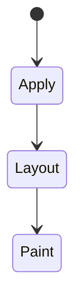
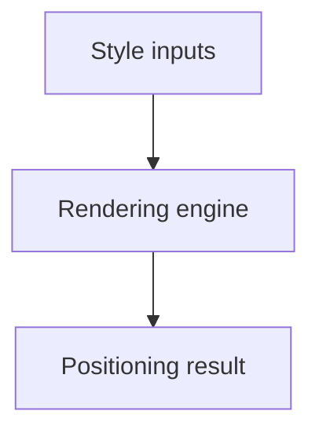

# Positioning

<TopicMeta />

<Prerequisites />

::: tip Published
This page meets the handbook **published** bar: deep explanation, ≥10 common mistakes, and official references. Further engine-level errata welcome via PR.
:::

## Introduction

**Positioning** schemes control how boxes are offset: `static` (normal flow), `relative` (offset without leaving flow space), `absolute`/`fixed` (removed from flow, positioned vs containing block), and `sticky` (hybrid of relative and fixed within a scroller).

## Why does it exist?

Overlays, tooltips, sticky headers, and badges depend on correct containing blocks—not magic z-index.

## Historical Background

Absolute/fixed came early; `sticky` arrived later and depends on ancestors’ overflow. Stacking contexts rules evolved with opacity/transform/filters.

## Mental Model

Find the containing block. Absolute uses nearest positioned ancestor (not `static`). Fixed uses the viewport (or a transformed ancestor). Sticky needs room to travel inside its ancestor.

## Internal Workflow

1. Choose scheme.
2. Identify containing block.
3. Set offsets.
4. Manage stacking (`z-index` only works on positioned/flex children etc.).
5. Check overflow ancestors clipping sticky/fixed.

## Lifecycle

Lifecycle for Positioning:



## Browser Perspective

Rendering engines apply Positioning during style/layout/paint as relevant. Debug with Elements + Performance.

## JavaScript Engine Perspective

CSS is applied by the rendering engine; JS only changes inputs (classes, style, attributes).

## React Perspective

React toggles class names/styles that exercise Positioning; prefer CSS for visual states when possible.

## Next.js Perspective

Works the same in Next.js apps; watch global CSS import order and CSS Modules.

## Server Perspective

SSR emits HTML/CSS classes; critical CSS strategies may inline rules involving this topic.

## Network Perspective

Stylesheets and font/image URLs related to this topic still load over HTTP caches.

## Memory Perspective

Layerized/composited results may consume GPU memory; prefer releasing unused large textures/images.

## Performance

`fixed`/`sticky` often promote layers; overuse increases memory. Prefer transform for movement when animating.

## Production Example

A sticky table header failed until an ancestor `overflow: hidden` was removed—fixed by restructuring the scroll container.

## Code Examples

```css
.header { position: sticky; top: 0; z-index: 10; }
.badge { position: absolute; top: 0; right: 0; }
.relative-wrap { position: relative; }
```

## Diagrams



## Common Mistakes

1. Misunderstanding when Positioning triggers layout vs paint vs composite
2. Copying snippets without checking browser support for edge features
3. Over-specifying selectors that make overrides brittle
4. Ignoring accessibility implications (motion, contrast, focus)
5. Optimizing visuals before measuring jank
6. Expecting z-index to work on static elements
7. Sticky broken by overflow on ancestors
8. Missing a production edge case for 05-css.positioning (#1)
9. Missing a production edge case for 05-css.positioning (#2)
10. Missing a production edge case for 05-css.positioning (#3)


## Best Practices

- Learn the mental model for Positioning before memorizing properties
- Verify in target browsers
- Keep fallbacks for progressive enhancement
- Document team conventions

## Anti-patterns

- Fighting the platform with !important and inline styles
- Animating layout properties without need
- Shipping unscoped experimental CSS to all browsers without testing

## Comparison

| Value | In flow? | Containing block |
| --- | --- | --- |
| relative | Yes | Normal |
| absolute | No | Nearest positioned |
| fixed | No | Viewport* |
| sticky | Yes | Scroll ancestor |

## Interview Questions

### Easy

**Q:** What is CSS positioning?

**A:** A set of schemes controlling offsets relative to containing blocks and whether boxes stay in normal flow.

### Medium

**Q:** Why did my sticky fail?

**A:** Often an ancestor has overflow hidden/auto creating a scroll container or clipping; sticky works within its sticky containing block constraints.

### Hard

**Q:** How do transforms affect fixed?

**A:** A transformed ancestor can become the containing block for fixed descendants, so `fixed` behaves more like absolute to that ancestor.

## Summary

- Positioning has a concrete layout/paint meaning in CSS
- Measure rendering impact
- Prefer simple, layered architecture
- Know official references

## References

- [MDN: position](https://developer.mozilla.org/en-US/docs/Web/CSS/position)
- [CSS Positioned Layout](https://www.w3.org/TR/css-position-3/)

<RelatedTopics />

Prev: [Box Model](/05-css/box-model/) · Next: [Flexbox](/05-css/flexbox/)
