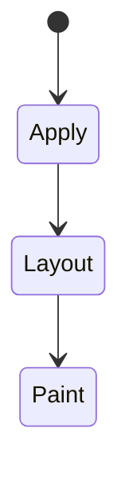
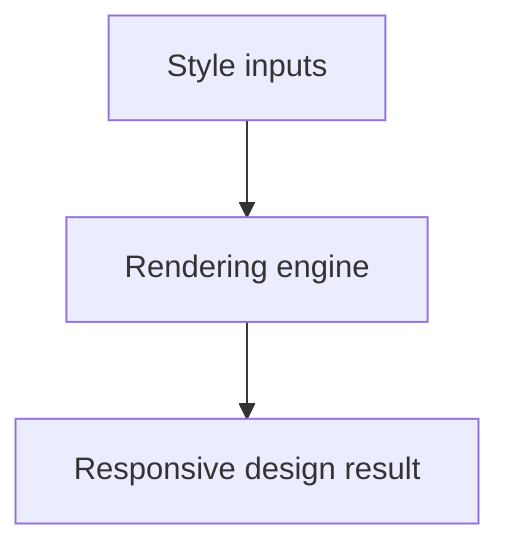

# Responsive Design

<TopicMeta />

<Prerequisites />

::: tip Published
This page meets the handbook **published** bar: deep explanation, ≥10 common mistakes, and official references. Further engine-level errata welcome via PR.
:::

## Introduction

**Responsive design** adapts UI across viewport sizes and input types using fluid layouts, flexible media, breakpoints, and increasingly container-based rules—not separate mobile sites.

## Why does it exist?

Users browse on phones, laptops, and TVs. One codebase with adaptable layout beats multiple fragmented sites.

## Historical Background

Ethan Marcotte’s responsive design (2010) popularized fluid grids + media queries. Today: `clamp()`, container queries, responsive images.

## Mental Model

Start from content width needs; use fluid type/spacing (`clamp`); add breakpoints when the layout breaks, not device brand names.

## Internal Workflow

1. Content-first mobile/base styles.
2. Fluid images (`max-width: 100%`) + `srcset`.
3. Breakpoints for nav/grid changes.
4. Test touch targets and keyboard.
5. Verify real devices/RUM.

## Lifecycle

Lifecycle for Responsive design:



## Browser Perspective

Rendering engines apply Responsive design during style/layout/paint as relevant. Debug with Elements + Performance.

## JavaScript Engine Perspective

CSS is applied by the rendering engine; JS only changes inputs (classes, style, attributes).

## React Perspective

React toggles class names/styles that exercise Responsive design; prefer CSS for visual states when possible.

## Next.js Perspective

Works the same in Next.js apps; watch global CSS import order and CSS Modules.

## Server Perspective

SSR emits HTML/CSS classes; critical CSS strategies may inline rules involving this topic.

## Network Perspective

Stylesheets and font/image URLs related to this topic still load over HTTP caches.

## Memory Perspective

Layerized/composited results may consume GPU memory; prefer releasing unused large textures/images.

## Performance

Understand whether Responsive design triggers layout, paint, or composite-only work.

## Production Example

Typography moved to `clamp(1rem, 0.9rem + 0.5vw, 1.25rem)`; fewer breakpoints and less jumpy scaling.

## Code Examples

```css
.prose { width: min(65ch, 100% - 2rem); margin-inline: auto; }
h1 { font-size: clamp(1.5rem, 1rem + 2vw, 2.5rem); }
@media (min-width: 64rem) { .nav { display: flex; } }
```

## Diagrams



## Common Mistakes

1. Misunderstanding when Responsive design triggers layout vs paint vs composite
2. Copying snippets without checking browser support for edge features
3. Over-specifying selectors that make overrides brittle
4. Ignoring accessibility implications (motion, contrast, focus)
5. Optimizing visuals before measuring jank
6. Designing only for specific device widths
7. Hiding content with display:none as the only “mobile strategy”
8. Missing a production edge case for 05-css.responsive-design (#1)
9. Missing a production edge case for 05-css.responsive-design (#2)
10. Missing a production edge case for 05-css.responsive-design (#3)


## Best Practices

- Learn the mental model for Responsive design before memorizing properties
- Verify in target browsers
- Keep fallbacks for progressive enhancement
- Document team conventions

## Anti-patterns

- Fighting the platform with !important and inline styles
- Animating layout properties without need
- Shipping unscoped experimental CSS to all browsers without testing

## Comparison

| Approach | Strength |
| --- | --- |
| Fluid + clamp | Smooth scaling |
| Media queries | Viewport breakpoints |
| Container queries | Component-level adaptation |

## Interview Questions

### Easy

**Q:** What is responsive design?

**A:** Building one layout system that adapts across viewport sizes and conditions instead of separate sites.

### Medium

**Q:** Fluid vs breakpoint-only?

**A:** Fluid techniques reduce discrete jumps; breakpoints restructure when content requires it.

### Hard

**Q:** How do responsive images fit?

**A:** `srcset`/`sizes`/`picture` serve appropriate resolution/art direction so layout adaptability isn’t wasted on huge downloads.

## Summary

- Responsive design has a concrete layout/paint meaning in CSS
- Measure rendering impact
- Prefer simple, layered architecture
- Know official references

## References

- [MDN: Responsive design](https://developer.mozilla.org/en-US/docs/Learn/CSS/CSS_layout/Responsive_Design)
- [web.dev: Responsive design](https://web.dev/learn/design/)

<RelatedTopics />

Prev: [Grid](/05-css/grid/) · Next: [Media Queries](/05-css/media-queries/)
