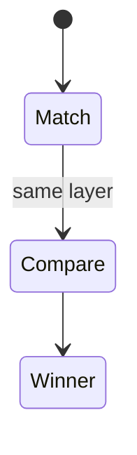
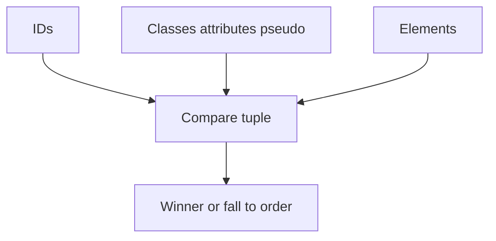

# Specificity

<TopicMeta />

<Prerequisites />

::: tip Published
This page meets the handbook **published** bar: deep explanation, ≥10 common mistakes, and official references. Further engine-level errata welcome via PR.
:::

## Introduction

**Specificity** is a tuple comparing how narrowly a selector matches: IDs beat classes/attributes/pseudo-classes, which beat elements/pseudo-elements. It is consulted only after origin/importance and cascade layers.

## Why does it exist?

When two author rules in the same layer conflict, specificity decides without needing source-order luck. Abuse (IDs, long chains) makes overrides painful.

## Historical Background

Specificity counting dates to early CSS. Modern practice favors class-based systems (BEM, CSS Modules, Tailwind) to keep weights flat; `@layer` further reduces need for escalation.

## Mental Model

Count (ignore universal `*` and the alone `:where()`). Example: `.nav .item.active` is three classes. `#app .item` includes one ID and wins over many classes. Inline `style=` beats selectors unless `!important` intervenes per cascade rules.

## Internal Workflow

1. Confirm both rules are same origin/layer.
2. Compare specificity tuples.
3. If equal, source order wins.
4. Prefer refactoring selectors over adding IDs.

## Lifecycle

Lifecycle for specificity:



## Browser Perspective

DevTools shows specificity-like reasons when hovering rules; crossed-out declarations often lost on specificity.

## JavaScript Engine Perspective

Not applicable to the JS engine beyond className changes triggering style recalc.

## React Perspective

CSS Modules hash class names but specificity is still usually one class—good. `:global` escapes can reintroduce wars.

## Next.js Perspective

Utility-first CSS keeps specificity flat by design.

## Server Perspective

Not applicable.

## Network Perspective

Not applicable.

## Memory Perspective

Negligible directly; selector matching cost can matter at huge DOM + complex selectors.

## Performance

Complex selectors (especially descendant chains) can slow matching/invalidation. Prefer shallow selectors.

## Production Example

A codebase banned IDs in CSS and capped selectors at two classes. Override time dropped; new features stopped shipping `#modal.modal.open`.

## Code Examples

```css
/* (0, 2, 1) */
nav .link:hover { color: blue; }
/* (1, 0, 0) wins in same layer */
#main { color: black; }
/* :where keeps specificity at zero */
:where(.btn) { padding: 0.5rem; }
```

## Diagrams



## Common Mistakes

1. Using IDs to win arguments with teammates
2. Counting `!important` as specificity (it is not)
3. Thinking inline styles always lose to classes
4. Ultra-long chains (`.a .b .c .d .e`) for structure
5. Forgetting `:is()` takes the most specific argument’s weight
6. Using `@layer` incorrectly then blaming specificity
7. Missing a production edge case for 05-css.specificity (#1)
8. Missing a production edge case for 05-css.specificity (#2)
9. Missing a production edge case for 05-css.specificity (#3)
10. Missing a production edge case for 05-css.specificity (#4)


## Best Practices

- Prefer single-class selectors for components
- Use `:where()` for low-power base rules
- Reserve IDs for JS hooks, not styling
- Document exceptions

## Anti-patterns

- Specificity climbing as a merge strategy
- Copying DevTools suggested selectors blindly
- Styling via `href`/`type` attributes unnecessarily

## Comparison

| Selector | Rough weight |
| --- | --- |
| `#id` | High |
| `.class`, `[attr]`, `:hover` | Medium |
| `div`, `::before` | Low |
| `:where(...)` | Zero |

## Interview Questions

### Easy

**Q:** What is CSS specificity?

**A:** A weight comparing selectors so the more specific rule wins when cascade origin/layer are equal.

### Medium

**Q:** Does `@layer` beat specificity?

**A:** Yes—layer order is compared before specificity.

### Hard

**Q:** How does `:is(.a, #b)` compute specificity?

**A:** It uses the most specific argument—here an ID—so the whole `:is()` carries ID weight.

## Summary

- Specificity is a tuple after layers
- Keep weights flat in apps
- `!important` ≠ specificity
- `:where` helps write low-power defaults

## References

- [MDN: Specificity](https://developer.mozilla.org/en-US/docs/Web/CSS/Specificity)
- [Selectors Level 4](https://www.w3.org/TR/selectors-4/)

<RelatedTopics />

Prev: [Cascade](/05-css/cascade/) · Next: [Inheritance](/05-css/inheritance/)
