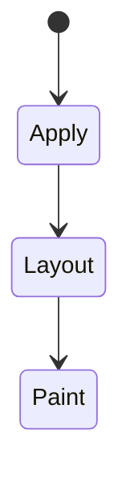
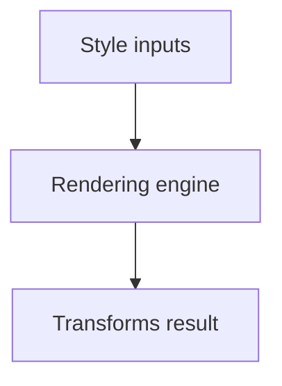

# Transforms

<TopicMeta />

<Prerequisites />

::: tip Published
This page meets the handbook **published** bar: deep explanation, ≥10 common mistakes, and official references. Further engine-level errata welcome via PR.
:::

## Introduction

**Transforms** visually move, scale, rotate, or skew elements via `transform` / individual transform properties without necessarily reflowing surrounding document layout the way `top`/`left` changes do.

## Why does it exist?

Compositor-friendly motion and UI effects. Also: a transformed element becomes a containing block for `fixed` descendants—critical side effect.

## Historical Background

2D then 3D transforms; individual properties (`translate`, `scale`, `rotate`) modernized composition.

## Mental Model

Transforms affect visual rendering and hit-testing; layout positions (for flow) often remain. Transformed boxes establish containing blocks and often stacking contexts.

## Internal Workflow

1. Prefer `translate` for movement.
2. Set `transform-origin` when rotating.
3. Beware fixed-position descendants.
4. Combine with `will-change` sparingly.

## Lifecycle

Lifecycle for Transforms:



## Browser Perspective

Rendering engines apply Transforms during style/layout/paint as relevant. Debug with Elements + Performance.

## JavaScript Engine Perspective

CSS is applied by the rendering engine; JS only changes inputs (classes, style, attributes).

## React Perspective

React toggles class names/styles that exercise Transforms; prefer CSS for visual states when possible.

## Next.js Perspective

Works the same in Next.js apps; watch global CSS import order and CSS Modules.

## Server Perspective

SSR emits HTML/CSS classes; critical CSS strategies may inline rules involving this topic.

## Network Perspective

Stylesheets and font/image URLs related to this topic still load over HTTP caches.

## Memory Perspective

Layerized/composited results may consume GPU memory; prefer releasing unused large textures/images.

## Performance

Understand whether Transforms triggers layout, paint, or composite-only work.

## Production Example

Modal animation used `translateY` instead of animating `top`, removing layout thrash during open.

## Code Examples

```css
.drawer { transform: translateX(-100%); transition: transform 200ms ease; }
.drawer.open { transform: translateX(0); }
```

## Diagrams



## Common Mistakes

1. Misunderstanding when Transforms triggers layout vs paint vs composite
2. Copying snippets without checking browser support for edge features
3. Over-specifying selectors that make overrides brittle
4. Ignoring accessibility implications (motion, contrast, focus)
5. Optimizing visuals before measuring jank
6. Animating left/top instead of translate
7. Unexpected fixed header trapped by transformed parent
8. Missing a production edge case for 05-css.transforms (#1)
9. Missing a production edge case for 05-css.transforms (#2)
10. Missing a production edge case for 05-css.transforms (#3)


## Best Practices

- Learn the mental model for Transforms before memorizing properties
- Verify in target browsers
- Keep fallbacks for progressive enhancement
- Document team conventions

## Anti-patterns

- Fighting the platform with !important and inline styles
- Animating layout properties without need
- Shipping unscoped experimental CSS to all browsers without testing

## Comparison

| Move with | Layout thrash risk |
| --- | --- |
| `top/left` | High |
| `transform` | Low (typical) |

## Interview Questions

### Easy

**Q:** What is CSS transforms?

**A:** Functions that change an element’s visual geometry (translate/scale/rotate/etc.) primarily at paint/composite time.

### Medium

**Q:** Impact on position:fixed?

**A:** A transformed ancestor can become the containing block, so fixed children stick to it instead of the viewport.

### Hard

**Q:** Why transforms for animation?

**A:** They typically avoid layout and can run on the compositor with opacity.

## Summary

- Transforms has a concrete layout/paint meaning in CSS
- Measure rendering impact
- Prefer simple, layered architecture
- Know official references

## References

- [MDN: transform](https://developer.mozilla.org/en-US/docs/Web/CSS/transform)
- [CSS Transforms](https://www.w3.org/TR/css-transforms-1/)

<RelatedTopics />

Prev: [Transitions](/05-css/transitions/) · Next: [Compositing](/05-css/compositing/)
