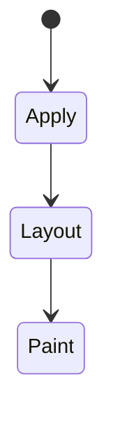
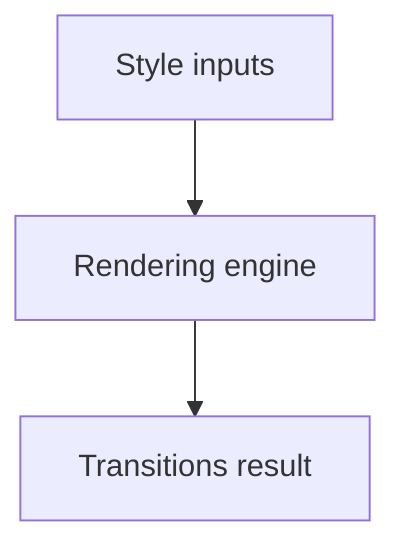

# Transitions

<TopicMeta />

<Prerequisites />

::: tip Published
This page meets the handbook **published** bar: deep explanation, ≥10 common mistakes, and official references. Further engine-level errata welcome via PR.
:::

## Introduction

**Transitions** animate property changes between states (e.g., class toggles, `:hover`) using `transition-property`, duration, and easing. No keyframes required for simple A→B moves.

## Why does it exist?

Subtle state feedback (hover, dialog open) improves UX when kept short and purposeful.

## Historical Background

Transitions arrived with CSS3 alongside transforms; widely used for UI chrome.

## Mental Model

Something must change the computed value. Discrete properties don’t interpolate smoothly. `transition: all` is a footgun.

## Internal Workflow

1. Identify properties that change.
2. Transition only those.
3. Keep durations ~150–300ms for UI.
4. Disable under reduced motion.

## Lifecycle

Lifecycle for Transitions:



## Browser Perspective

Rendering engines apply Transitions during style/layout/paint as relevant. Debug with Elements + Performance.

## JavaScript Engine Perspective

CSS is applied by the rendering engine; JS only changes inputs (classes, style, attributes).

## React Perspective

React toggles class names/styles that exercise Transitions; prefer CSS for visual states when possible.

## Next.js Perspective

Works the same in Next.js apps; watch global CSS import order and CSS Modules.

## Server Perspective

SSR emits HTML/CSS classes; critical CSS strategies may inline rules involving this topic.

## Network Perspective

Stylesheets and font/image URLs related to this topic still load over HTTP caches.

## Memory Perspective

Layerized/composited results may consume GPU memory; prefer releasing unused large textures/images.

## Performance

Understand whether Transitions triggers layout, paint, or composite-only work.

## Production Example

Sidebar width stopped transitioning `width` and used `transform: translateX` for smoother open/close.

## Code Examples

```css
.button {
  transition: background-color 150ms ease, transform 150ms ease;
}
.button:hover { transform: translateY(-1px); }
```

## Diagrams



## Common Mistakes

1. Misunderstanding when Transitions triggers layout vs paint vs composite
2. Copying snippets without checking browser support for edge features
3. Over-specifying selectors that make overrides brittle
4. Ignoring accessibility implications (motion, contrast, focus)
5. Optimizing visuals before measuring jank
6. `transition: all` causing accidental layout animation
7. Transitioning from `display: none` without tricks/WAAPI
8. Missing a production edge case for 05-css.transitions (#1)
9. Missing a production edge case for 05-css.transitions (#2)
10. Missing a production edge case for 05-css.transitions (#3)


## Best Practices

- Learn the mental model for Transitions before memorizing properties
- Verify in target browsers
- Keep fallbacks for progressive enhancement
- Document team conventions

## Anti-patterns

- Fighting the platform with !important and inline styles
- Animating layout properties without need
- Shipping unscoped experimental CSS to all browsers without testing

## Comparison

| Need | Prefer |
| --- | --- |
| Simple state change | Transition |
| Multi-step/loop | Animation |
| JS-driven timeline | Web Animations API |

## Interview Questions

### Easy

**Q:** What is CSS transitions?

**A:** Interpolations that run when a property’s value changes over a specified duration/easing.

### Medium

**Q:** Why won’t display:none transition?

**A:** Display is not interpolable; use opacity/visibility/transform or WAAPI with explicit keyframes and presence management.

### Hard

**Q:** Why avoid transition: all?

**A:** It can animate unexpected properties (e.g., layout) and hurt performance/clarity.

## Summary

- Transitions has a concrete layout/paint meaning in CSS
- Measure rendering impact
- Prefer simple, layered architecture
- Know official references

## References

- [MDN: Transitions](https://developer.mozilla.org/en-US/docs/Web/CSS/CSS_transitions)
- [CSS Transitions](https://www.w3.org/TR/css-transitions-1/)

<RelatedTopics />

Prev: [Animations](/05-css/animations/) · Next: [Transforms](/05-css/transforms/)
