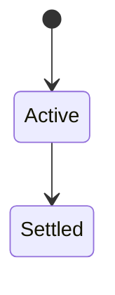
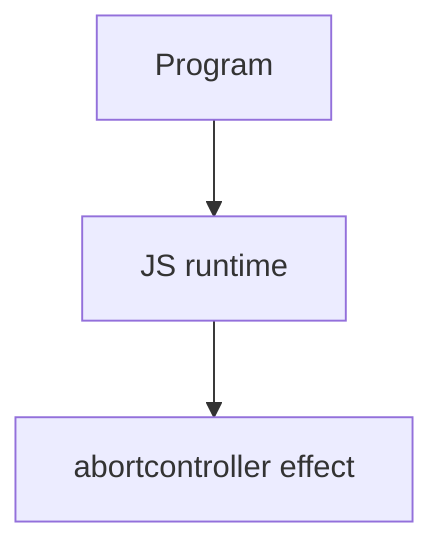

# AbortController

<TopicMeta />

<Prerequisites />

::: tip Published
This page meets the handbook **published** bar: deep explanation, ≥10 common mistakes, and official references. Further engine-level errata welcome via PR.
:::

## Introduction

**AbortController** creates an **AbortSignal** you pass to cancelable APIs (`fetch`). Aborting rejects fetch with `AbortError` and can notify custom listeners via `signal.addEventListener('abort')`.

## Why does it exist?

Without cancellation, SPA navigations leak in-flight work and apply stale results. Abort is the platform cancellation primitive.

## Historical Background

Added to the web platform; widely adopted beyond fetch (streams, addons).

## Mental Model

One controller → many listeners/signals. Abort is idempotent. Check `signal.aborted` before starting heavy work; pass signal downstream.

## Internal Workflow

1. Create controller per operation/route.
2. Abort on unmount/navigation.
3. Ignore AbortError in UI or treat as cancel.
4. Don’t reuse aborted controllers.

## Lifecycle

Lifecycle for abortcontroller:



## Browser Perspective

Browsers host the JS runtime; DevTools Sources/Console observe this topic at runtime.

## JavaScript Engine Perspective

Engines implement ECMAScript semantics (V8/JavaScriptCore/SpiderMonkey); optimize hot paths after correctness.

## React Perspective

Effect cleanup should abort in-flight fetches tied to that effect instance.

## Next.js Perspective

Next.js runs JS in Node/Edge and the browser; verify APIs exist in each runtime.

## Server Perspective

Node/Edge may implement the same language feature with different host APIs.

## Network Perspective

Not primarily a network feature unless combined with fetch/HTTP.

## Memory Perspective

Watch retained objects via DevTools Memory; closures and globals keep references alive.

## Performance

Measure with Performance panel / benchmarks before micro-optimizing.

## Production Example

React route changes aborted prior fetches; “setState on unmounted” warnings and stale overwrites dropped to near zero.

## Code Examples

```js
const c = new AbortController()
fetch('/slow', { signal: c.signal }).catch(err => {
  if (err.name === 'AbortError') return
  throw err
})
c.abort()
```

## Diagrams



## Common Mistakes

1. Treating the feature as magic without the language rule behind it
2. Copying Stack Overflow snippets without edge cases
3. Confusing browser host APIs with ECMAScript language semantics
4. Optimizing before measuring
5. Ignoring strict mode / module differences
6. Reusing an aborted controller
7. Treating AbortError as a user-visible hard failure
8. Missing a production edge case for 06-javascript.abortcontroller (#1)
9. Missing a production edge case for 06-javascript.abortcontroller (#2)
10. Missing a production edge case for 06-javascript.abortcontroller (#3)


## Best Practices

- Prefer language defaults and clear naming
- Write a failing test for the sharp edge you hit
- Use MDN + ECMA-262 for disagreements
- Keep examples small and runnable

## Anti-patterns

- Clever code that obscures control flow
- Polyfilling incorrectly and masking bugs
- Global mutable state as the default architecture

## Comparison

| Mechanism | Use |
| --- | --- |
| AbortSignal | Platform cancel |
| boolean flag | DIY cooperative |
| Promise.race timeout | Prefer AbortSignal.timeout |

## Interview Questions

### Easy

**Q:** What is AbortController?

**A:** A controller producing a signal that cancelable async APIs observe to abort work.

### Medium

**Q:** How do you timeout fetch?

**A:** `AbortSignal.timeout(ms)` or abort a controller from `setTimeout`.

### Hard

**Q:** How to wire React effects?

**A:** Create controller in effect; abort in cleanup function.

## Summary

- abortcontroller has precise ECMAScript/host semantics
- Know failure modes and scope interactions
- Measure production impact
- Cross-link related handbook topics

## References

- [MDN: AbortController](https://developer.mozilla.org/en-US/docs/Web/API/AbortController)
- [DOM Standard — Aborting](https://dom.spec.whatwg.org/#aborting-ongoing-activities)

<RelatedTopics />

Prev: [Fetch API](/06-javascript/fetch-api/) · Next: [Proxy](/06-javascript/proxy/)
