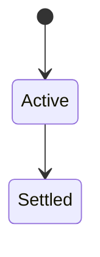
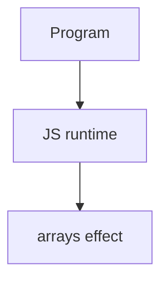

# Arrays

<TopicMeta />

<Prerequisites />

::: tip Published
This page meets the handbook **published** bar: deep explanation, ≥10 common mistakes, and official references. Further engine-level errata welcome via PR.
:::

## Introduction

**Arrays** are objects with length and indexed elements, plus highly optimized methods. Understand mutation vs non-mutation (`push` vs `toSorted`/`map`), holes, and iteration protocols.

## Why does it exist?

UI lists, data transforms, and performance-sensitive loops all center on arrays.

## Historical Background

Array extras (ES5) then typed arrays / modern non-mutating methods (`toSorted`, `with`).

## Mental Model

Dense vs sparse. Methods that skip holes vs not. Prefer map/filter for transforms; for loops for hot paths when measured.

## Internal Workflow

1. Prefer non-mutating transforms in React state.
2. Use `Array.isArray`.
3. Know `sort` mutates (or use `toSorted`).
4. Avoid sparse arrays intentionally.

## Lifecycle

Lifecycle for arrays:



## Browser Perspective

Browsers host the JS runtime; DevTools Sources/Console observe this topic at runtime.

## JavaScript Engine Perspective

Engines implement ECMAScript semantics (V8/JavaScriptCore/SpiderMonkey); optimize hot paths after correctness.

## React Perspective

Never mutate arrays in state; copy with map/filter/toSorted.

## Next.js Perspective

Next.js runs JS in Node/Edge and the browser; verify APIs exist in each runtime.

## Server Perspective

Node/Edge may implement the same language feature with different host APIs.

## Network Perspective

Not primarily a network feature unless combined with fetch/HTTP.

## Memory Perspective

Watch retained objects via DevTools Memory; closures and globals keep references alive.

## Performance

Measure with Performance panel / benchmarks before micro-optimizing.

## Production Example

React list updates switched to immutable `map`/`toSpliced` patterns; accidental shared mutations disappeared.

## Code Examples

```js
const a = [3, 1, 2]
const b = a.toSorted((x, y) => x - y) // non-mutating
a.map(x => x * 2)
```

## Diagrams



## Common Mistakes

1. Treating the feature as magic without the language rule behind it
2. Copying Stack Overflow snippets without edge cases
3. Confusing browser host APIs with ECMAScript language semantics
4. Optimizing before measuring
5. Ignoring strict mode / module differences
6. Using sort without comparator for numbers
7. Mutating state arrays in place in React
8. Missing a production edge case for 06-javascript.arrays (#1)
9. Missing a production edge case for 06-javascript.arrays (#2)
10. Missing a production edge case for 06-javascript.arrays (#3)


## Best Practices

- Prefer language defaults and clear naming
- Write a failing test for the sharp edge you hit
- Use MDN + ECMA-262 for disagreements
- Keep examples small and runnable

## Anti-patterns

- Clever code that obscures control flow
- Polyfilling incorrectly and masking bugs
- Global mutable state as the default architecture

## Comparison

| Method | Mutates? |
| --- | --- |
| `push/splice/sort` | Yes |
| `map/filter/toSorted` | No |

## Interview Questions

### Easy

**Q:** What is JS arrays?

**A:** Ordered, length-tracking indexed collections with rich transformation methods.

### Medium

**Q:** Why is sort weird for numbers?

**A:** Default sort converts to strings; provide a numeric comparator.

### Hard

**Q:** map vs forEach?

**A:** `map` builds a new array of results; `forEach` is for side effects and returns undefined.

## Summary

- arrays has precise ECMAScript/host semantics
- Know failure modes and scope interactions
- Measure production impact
- Cross-link related handbook topics

## References

- [MDN: Array](https://developer.mozilla.org/en-US/docs/Web/JavaScript/Reference/Global_Objects/Array)
- [ECMA-262](https://tc39.es/ecma262/)

<RelatedTopics />

Prev: [Objects](/06-javascript/objects/) · Next: [Modules](/06-javascript/modules/)
