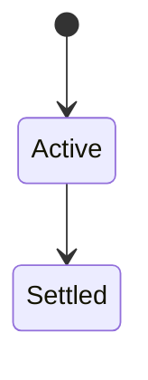
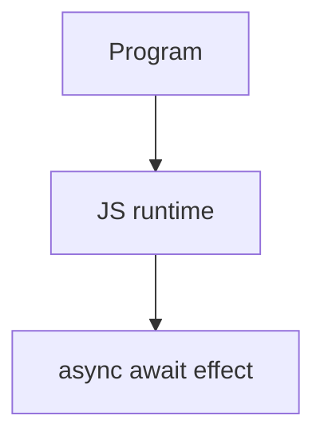

# Async/Await

<TopicMeta />

<Prerequisites />

::: tip Published
This page meets the handbook **published** bar: deep explanation, ≥10 common mistakes, and official references. Further engine-level errata welcome via PR.
:::

## Introduction

**`async` functions** always return promises. **`await`** pauses the function, waiting for a thenable settlement, then resumes via a microtask. Errors throw into `try/catch`.

## Why does it exist?

Readable control flow for sequential async steps without nested `then` chains—while still being promises underneath.

## Historical Background

ES2017; built directly on Promise semantics + jobs.

## Mental Model

`await` only delays the async function, not the whole program. Parallelism needs starting promises before awaiting them together.

## Internal Workflow

1. Use try/catch around await.
2. Start independent work early.
3. Don’t ignore returned promises.
4. Combine with AbortSignal.

## Lifecycle

Lifecycle for async await:



## Browser Perspective

Browsers host the JS runtime; DevTools Sources/Console observe this topic at runtime.

## JavaScript Engine Perspective

Engines implement ECMAScript semantics (V8/JavaScriptCore/SpiderMonkey); optimize hot paths after correctness.

## React Perspective

React app code is JS—misunderstanding this topic often shows up as stale UI state or broken effects.

## Next.js Perspective

Next.js runs JS in Node/Edge and the browser; verify APIs exist in each runtime.

## Server Perspective

Node/Edge may implement the same language feature with different host APIs.

## Network Perspective

Not primarily a network feature unless combined with fetch/HTTP.

## Memory Perspective

Watch retained objects via DevTools Memory; closures and globals keep references alive.

## Performance

Measure with Performance panel / benchmarks before micro-optimizing.

## Production Example

Serial awaits in a map were replaced with `Promise.all` + async mapper; wall time dropped ~5×.

## Code Examples

```js
async function load() {
  try {
    const a = fetch('/a')
    const b = fetch('/b')
    const [ra, rb] = await Promise.all([a, b])
    return [await ra.json(), await rb.json()]
  } catch (e) {
    console.error(e)
    throw e
  }
}
```

## Diagrams



## Common Mistakes

1. Treating the feature as magic without the language rule behind it
2. Copying Stack Overflow snippets without edge cases
3. Confusing browser host APIs with ECMAScript language semantics
4. Optimizing before measuring
5. Ignoring strict mode / module differences
6. Serial await in loops for independent requests
7. Forgetting async function returns a promise to callers
8. Missing a production edge case for 06-javascript.async-await (#1)
9. Missing a production edge case for 06-javascript.async-await (#2)
10. Missing a production edge case for 06-javascript.async-await (#3)


## Best Practices

- Prefer language defaults and clear naming
- Write a failing test for the sharp edge you hit
- Use MDN + ECMA-262 for disagreements
- Keep examples small and runnable

## Anti-patterns

- Clever code that obscures control flow
- Polyfilling incorrectly and masking bugs
- Global mutable state as the default architecture

## Comparison

| Style | Readability | Parallelism control |
| --- | --- | --- |
| then chains | Medium | Explicit |
| async/await | High | Easy to accidental-serial |

## Interview Questions

### Easy

**Q:** What is async/await?

**A:** Syntax sugar over promises: await pauses an async function until settlement; errors become throws.

### Medium

**Q:** Does await block the JS thread?

**A:** No—it yields so other tasks/microtasks can run; only the async function is suspended.

### Hard

**Q:** How to await in parallel?

**A:** Start promises first, then await Promise.all (or similar).

## Summary

- async await has precise ECMAScript/host semantics
- Know failure modes and scope interactions
- Measure production impact
- Cross-link related handbook topics

## References

- [MDN: async function](https://developer.mozilla.org/en-US/docs/Web/JavaScript/Reference/Statements/async_function)
- [ECMA-262](https://tc39.es/ecma262/)

<RelatedTopics />

Prev: [Promise](/06-javascript/promise/) · Next: [Generator](/06-javascript/generator/)
