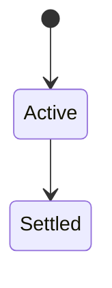
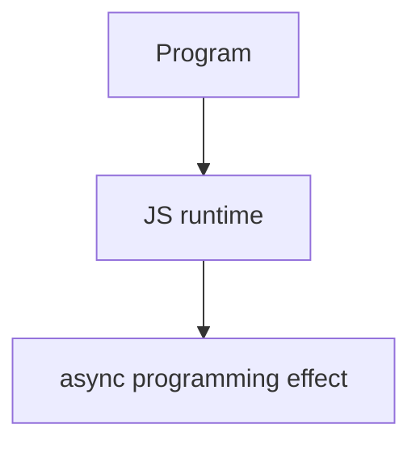

# Async Programming

<TopicMeta />

<Prerequisites />

::: tip Published
This page meets the handbook **published** bar: deep explanation, ≥10 common mistakes, and official references. Further engine-level errata welcome via PR.
:::

## Introduction

**Async programming** coordinates waiting (I/O, timers) without blocking the main thread. JS uses callbacks → Promises → `async`/`await` on a single-threaded event loop with concurrency via interleaving, not parallel JS (unless workers).

## Why does it exist?

Networks and timers are slow. Blocking the main thread freezes UI; async keeps apps responsive.

## Historical Background

Callback era → Promises (ES2015) → async/await (ES2017) → cancellation via AbortSignal patterns.

## Mental Model

Start async work, continue other tasks, resume on completion. Errors become rejections. Never forget to handle failures.

## Internal Workflow

1. Prefer async/await for linear flows.
2. Use Promise.all carefully (fail-fast).
3. Propagate AbortSignal.
4. Don’t await in serial when parallel is safe.

## Lifecycle

Lifecycle for async programming:



## Browser Perspective

Browsers host the JS runtime; DevTools Sources/Console observe this topic at runtime.

## JavaScript Engine Perspective

Engines implement ECMAScript semantics (V8/JavaScriptCore/SpiderMonkey); optimize hot paths after correctness.

## React Perspective

React app code is JS—misunderstanding this topic often shows up as stale UI state or broken effects.

## Next.js Perspective

Next.js runs JS in Node/Edge and the browser; verify APIs exist in each runtime.

## Server Perspective

Node/Edge may implement the same language feature with different host APIs.

## Network Perspective

Most async UI work waits on network; pair with HTTP caching and timeouts.

## Memory Perspective

Watch retained objects via DevTools Memory; closures and globals keep references alive.

## Performance

Measure with Performance panel / benchmarks before micro-optimizing.

## Production Example

Checkout refactored nested callbacks to async/await + AbortController; timeout errors became typed and UX-recoverable.

## Code Examples

```js
async function loadUser(id, signal) {
  const res = await fetch(`/api/users/${id}`, { signal })
  if (!res.ok) throw new Error('load failed')
  return res.json()
}
```

## Diagrams



## Common Mistakes

1. Treating the feature as magic without the language rule behind it
2. Copying Stack Overflow snippets without edge cases
3. Confusing browser host APIs with ECMAScript language semantics
4. Optimizing before measuring
5. Ignoring strict mode / module differences
6. Awaiting in a loop when Promise.all was correct
7. Swallowing rejections silently
8. Missing a production edge case for 06-javascript.async-programming (#1)
9. Missing a production edge case for 06-javascript.async-programming (#2)
10. Missing a production edge case for 06-javascript.async-programming (#3)


## Best Practices

- Prefer language defaults and clear naming
- Write a failing test for the sharp edge you hit
- Use MDN + ECMA-262 for disagreements
- Keep examples small and runnable

## Anti-patterns

- Clever code that obscures control flow
- Polyfilling incorrectly and masking bugs
- Global mutable state as the default architecture

## Comparison

| Style | Pros |
| --- | --- |
| Callbacks | Simple hosts |
| Promises | Composable |
| async/await | Readable control flow |

## Interview Questions

### Easy

**Q:** What is async programming in JS?

**A:** Coordinating delayed work via the event loop using callbacks/promises/async-await without blocking the thread.

### Medium

**Q:** Concurrency vs parallelism?

**A:** JS concurrency interleaves tasks on one thread; parallelism needs workers/WASM threads/etc.

### Hard

**Q:** How do you cancel work?

**A:** AbortController/AbortSignal for fetch and custom cooperative cancellation.

## Summary

- async programming has precise ECMAScript/host semantics
- Know failure modes and scope interactions
- Measure production impact
- Cross-link related handbook topics

## References

- [MDN: Asynchronous JS](https://developer.mozilla.org/en-US/docs/Learn/JavaScript/Asynchronous)
- [TC39 Promises](https://tc39.es/ecma262/#sec-promise-objects)

<RelatedTopics />

Prev: [CommonJS](/06-javascript/commonjs/) · Next: [Event Loop (JavaScript View)](/06-javascript/event-loop-js/)
