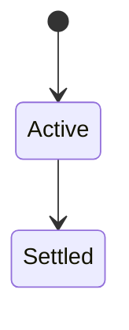
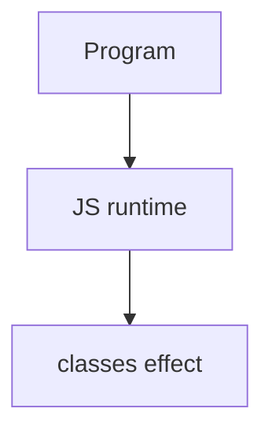

# Classes

<TopicMeta />

<Prerequisites />

::: tip Published
This page meets the handbook **published** bar: deep explanation, ≥10 common mistakes, and official references. Further engine-level errata welcome via PR.
:::

## Introduction

**Classes** (`class`) provide cleaner syntax for constructor functions + prototype methods, with `extends`/`super`, instance fields, and private `#fields`. Underneath, prototypes still exist.

## Why does it exist?

Shared APIs for OO patterns without hand-rolling prototype wiring—still JS, not Java.

## Historical Background

ES2015 classes standardized widely used patterns; later: private fields, static blocks.

## Mental Model

Class body declares methods on prototype; fields on instances. `extends` links prototype chains. `super` calls parent constructor/methods.

## Internal Workflow

1. Prefer composition when inheritance deepens.
2. Call `super()` before using `this` in subclass constructors.
3. Use private fields for encapsulation.
4. Don’t expect Java-like overloads.

## Lifecycle

Lifecycle for classes:



## Browser Perspective

Browsers host the JS runtime; DevTools Sources/Console observe this topic at runtime.

## JavaScript Engine Perspective

Engines implement ECMAScript semantics (V8/JavaScriptCore/SpiderMonkey); optimize hot paths after correctness.

## React Perspective

React app code is JS—misunderstanding this topic often shows up as stale UI state or broken effects.

## Next.js Perspective

Next.js runs JS in Node/Edge and the browser; verify APIs exist in each runtime.

## Server Perspective

Node/Edge may implement the same language feature with different host APIs.

## Network Perspective

Not primarily a network feature unless combined with fetch/HTTP.

## Memory Perspective

Watch retained objects via DevTools Memory; closures and globals keep references alive.

## Performance

Measure with Performance panel / benchmarks before micro-optimizing.

## Production Example

Migrating constructor functions to classes clarified `super` bugs and made private state possible with `#`.

## Code Examples

```js
class Animal {
  #energy = 10
  constructor(name) { this.name = name }
  speak() { return `${this.name}` }
}
class Dog extends Animal {
  speak() { return super.speak() + ' woof' }
}
```

## Diagrams



## Common Mistakes

1. Treating the feature as magic without the language rule behind it
2. Copying Stack Overflow snippets without edge cases
3. Confusing browser host APIs with ECMAScript language semantics
4. Optimizing before measuring
5. Ignoring strict mode / module differences
6. Forgetting super() in derived constructors
7. Assuming class methods are auto-bound
8. Missing a production edge case for 06-javascript.classes (#1)
9. Missing a production edge case for 06-javascript.classes (#2)
10. Missing a production edge case for 06-javascript.classes (#3)


## Best Practices

- Prefer language defaults and clear naming
- Write a failing test for the sharp edge you hit
- Use MDN + ECMA-262 for disagreements
- Keep examples small and runnable

## Anti-patterns

- Clever code that obscures control flow
- Polyfilling incorrectly and masking bugs
- Global mutable state as the default architecture

## Comparison

| Feature | Class | Function+proto |
| --- | --- | --- |
| Syntax | Clear | Manual |
| Privacy | `#` fields | Closures/WeakMaps |
| Runtime | Same prototype model | Same |

## Interview Questions

### Easy

**Q:** What is JS classes?

**A:** Syntactic sugar over prototypes providing constructors, methods, extends/super, and fields.

### Medium

**Q:** Are class methods enumerable on instances?

**A:** Methods live on the prototype (non-enumerable typically); fields are per-instance.

### Hard

**Q:** Private fields semantics?

**A:** `#x` is scoped to the class; access from outsiders throws; not just underscore convention.

## Summary

- classes has precise ECMAScript/host semantics
- Know failure modes and scope interactions
- Measure production impact
- Cross-link related handbook topics

## References

- [MDN: Classes](https://developer.mozilla.org/en-US/docs/Web/JavaScript/Reference/Classes)
- [ECMA-262: Class Definitions](https://tc39.es/ecma262/)

<RelatedTopics />

Prev: [this](/06-javascript/this/) · Next: [Functions](/06-javascript/functions/)
