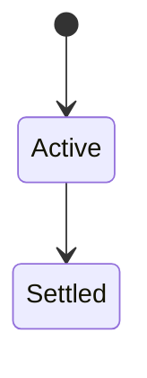
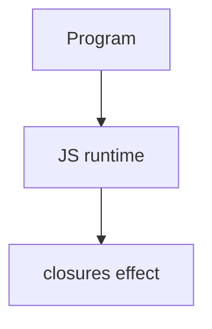

# Closures

<TopicMeta />

<Prerequisites />

::: tip Published
This page meets the handbook **published** bar: deep explanation, ≥10 common mistakes, and official references. Further engine-level errata welcome via PR.
:::

## Introduction

A **closure** is a function bundled with references to its surrounding lexical environment. Inner functions can read/write outer variables even after the outer function has returned.

## Why does it exist?

Closures enable data privacy, factories, React state updaters’ mental models, and callbacks that remember context—without global variables.

## Historical Background

Classic Scheme/JS concept; ubiquitous once nested functions + GC became normal.

## Mental Model

The inner function keeps the outer environment alive. Multiple closures from one outer call share that environment unless you create fresh bindings per iteration (`let` in loops).

## Internal Workflow

1. Identify captured variables.
2. Ensure loop bindings are per-iteration when needed.
3. Avoid capturing huge objects unintentionally.
4. Return small APIs over closed state (module/revealing pattern).

## Lifecycle

Lifecycle for closures:



## Browser Perspective

Browsers host the JS runtime; DevTools Sources/Console observe this topic at runtime.

## JavaScript Engine Perspective

Engines implement ECMAScript semantics (V8/JavaScriptCore/SpiderMonkey); optimize hot paths after correctness.

## React Perspective

Stale closures in effects/event handlers happen when callbacks capture old props/state—fix with correct deps or functional updates.

## Next.js Perspective

Next.js runs JS in Node/Edge and the browser; verify APIs exist in each runtime.

## Server Perspective

Node/Edge may implement the same language feature with different host APIs.

## Network Perspective

Not primarily a network feature unless combined with fetch/HTTP.

## Memory Perspective

Captured bindings keep heap objects alive for the closure’s lifetime.

## Performance

Measure with Performance panel / benchmarks before micro-optimizing.

## Production Example

A `makeCounter()` factory replaced ad-hoc globals; tests could create isolated counters per case.

## Code Examples

```js
function makeCounter() {
  let n = 0
  return () => ++n
}
const c = makeCounter()
c(); c() // 2

// classic bug with var:
for (var i = 0; i < 3; i++) setTimeout(() => console.log(i), 0) // 3,3,3
```

## Diagrams



## Common Mistakes

1. Treating the feature as magic without the language rule behind it
2. Copying Stack Overflow snippets without edge cases
3. Confusing browser host APIs with ECMAScript language semantics
4. Optimizing before measuring
5. Ignoring strict mode / module differences
6. Loop + var + async callback sharing one binding
7. Closures retaining DOM nodes → memory leaks
8. Creating closures in hot loops that capture large objects unintentionally
9. Using closures as a substitute for proper module boundaries forever
10. Mutating closed-over objects and wondering why “copies” share state


## Best Practices

- Prefer language defaults and clear naming
- Write a failing test for the sharp edge you hit
- Use MDN + ECMA-262 for disagreements
- Keep examples small and runnable

## Anti-patterns

- Clever code that obscures control flow
- Polyfilling incorrectly and masking bugs
- Global mutable state as the default architecture

## Comparison

| Pattern | Uses closures |
| --- | --- |
| Partial application | Yes |
| Module privacy | Yes |
| React hooks internals | Yes (environment) |

## Interview Questions

### Easy

**Q:** What is a closure?

**A:** A function that retains access to variables from its lexical scope even after that scope’s call completed.

### Medium

**Q:** Why does var in a for-loop break async callbacks?

**A:** One function-scoped `i` shared by all callbacks; with `let`, each iteration has a fresh binding.

### Hard

**Q:** How can closures leak memory?

**A:** They keep outer variables reachable; capturing large DOM trees or unused caches prevents GC until the function is dropped.

## Summary

- closures has precise ECMAScript/host semantics
- Know failure modes and scope interactions
- Measure production impact
- Cross-link related handbook topics

## References

- [MDN: Closures](https://developer.mozilla.org/en-US/docs/Web/JavaScript/Guide/Closures)
- [ECMA-262](https://tc39.es/ecma262/)

<RelatedTopics />

Prev: [Scope](/06-javascript/scope/) · Next: [Hoisting](/06-javascript/hoisting/)
