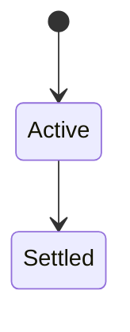
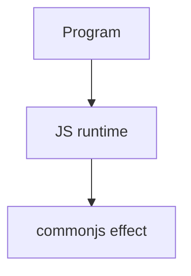

# CommonJS

<TopicMeta />

<Prerequisites />

::: tip Published
This page meets the handbook **published** bar: deep explanation, ≥10 common mistakes, and official references. Further engine-level errata welcome via PR.
:::

## Introduction

**CommonJS** loads modules with `require`, returning `module.exports`. It is synchronous and still widespread in Node ecosystems, but differs sharply from ESM semantics.

## Why does it exist?

Legacy Node code and many packages still ship CJS. Engineers must read, maintain, and interoperate safely.

## Historical Background

Node’s original module system before ESM; bundlers emulated it for browsers.

## Mental Model

`require` is runtime and dynamic; exports are values snapshot-ish via `module.exports` object reference. Cycles return partial exports.

## Internal Workflow

1. Know when a package is CJS vs ESM.
2. Use `createRequire` / documented interop.
3. Avoid dual publishing mistakes.
4. Prefer ESM for new Node apps when possible.

## Lifecycle

Lifecycle for commonjs:



## Browser Perspective

Browsers host the JS runtime; DevTools Sources/Console observe this topic at runtime.

## JavaScript Engine Perspective

Engines implement ECMAScript semantics (V8/JavaScriptCore/SpiderMonkey); optimize hot paths after correctness.

## React Perspective

React app code is JS—misunderstanding this topic often shows up as stale UI state or broken effects.

## Next.js Perspective

Next.js runs JS in Node/Edge and the browser; verify APIs exist in each runtime.

## Server Perspective

CJS is primarily a Node/host concern; browsers don’t have native require.

## Network Perspective

Not primarily a network feature unless combined with fetch/HTTP.

## Memory Perspective

Watch retained objects via DevTools Memory; closures and globals keep references alive.

## Performance

Measure with Performance panel / benchmarks before micro-optimizing.

## Production Example

A dual-package hazard caused “two Reacts” until exports were fixed to a single module type path.

## Code Examples

```js
// cjs
const fs = require('fs')
module.exports = { read: (p) => fs.readFileSync(p, 'utf8') }
```

## Diagrams



## Common Mistakes

1. Treating the feature as magic without the language rule behind it
2. Copying Stack Overflow snippets without edge cases
3. Confusing browser host APIs with ECMAScript language semantics
4. Optimizing before measuring
5. Ignoring strict mode / module differences
6. require of ESM-only package without interop
7. Mutating exports after require inconsistently across consumers
8. Missing a production edge case for 06-javascript.commonjs (#1)
9. Missing a production edge case for 06-javascript.commonjs (#2)
10. Missing a production edge case for 06-javascript.commonjs (#3)


## Best Practices

- Prefer language defaults and clear naming
- Write a failing test for the sharp edge you hit
- Use MDN + ECMA-262 for disagreements
- Keep examples small and runnable

## Anti-patterns

- Clever code that obscures control flow
- Polyfilling incorrectly and masking bugs
- Global mutable state as the default architecture

## Comparison

| | CJS | ESM |
| --- | --- | --- |
| Load | `require` sync | static/dynamic |
| this | wrappers | undefined top-level |
| Browser | via bundler | native |

## Interview Questions

### Easy

**Q:** What is CommonJS?

**A:** Node’s original `require`/`module.exports` module system with synchronous loading.

### Medium

**Q:** Can you require ESM?

**A:** Only with specific interop paths; pure ESM packages may need dynamic `import()`.

### Hard

**Q:** Why dual package hazard?

**A:** Two module formats can accidentally load two copies of a library, breaking singletons like React.

## Summary

- commonjs has precise ECMAScript/host semantics
- Know failure modes and scope interactions
- Measure production impact
- Cross-link related handbook topics

## References

- [Node.js CommonJS](https://nodejs.org/api/modules.html)
- [Node.js ESM interop](https://nodejs.org/api/esm.html)

<RelatedTopics />

Prev: [ES Modules](/06-javascript/es-modules/) · Next: [Async Programming](/06-javascript/async-programming/)
