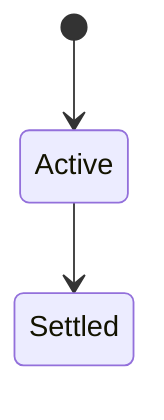
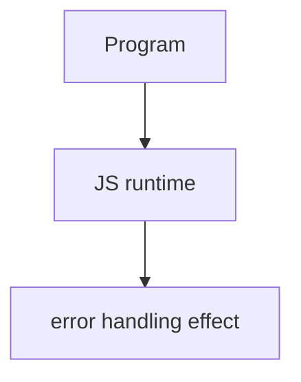

# Error Handling

<TopicMeta />

<Prerequisites />

::: tip Published
This page meets the handbook **published** bar: deep explanation, ≥10 common mistakes, and official references. Further engine-level errata welcome via PR.
:::

## Introduction

**Error handling** covers throwing `Error` objects, `try/catch/finally`, async rejections, and choosing between expected failures vs programmer bugs. Consistent error types make UX and logging possible.

## Why does it exist?

Failure is normal in networks/UI. Uncaught errors crash experiences; swallowed errors hide outages.

## Historical Background

From callbacks’ `(err, value)` to Promises/async and optional `AggregateError`/`cause`.

## Mental Model

Throw Errors with messages/causes. Catch near boundaries (UI/API). Don’t catch-and-ignore. Map to user-safe messages.

## Internal Workflow

1. Use Error subclasses/names.
2. Set `cause` when wrapping.
3. Handle await with try/catch.
4. Log with correlation IDs at boundaries.

## Lifecycle

Lifecycle for error handling:



## Browser Perspective

Browsers host the JS runtime; DevTools Sources/Console observe this topic at runtime.

## JavaScript Engine Perspective

Engines implement ECMAScript semantics (V8/JavaScriptCore/SpiderMonkey); optimize hot paths after correctness.

## React Perspective

React app code is JS—misunderstanding this topic often shows up as stale UI state or broken effects.

## Next.js Perspective

Next.js runs JS in Node/Edge and the browser; verify APIs exist in each runtime.

## Server Perspective

Node/Edge may implement the same language feature with different host APIs.

## Network Perspective

Not primarily a network feature unless combined with fetch/HTTP.

## Memory Perspective

Watch retained objects via DevTools Memory; closures and globals keep references alive.

## Performance

Measure with Performance panel / benchmarks before micro-optimizing.

## Production Example

API client wrapped failures with `{ cause }` preserving stack; support could distinguish 401 vs parse errors from one alert.

## Code Examples

```js
try {
  await load()
} catch (err) {
  throw new Error('Failed to load profile', { cause: err })
}
```

## Diagrams



## Common Mistakes

1. Treating the feature as magic without the language rule behind it
2. Copying Stack Overflow snippets without edge cases
3. Confusing browser host APIs with ECMAScript language semantics
4. Optimizing before measuring
5. Ignoring strict mode / module differences
6. Empty catch blocks
7. Throwing strings instead of Error
8. Missing a production edge case for 06-javascript.error-handling (#1)
9. Missing a production edge case for 06-javascript.error-handling (#2)
10. Missing a production edge case for 06-javascript.error-handling (#3)


## Best Practices

- Prefer language defaults and clear naming
- Write a failing test for the sharp edge you hit
- Use MDN + ECMA-262 for disagreements
- Keep examples small and runnable

## Anti-patterns

- Clever code that obscures control flow
- Polyfilling incorrectly and masking bugs
- Global mutable state as the default architecture

## Comparison

| Channel | Mechanism |
| --- | --- |
| Sync | throw/try |
| Promise | reject/catch |
| Event | error events |

## Interview Questions

### Easy

**Q:** What is error handling in JS?

**A:** Using throw/try/catch and promise rejections to manage failures with Error objects and boundary handling.

### Medium

**Q:** Why Error over string throw?

**A:** Stacks, names, causes, and consistent tooling expect Error instances.

### Hard

**Q:** How to handle async errors?

**A:** try/catch around await, or .catch; listen for unhandledrejection in diagnostics.

## Summary

- error handling has precise ECMAScript/host semantics
- Know failure modes and scope interactions
- Measure production impact
- Cross-link related handbook topics

## References

- [MDN: Error](https://developer.mozilla.org/en-US/docs/Web/JavaScript/Reference/Global_Objects/Error)
- [MDN: try...catch](https://developer.mozilla.org/en-US/docs/Web/JavaScript/Reference/Statements/try...catch)

<RelatedTopics />

Prev: [WeakSet](/06-javascript/weakset/) · Next: [Strict Mode](/06-javascript/strict-mode/)
