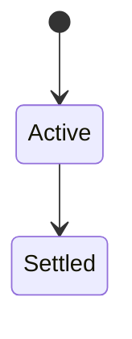
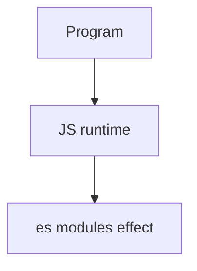

# ES Modules

<TopicMeta />

<Prerequisites />

::: tip Published
This page meets the handbook **published** bar: deep explanation, ≥10 common mistakes, and official references. Further engine-level errata welcome via PR.
:::

## Introduction

**ES modules** use static `import`/`export`, live bindings, deferred classic-script-like loading in browsers (`type="module"`), and CORS for cross-origin. `import()` enables dynamic loading.

## Why does it exist?

Static structure enables tree-shaking and earlier error detection; live bindings make re-exports coherent.

## Historical Background

Standardized in ES2015; browsers/Node shipped later with interoperability quirks.

## Mental Model

Imports are hoisted and read-only views of exported bindings. Default vs named exports. Conditional imports via dynamic `import()`.

## Internal Workflow

1. Prefer named exports for libraries.
2. Use dynamic import for code splits.
3. Remember browser module CORS + MIME.
4. Align Node `module`/`moduleResolution` in TS.

## Lifecycle

Lifecycle for es modules:



## Browser Perspective

type=module scripts are deferred by default and use module maps.

## JavaScript Engine Perspective

Engines implement ECMAScript semantics (V8/JavaScriptCore/SpiderMonkey); optimize hot paths after correctness.

## React Perspective

React app code is JS—misunderstanding this topic often shows up as stale UI state or broken effects.

## Next.js Perspective

Next.js runs JS in Node/Edge and the browser; verify APIs exist in each runtime.

## Server Perspective

Node/Edge may implement the same language feature with different host APIs.

## Network Perspective

Not primarily a network feature unless combined with fetch/HTTP.

## Memory Perspective

Watch retained objects via DevTools Memory; closures and globals keep references alive.

## Performance

Measure with Performance panel / benchmarks before micro-optimizing.

## Production Example

Route-level `import()` cut initial bundle 40% on a dashboard without changing UX.

## Code Examples

```js
export let count = 0
export function inc() { count++ }
// importer sees live count updates
const mod = await import('./lazy.js')
```

## Diagrams



## Common Mistakes

1. Treating the feature as magic without the language rule behind it
2. Copying Stack Overflow snippets without edge cases
3. Confusing browser host APIs with ECMAScript language semantics
4. Optimizing before measuring
5. Ignoring strict mode / module differences
6. Expecting CJS-like mutable import rebinding
7. Forgetting .js extensions in native ESM
8. Missing a production edge case for 06-javascript.es-modules (#1)
9. Missing a production edge case for 06-javascript.es-modules (#2)
10. Missing a production edge case for 06-javascript.es-modules (#3)


## Best Practices

- Prefer language defaults and clear naming
- Write a failing test for the sharp edge you hit
- Use MDN + ECMA-262 for disagreements
- Keep examples small and runnable

## Anti-patterns

- Clever code that obscures control flow
- Polyfilling incorrectly and masking bugs
- Global mutable state as the default architecture

## Comparison

| Import kind | When |
| --- | --- |
| Static | Build/load time graph |
| Dynamic `import()` | On demand |

## Interview Questions

### Easy

**Q:** What is ES modules?

**A:** The standard JS module system with static imports/exports and live bindings.

### Medium

**Q:** What is a live binding?

**A:** Imported names reflect updates to the exported binding over time—not a one-time copy of the value for `let` exports.

### Hard

**Q:** Browser differences vs Node?

**A:** Browsers need URLs/MIME/CORS; Node uses file URLs/package exports and still interops with CJS.

## Summary

- es modules has precise ECMAScript/host semantics
- Know failure modes and scope interactions
- Measure production impact
- Cross-link related handbook topics

## References

- [MDN: import](https://developer.mozilla.org/en-US/docs/Web/JavaScript/Reference/Statements/import)
- [HTML module scripts](https://html.spec.whatwg.org/multipage/webappapis.html#integration-with-the-javascript-module-system)

<RelatedTopics />

Prev: [Modules](/06-javascript/modules/) · Next: [CommonJS](/06-javascript/commonjs/)
