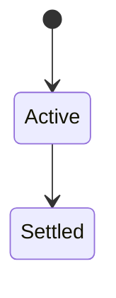
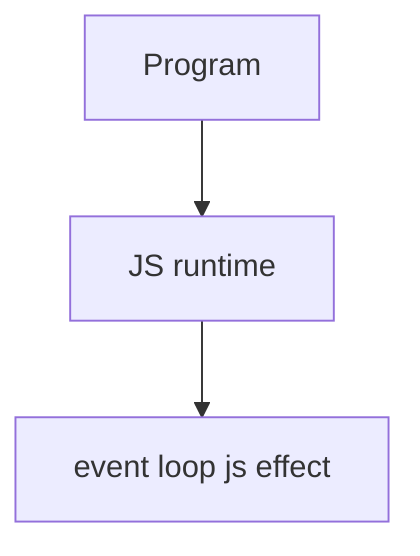

# Event Loop (JavaScript View)

<TopicMeta />

<Prerequisites />

::: tip Published
This page meets the handbook **published** bar: deep explanation, ≥10 common mistakes, and official references. Further engine-level errata welcome via PR.
:::

## Introduction

The **event loop** (host + JS jobs) drains the call stack, then **microtasks** (Promise jobs), then next **macrotasks** (timers, I/O, UI events). This topic focuses on JS-visible scheduling—see browser module for rendering integration.

## Why does it exist?

Explains ordering: `Promise.then` vs `setTimeout(0)`, async/await breakpoints, and starvation by microtask loops.

## Historical Background

HTML/browser event loops + ECMAScript Job Queue; Node has its own phases.

## Mental Model

Sync runs to completion. Queue microtasks before the next task. Don’t confuse “async” with “parallel.”

## Internal Workflow

1. Predict order with tiny experiments.
2. Avoid microtask dead loops.
3. Yield to the browser for long work (`scheduler`/`setTimeout`).
4. Link to browser event-loop topic for paint.

## Lifecycle

Lifecycle for event loop js:



## Browser Perspective

Browser loops also integrate rendering; see 03-browser.event-loop for frames.

## JavaScript Engine Perspective

Engines implement ECMAScript semantics (V8/JavaScriptCore/SpiderMonkey); optimize hot paths after correctness.

## React Perspective

React app code is JS—misunderstanding this topic often shows up as stale UI state or broken effects.

## Next.js Perspective

Next.js runs JS in Node/Edge and the browser; verify APIs exist in each runtime.

## Server Perspective

Node/Edge may implement the same language feature with different host APIs.

## Network Perspective

Not primarily a network feature unless combined with fetch/HTTP.

## Memory Perspective

Watch retained objects via DevTools Memory; closures and globals keep references alive.

## Performance

Measure with Performance panel / benchmarks before micro-optimizing.

## Production Example

A progress bar never painted because a tight Promise chain starved rendering; yielding fixed perceived latency.

## Code Examples

```js
console.log('a')
setTimeout(() => console.log('c'), 0)
Promise.resolve().then(() => console.log('b'))
// a b c
```

## Diagrams



## Common Mistakes

1. Treating the feature as magic without the language rule behind it
2. Copying Stack Overflow snippets without edge cases
3. Confusing browser host APIs with ECMAScript language semantics
4. Optimizing before measuring
5. Ignoring strict mode / module differences
6. Assuming setTimeout(0) runs before promise then
7. Busy microtask loops blocking rendering
8. Confusing language jobs with HTML event-loop tasks
9. Teaching only “Promise before setTimeout” without microtask checkpoints
10. Ignoring async/await desugaring into Promise jobs


## Best Practices

- Prefer language defaults and clear naming
- Write a failing test for the sharp edge you hit
- Use MDN + ECMA-262 for disagreements
- Keep examples small and runnable

## Anti-patterns

- Clever code that obscures control flow
- Polyfilling incorrectly and masking bugs
- Global mutable state as the default architecture

## Comparison

| Queue | Examples |
| --- | --- |
| Call stack | Sync fns |
| Microtasks | Promise then/await |
| Tasks | setTimeout, I/O, events |

## Interview Questions

### Easy

**Q:** What is the JS event loop?

**A:** The host mechanism that runs JS, then microtasks, then the next task—enabling async without multi-threaded JS.

### Medium

**Q:** Why does promise then beat setTimeout(0)?

**A:** After sync code, microtasks run before the next macrotask timer callback.

### Hard

**Q:** How can microtasks starve the UI?

**A:** Continuously scheduling new microtasks never returns to the browser task that would render/paint.

## Summary

- event loop js has precise ECMAScript/host semantics
- Know failure modes and scope interactions
- Measure production impact
- Cross-link related handbook topics

## References

- [MDN: Event loop](https://developer.mozilla.org/en-US/docs/Web/JavaScript/Event_loop)
- [HTML: Event loop](https://html.spec.whatwg.org/multipage/webappapis.html#event-loops)

<RelatedTopics />

Prev: [Async Programming](/06-javascript/async-programming/) · Next: [Promise](/06-javascript/promise/)
