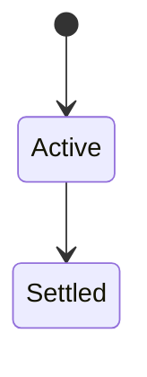
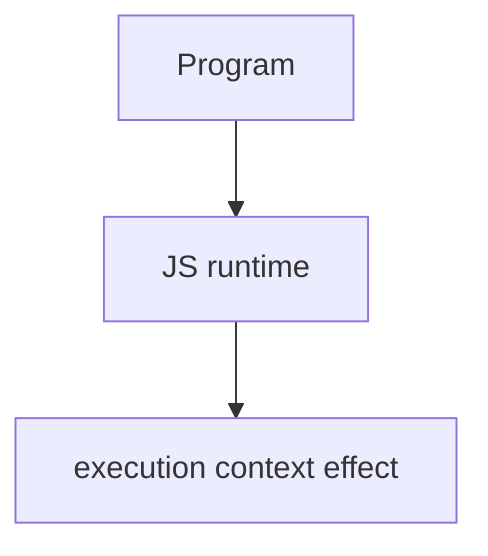

# Execution Context

<TopicMeta />

<Prerequisites />

::: tip Published
This page meets the handbook **published** bar: deep explanation, ≥10 common mistakes, and official references. Further engine-level errata welcome via PR.
:::

## Introduction

An **execution context** is the evaluation environment for global code, a function call, or `eval`. Engines push/pop them on the **call stack**. Each holds lexical/variable environments and for functions a `this` binding.

## Why does it exist?

Explains call stack traces, recursion limits, and when `this`/locals exist.

## Historical Background

ECMAScript specifies Executable Code and Execution Contexts; engines implement with stacks and environment records.

## Mental Model

Running a function creates a new context; awaiting pauses the async function’s execution but the call stack unwinds until the continuation resumes later.

## Internal Workflow

1. Read stack traces top-down.
2. Avoid deep sync recursion.
3. Know async breaks the stack across turns.
4. Separate lexical env from `this`.

## Lifecycle

Lifecycle for execution context:



## Browser Perspective

Browsers host the JS runtime; DevTools Sources/Console observe this topic at runtime.

## JavaScript Engine Perspective

Stack overflow errors mean too many sync nested contexts.

## React Perspective

React app code is JS—misunderstanding this topic often shows up as stale UI state or broken effects.

## Next.js Perspective

Next.js runs JS in Node/Edge and the browser; verify APIs exist in each runtime.

## Server Perspective

Node/Edge may implement the same language feature with different host APIs.

## Network Perspective

Not primarily a network feature unless combined with fetch/HTTP.

## Memory Perspective

Watch retained objects via DevTools Memory; closures and globals keep references alive.

## Performance

Measure with Performance panel / benchmarks before micro-optimizing.

## Production Example

Debugging “Invalid hook call” and recursion max stacks became faster once engineers mapped contexts to call stack frames.

## Code Examples

```js
function a() { b() }
function b() { console.trace('stack') }
a()
```

## Diagrams



## Common Mistakes

1. Treating the feature as magic without the language rule behind it
2. Copying Stack Overflow snippets without edge cases
3. Confusing browser host APIs with ECMAScript language semantics
4. Optimizing before measuring
5. Ignoring strict mode / module differences
6. Thinking await keeps the same call stack continuously
7. Confusing execution context with browser event-loop tasks
8. Missing a production edge case for 06-javascript.execution-context (#1)
9. Missing a production edge case for 06-javascript.execution-context (#2)
10. Missing a production edge case for 06-javascript.execution-context (#3)


## Best Practices

- Prefer language defaults and clear naming
- Write a failing test for the sharp edge you hit
- Use MDN + ECMA-262 for disagreements
- Keep examples small and runnable

## Anti-patterns

- Clever code that obscures control flow
- Polyfilling incorrectly and masking bugs
- Global mutable state as the default architecture

## Comparison

| Context | Created for |
| --- | --- |
| Global | Script/module |
| Function | Invocation |
| Eval | `eval` code |

## Interview Questions

### Easy

**Q:** What is an execution context?

**A:** The runtime frame in which code evaluates, holding environments and control state on the call stack.

### Medium

**Q:** What happens on a function call?

**A:** Engine pushes a new function execution context, runs the body, then pops it on return.

### Hard

**Q:** How does async/await interact?

**A:** Await suspends the async function; the stack clears for other work; later a job resumes the async function’s state.

## Summary

- execution context has precise ECMAScript/host semantics
- Know failure modes and scope interactions
- Measure production impact
- Cross-link related handbook topics

## References

- [ECMA-262: Execution Contexts](https://tc39.es/ecma262/#sec-execution-contexts)
- [MDN: Call stack](https://developer.mozilla.org/en-US/docs/Glossary/Call_stack)

<RelatedTopics />

Prev: [Hoisting](/06-javascript/hoisting/) · Next: [Lexical Environment](/06-javascript/lexical-environment/)
