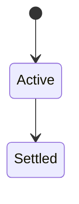
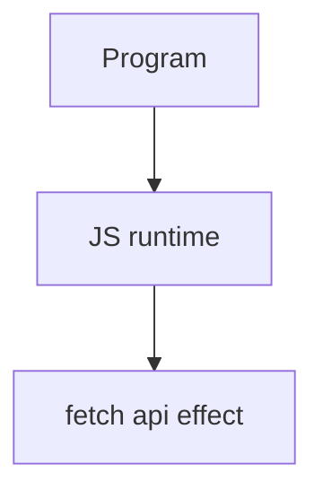

# Fetch API

<TopicMeta />

<Prerequisites />

::: tip Published
This page meets the handbook **published** bar: deep explanation, ≥10 common mistakes, and official references. Further engine-level errata welcome via PR.
:::

## Introduction

**`fetch`** performs HTTP requests returning a Promise of `Response`. You must check `response.ok`, choose body readers (`json`/`text`/`stream`), and handle network vs HTTP errors differently.

## Why does it exist?

XHR’s callback API was cumbersome. Fetch + Promises became the modern web networking primitive (also in Node via undici).

## Historical Background

WHATWG Fetch Standard; replaced many XHR uses; streaming/body mixins evolved.

## Mental Model

Network failure rejects; HTTP 404 fulfills with `ok: false`. CORS and opaque responses restrict body access. Pair with AbortController.

## Internal Workflow

1. Check `res.ok`.
2. Pass AbortSignal.
3. Set headers/credentials deliberately.
4. Stream large bodies when needed.

## Lifecycle

Lifecycle for fetch api:



## Browser Perspective

DevTools Network inspects fetch; CORS errors appear as failed fetches.

## JavaScript Engine Perspective

Engines implement ECMAScript semantics (V8/JavaScriptCore/SpiderMonkey); optimize hot paths after correctness.

## React Perspective

React app code is JS—misunderstanding this topic often shows up as stale UI state or broken effects.

## Next.js Perspective

Next.js runs JS in Node/Edge and the browser; verify APIs exist in each runtime.

## Server Perspective

Node/Edge may implement the same language feature with different host APIs.

## Network Perspective

Fetch is a network API—caching, HTTP/2, CORS, cookies all apply.

## Memory Perspective

Watch retained objects via DevTools Memory; closures and globals keep references alive.

## Performance

Measure with Performance panel / benchmarks before micro-optimizing.

## Production Example

API client wrapper standardized ok-check + timeout abort; mystery “successful” 500 JSON parses vanished.

## Code Examples

```js
const res = await fetch('/api/items', {
  headers: { Accept: 'application/json' },
  signal: AbortSignal.timeout(8000),
})
if (!res.ok) throw new Error(`HTTP ${res.status}`)
return res.json()
```

## Diagrams



## Common Mistakes

1. Treating the feature as magic without the language rule behind it
2. Copying Stack Overflow snippets without edge cases
3. Confusing browser host APIs with ECMAScript language semantics
4. Optimizing before measuring
5. Ignoring strict mode / module differences
6. Treating fetch 404 as throw by default
7. Forgetting credentials/CORS mode for cookie APIs
8. Missing a production edge case for 06-javascript.fetch-api (#1)
9. Missing a production edge case for 06-javascript.fetch-api (#2)
10. Missing a production edge case for 06-javascript.fetch-api (#3)


## Best Practices

- Prefer language defaults and clear naming
- Write a failing test for the sharp edge you hit
- Use MDN + ECMA-262 for disagreements
- Keep examples small and runnable

## Anti-patterns

- Clever code that obscures control flow
- Polyfilling incorrectly and masking bugs
- Global mutable state as the default architecture

## Comparison

| API | Style |
| --- | --- |
| `fetch` | Promises |
| XHR | Events |
| axios etc. | Wrappers |

## Interview Questions

### Easy

**Q:** What is fetch?

**A:** A promise-based HTTP API returning Response objects; HTTP errors don’t reject unless you throw after checking status.

### Medium

**Q:** When does fetch reject?

**A:** Network failures/aborts—not merely 4xx/5xx statuses.

### Hard

**Q:** How do you cancel fetch?

**A:** Pass an AbortSignal from AbortController (or AbortSignal.timeout).

## Summary

- fetch api has precise ECMAScript/host semantics
- Know failure modes and scope interactions
- Measure production impact
- Cross-link related handbook topics

## References

- [MDN: Fetch](https://developer.mozilla.org/en-US/docs/Web/API/Fetch_API)
- [Fetch Standard](https://fetch.spec.whatwg.org/)

<RelatedTopics />

Prev: [Iterator](/06-javascript/iterator/) · Next: [AbortController](/06-javascript/abortcontroller/)
