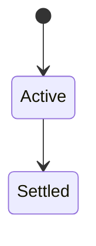
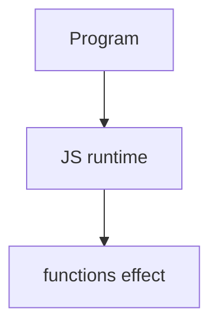

# Functions

<TopicMeta />

<Prerequisites />

::: tip Published
This page meets the handbook **published** bar: deep explanation, ≥10 common mistakes, and official references. Further engine-level errata welcome via PR.
:::

## Introduction

Functions are first-class values. Declarations, expressions, arrows, and methods differ in hoisting, `this`, and `new`/`arguments` behavior. Defaults and rest parameters improve APIs.

## Why does it exist?

Callbacks, methods, and modular APIs are all functions—small differences cause large bugs.

## Historical Background

From `Function` objects and declarations to arrows (ES2015) and concise methods.

## Mental Model

Arrows: lexical `this`, no `arguments`, not constructable. Declarations: hoisted. Methods: concise on objects/classes.

## Internal Workflow

1. Choose form based on `this` needs.
2. Keep pure helpers for testability.
3. Prefer rest over `arguments`.
4. Avoid huge parameter lists—use objects.

## Lifecycle

Lifecycle for functions:



## Browser Perspective

Browsers host the JS runtime; DevTools Sources/Console observe this topic at runtime.

## JavaScript Engine Perspective

Engines implement ECMAScript semantics (V8/JavaScriptCore/SpiderMonkey); optimize hot paths after correctness.

## React Perspective

React app code is JS—misunderstanding this topic often shows up as stale UI state or broken effects.

## Next.js Perspective

Next.js runs JS in Node/Edge and the browser; verify APIs exist in each runtime.

## Server Perspective

Node/Edge may implement the same language feature with different host APIs.

## Network Perspective

Not primarily a network feature unless combined with fetch/HTTP.

## Memory Perspective

Watch retained objects via DevTools Memory; closures and globals keep references alive.

## Performance

Measure with Performance panel / benchmarks before micro-optimizing.

## Production Example

Standardizing on named function declarations for stack traces improved production debugging.

## Code Examples

```js
const add = (a, b = 0) => a + b
function sum(...nums) { return nums.reduce((a, b) => a + b, 0) }
```

## Diagrams



## Common Mistakes

1. Treating the feature as magic without the language rule behind it
2. Copying Stack Overflow snippets without edge cases
3. Confusing browser host APIs with ECMAScript language semantics
4. Optimizing before measuring
5. Ignoring strict mode / module differences
6. Using arrow as constructor
7. Depending on arguments in arrows
8. Missing a production edge case for 06-javascript.functions (#1)
9. Missing a production edge case for 06-javascript.functions (#2)
10. Missing a production edge case for 06-javascript.functions (#3)


## Best Practices

- Prefer language defaults and clear naming
- Write a failing test for the sharp edge you hit
- Use MDN + ECMA-262 for disagreements
- Keep examples small and runnable

## Anti-patterns

- Clever code that obscures control flow
- Polyfilling incorrectly and masking bugs
- Global mutable state as the default architecture

## Comparison

| Form | `this` | `new` |
| --- | --- | --- |
| function | dynamic | yes |
| arrow | lexical | no |
| method | dynamic | no (typically) |

## Interview Questions

### Easy

**Q:** What is JS functions?

**A:** First-class callable objects with several declaration forms that differ in hoisting and `this`.

### Medium

**Q:** Arrow vs function?

**A:** Arrows inherit lexical `this` and cannot be used with `new`; ordinary functions have dynamic `this` and are constructable.

### Hard

**Q:** Why prefer rest parameters?

**A:** Real arrays, clearer signatures, work in arrows—unlike `arguments`.

## Summary

- functions has precise ECMAScript/host semantics
- Know failure modes and scope interactions
- Measure production impact
- Cross-link related handbook topics

## References

- [MDN: Functions](https://developer.mozilla.org/en-US/docs/Web/JavaScript/Guide/Functions)
- [ECMA-262](https://tc39.es/ecma262/)

<RelatedTopics />

Prev: [Classes](/06-javascript/classes/) · Next: [Objects](/06-javascript/objects/)
