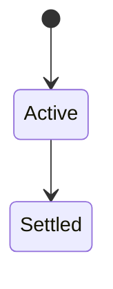
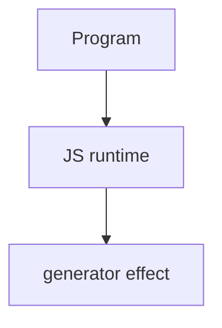

# Generator

<TopicMeta />

<Prerequisites />

::: tip Published
This page meets the handbook **published** bar: deep explanation, ≥10 common mistakes, and official references. Further engine-level errata welcome via PR.
:::

## Introduction

**Generators** (`function*`) return iterator objects. `yield` pauses execution and returns a value; `.next(arg)` resumes. They underpin async generators and some custom iterables.

## Why does it exist?

Lazy sequences, custom iteration, and cooperative pause/resume without full async machinery.

## Historical Background

ES2015 generators; later async generators (`async function*`).

## Mental Model

Calling a generator does not run the body fully—it returns an iterator. Each `next` runs until the next `yield`/`return`.

## Internal Workflow

1. Implement custom iterables with `*[Symbol.iterator]`.
2. Prefer simple generators for lazy maps.
3. Know `yield*` delegation.
4. Don’t overuse where async/await is clearer.

## Lifecycle

Lifecycle for generator:



## Browser Perspective

Browsers host the JS runtime; DevTools Sources/Console observe this topic at runtime.

## JavaScript Engine Perspective

Engines implement ECMAScript semantics (V8/JavaScriptCore/SpiderMonkey); optimize hot paths after correctness.

## React Perspective

React app code is JS—misunderstanding this topic often shows up as stale UI state or broken effects.

## Next.js Perspective

Next.js runs JS in Node/Edge and the browser; verify APIs exist in each runtime.

## Server Perspective

Node/Edge may implement the same language feature with different host APIs.

## Network Perspective

Not primarily a network feature unless combined with fetch/HTTP.

## Memory Perspective

Watch retained objects via DevTools Memory; closures and globals keep references alive.

## Performance

Measure with Performance panel / benchmarks before micro-optimizing.

## Production Example

A pagination helper used generators to pull pages lazily until the UI canceled iteration.

## Code Examples

```js
function* ids() {
  let i = 0
  while (true) yield i++
}
const it = ids()
it.next().value // 0
```

## Diagrams



## Common Mistakes

1. Treating the feature as magic without the language rule behind it
2. Copying Stack Overflow snippets without edge cases
3. Confusing browser host APIs with ECMAScript language semantics
4. Optimizing before measuring
5. Ignoring strict mode / module differences
6. Expecting generator body to run at call time
7. Confusing generators with async functions
8. Missing a production edge case for 06-javascript.generator (#1)
9. Missing a production edge case for 06-javascript.generator (#2)
10. Missing a production edge case for 06-javascript.generator (#3)


## Best Practices

- Prefer language defaults and clear naming
- Write a failing test for the sharp edge you hit
- Use MDN + ECMA-262 for disagreements
- Keep examples small and runnable

## Anti-patterns

- Clever code that obscures control flow
- Polyfilling incorrectly and masking bugs
- Global mutable state as the default architecture

## Comparison

| Feature | Generator | async/await |
| --- | --- | --- |
| Pause | yield |
| Host jobs | sync iterator | promises |

## Interview Questions

### Easy

**Q:** What is generators?

**A:** `function*` produces iterators that pause at `yield` and resume on `next`.

### Medium

**Q:** What does yield* do?

**A:** Delegates to another iterable/generator, yielding its sequence.

### Hard

**Q:** Generator vs async generator?

**A:** Async generators `yield` promises/async values and implement async iteration (`for await`).

## Summary

- generator has precise ECMAScript/host semantics
- Know failure modes and scope interactions
- Measure production impact
- Cross-link related handbook topics

## References

- [MDN: Generators](https://developer.mozilla.org/en-US/docs/Web/JavaScript/Reference/Global_Objects/Generator)
- [ECMA-262](https://tc39.es/ecma262/)

<RelatedTopics />

Prev: [Async/Await](/06-javascript/async-await/) · Next: [Iterator](/06-javascript/iterator/)
