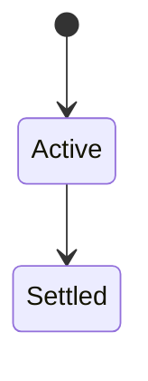
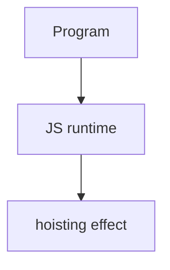

# Hoisting

<TopicMeta />

<Prerequisites />

::: tip Published
This page meets the handbook **published** bar: deep explanation, ≥10 common mistakes, and official references. Further engine-level errata welcome via PR.
:::

## Introduction

**Hoisting** describes that bindings are created during instantiation before code runs. `var`/`function` declarations initialize specially; `let`/`const` exist in the TDZ until their declaration line executes.

## Why does it exist?

Explains why you can call some functions before their line, and why `let` throws if accessed early—not magic reordering of assignments.

## Historical Background

Historically taught as “declarations move to the top”; the precise model is environment instantiation + initialization rules.

## Mental Model

`function foo(){}` declarations are initialized to the function object. `var x` initializes to `undefined`. `let`/`const` uninitialized until evaluated.

## Internal Workflow

1. Prefer declaring before use (readability).
2. Use function declarations carefully or const + arrow.
3. Don’t rely on var hoisting.
4. Know class declarations are TDZ’d too.

## Lifecycle

Lifecycle for hoisting:



## Browser Perspective

Browsers host the JS runtime; DevTools Sources/Console observe this topic at runtime.

## JavaScript Engine Perspective

Engines implement ECMAScript semantics (V8/JavaScriptCore/SpiderMonkey); optimize hot paths after correctness.

## React Perspective

React app code is JS—misunderstanding this topic often shows up as stale UI state or broken effects.

## Next.js Perspective

Next.js runs JS in Node/Edge and the browser; verify APIs exist in each runtime.

## Server Perspective

Node/Edge may implement the same language feature with different host APIs.

## Network Perspective

Not primarily a network feature unless combined with fetch/HTTP.

## Memory Perspective

Watch retained objects via DevTools Memory; closures and globals keep references alive.

## Performance

Measure with Performance panel / benchmarks before micro-optimizing.

## Production Example

Banning use-before-define via ESLint removed subtle TDZ crashes in refactors.

## Code Examples

```js
console.log(a) // undefined
var a = 1
console.log(b) // ReferenceError TDZ
let b = 2
ok()
function ok() { return 1 }
```

## Diagrams



## Common Mistakes

1. Treating the feature as magic without the language rule behind it
2. Copying Stack Overflow snippets without edge cases
3. Confusing browser host APIs with ECMAScript language semantics
4. Optimizing before measuring
5. Ignoring strict mode / module differences
6. Believing let is hoisted like var initialized undefined
7. Relying on function declaration hoisting across blocks differently across modes
8. Missing a production edge case for 06-javascript.hoisting (#1)
9. Missing a production edge case for 06-javascript.hoisting (#2)
10. Missing a production edge case for 06-javascript.hoisting (#3)


## Best Practices

- Prefer language defaults and clear naming
- Write a failing test for the sharp edge you hit
- Use MDN + ECMA-262 for disagreements
- Keep examples small and runnable

## Anti-patterns

- Clever code that obscures control flow
- Polyfilling incorrectly and masking bugs
- Global mutable state as the default architecture

## Comparison

| Binding | Before init |
| --- | --- |
| `var` | `undefined` |
| `let`/`const` | TDZ throw |
| `function` decl | Callable |

## Interview Questions

### Easy

**Q:** What is hoisting?

**A:** Bindings are created at scope entry; initialization timing differs by declaration kind.

### Medium

**Q:** TDZ vs undefined?

**A:** `var` reads as undefined before assignment; `let`/`const` throw if read before initialization.

### Hard

**Q:** Are classes hoisted?

**A:** Class declarations are hoisted into TDZ—cannot use before the class line.

## Summary

- hoisting has precise ECMAScript/host semantics
- Know failure modes and scope interactions
- Measure production impact
- Cross-link related handbook topics

## References

- [MDN: Hoisting](https://developer.mozilla.org/en-US/docs/Glossary/Hoisting)
- [ECMA-262](https://tc39.es/ecma262/)

<RelatedTopics />

Prev: [Closures](/06-javascript/closures/) · Next: [Execution Context](/06-javascript/execution-context/)
