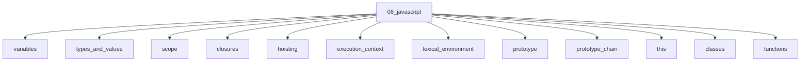

# JavaScript

## Scope

Language semantics from values and scope through async and metaprogramming

## Prerequisites

See the learning paths and each topic's prerequisites in the registry.

## Topics in order

- [Variables](/06-javascript/variables/) — beginner, ~25 min
- [Types and Values](/06-javascript/types-and-values/) — beginner, ~35 min
- [Scope](/06-javascript/scope/) — junior, ~35 min
- [Closures](/06-javascript/closures/) — junior, ~40 min
- [Hoisting](/06-javascript/hoisting/) — junior, ~30 min
- [Execution Context](/06-javascript/execution-context/) — mid, ~40 min
- [Lexical Environment](/06-javascript/lexical-environment/) — mid, ~35 min
- [Prototype](/06-javascript/prototype/) — mid, ~35 min
- [Prototype Chain](/06-javascript/prototype-chain/) — mid, ~35 min
- [this](/06-javascript/this/) — mid, ~40 min
- [Classes](/06-javascript/classes/) — junior, ~35 min
- [Functions](/06-javascript/functions/) — beginner, ~30 min
- [Objects](/06-javascript/objects/) — beginner, ~30 min
- [Arrays](/06-javascript/arrays/) — beginner, ~30 min
- [Modules](/06-javascript/modules/) — junior, ~25 min
- [ES Modules](/06-javascript/es-modules/) — junior, ~35 min
- [CommonJS](/06-javascript/commonjs/) — junior, ~25 min
- [Async Programming](/06-javascript/async-programming/) — junior, ~35 min
- [Event Loop (JavaScript View)](/06-javascript/event-loop-js/) — mid, ~40 min
- [Promise](/06-javascript/promise/) — junior, ~40 min
- [Async/Await](/06-javascript/async-await/) — junior, ~35 min
- [Generator](/06-javascript/generator/) — mid, ~35 min
- [Iterator](/06-javascript/iterator/) — mid, ~30 min
- [Fetch API](/06-javascript/fetch-api/) — junior, ~35 min
- [AbortController](/06-javascript/abortcontroller/) — mid, ~25 min
- [Proxy](/06-javascript/proxy/) — senior, ~35 min
- [Reflect](/06-javascript/reflect/) — senior, ~25 min
- [Symbols](/06-javascript/symbols/) — mid, ~25 min
- [WeakMap](/06-javascript/weakmap/) — mid, ~25 min
- [WeakSet](/06-javascript/weakset/) — mid, ~20 min
- [Error Handling](/06-javascript/error-handling/) — junior, ~30 min
- [Strict Mode](/06-javascript/strict-mode/) — junior, ~20 min
- [Memory and References](/06-javascript/memory-and-references/) — mid, ~35 min

## Module knowledge graph

## Suggested learning paths

Browse [Learning Paths](/learning-paths/).
