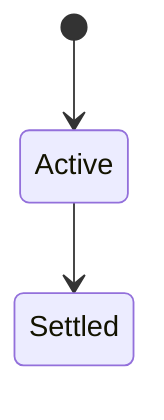
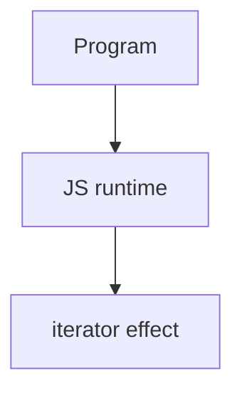

# Iterator

<TopicMeta />

<Prerequisites />

::: tip Published
This page meets the handbook **published** bar: deep explanation, ≥10 common mistakes, and official references. Further engine-level errata welcome via PR.
:::

## Introduction

An **iterable** implements `Symbol.iterator` returning an **iterator** with `next()` → `{ value, done }`. `for...of`, spread, and many APIs consume iterables.

## Why does it exist?

Standardized pulling values enables custom collections and lazy pipelines interoperable with language syntax.

## Historical Background

ES2015 protocols unified arrays, strings, maps, sets, and user types.

## Mental Model

Iterable ≠ iterator (though generators are both). Exhausted iterators stay done. Prefer iterables as public APIs.

## Internal Workflow

1. Implement `Symbol.iterator` for custom collections.
2. Use `for...of` over index loops for clarity.
3. Know array-like vs iterable.
4. Use async iterators for streams.

## Lifecycle

Lifecycle for iterator:



## Browser Perspective

Browsers host the JS runtime; DevTools Sources/Console observe this topic at runtime.

## JavaScript Engine Perspective

Engines implement ECMAScript semantics (V8/JavaScriptCore/SpiderMonkey); optimize hot paths after correctness.

## React Perspective

React app code is JS—misunderstanding this topic often shows up as stale UI state or broken effects.

## Next.js Perspective

Next.js runs JS in Node/Edge and the browser; verify APIs exist in each runtime.

## Server Perspective

Node/Edge may implement the same language feature with different host APIs.

## Network Perspective

Not primarily a network feature unless combined with fetch/HTTP.

## Memory Perspective

Watch retained objects via DevTools Memory; closures and globals keep references alive.

## Performance

Measure with Performance panel / benchmarks before micro-optimizing.

## Production Example

A custom `Range` type became iterable so callers could `for (const n of range)` without converting to arrays.

## Code Examples

```js
const iterable = {
  *[Symbol.iterator]() {
    yield 1; yield 2
  }
}
;[...iterable] // [1,2]
```

## Diagrams



## Common Mistakes

1. Treating the feature as magic without the language rule behind it
2. Copying Stack Overflow snippets without edge cases
3. Confusing browser host APIs with ECMAScript language semantics
4. Optimizing before measuring
5. Ignoring strict mode / module differences
6. Implementing next incorrectly without done:true termination
7. Confusing for...in (keys) with for...of (values)
8. Missing a production edge case for 06-javascript.iterator (#1)
9. Missing a production edge case for 06-javascript.iterator (#2)
10. Missing a production edge case for 06-javascript.iterator (#3)


## Best Practices

- Prefer language defaults and clear naming
- Write a failing test for the sharp edge you hit
- Use MDN + ECMA-262 for disagreements
- Keep examples small and runnable

## Anti-patterns

- Clever code that obscures control flow
- Polyfilling incorrectly and masking bugs
- Global mutable state as the default architecture

## Comparison

| Protocol | Method |
| --- | --- |
| Iterable | `Symbol.iterator` |
| Iterator | `next` |
| Async iterable | `Symbol.asyncIterator` |

## Interview Questions

### Easy

**Q:** What is iterators/iterables?

**A:** Protocols enabling sequential consumption via `Symbol.iterator` and `next`, powering `for...of`.

### Medium

**Q:** for...in vs for...of?

**A:** `for...in` enumerates keys; `for...of` iterates values of an iterable.

### Hard

**Q:** How do you make an object work with spread?

**A:** Implement `Symbol.iterator` (or be array-like in limited cases—prefer real iterables).

## Summary

- iterator has precise ECMAScript/host semantics
- Know failure modes and scope interactions
- Measure production impact
- Cross-link related handbook topics

## References

- [MDN: Iteration protocols](https://developer.mozilla.org/en-US/docs/Web/JavaScript/Reference/Iteration_protocols)
- [ECMA-262](https://tc39.es/ecma262/)

<RelatedTopics />

Prev: [Generator](/06-javascript/generator/) · Next: [Fetch API](/06-javascript/fetch-api/)
