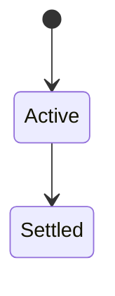
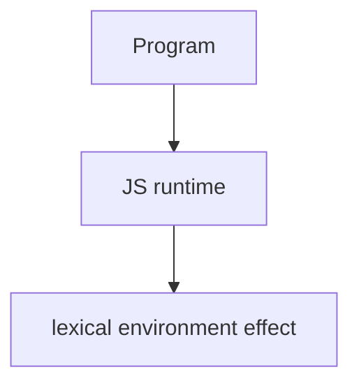

# Lexical Environment

<TopicMeta />

<Prerequisites />

::: tip Published
This page meets the handbook **published** bar: deep explanation, ≥10 common mistakes, and official references. Further engine-level errata welcome via PR.
:::

## Introduction

A **lexical environment** is a spec structure pairing an environment record (bindings) with an outer reference. It is the formal model behind scope and closures.

## Why does it exist?

Precise vocabulary for how nested scopes chain and why closures retain bindings—not copies of values at creation time for mutable bindings.

## Historical Background

Defined in ECMAScript; engines approximate with hidden classes/activation objects.

## Mental Model

When a function is created, it references the lexical environment where it was defined. Captured `let` bindings are shared references to those slots.

## Internal Workflow

1. Draw environment diagrams for nested functions.
2. Track mutable binding updates.
3. Distinguish declarative vs object environment records (globals/`with`).
4. Prefer diagrams over memorizing jargon in interviews—but know the terms.

## Lifecycle

Lifecycle for lexical environment:



## Browser Perspective

Browsers host the JS runtime; DevTools Sources/Console observe this topic at runtime.

## JavaScript Engine Perspective

Engines implement ECMAScript semantics (V8/JavaScriptCore/SpiderMonkey); optimize hot paths after correctness.

## React Perspective

React app code is JS—misunderstanding this topic often shows up as stale UI state or broken effects.

## Next.js Perspective

Next.js runs JS in Node/Edge and the browser; verify APIs exist in each runtime.

## Server Perspective

Node/Edge may implement the same language feature with different host APIs.

## Network Perspective

Not primarily a network feature unless combined with fetch/HTTP.

## Memory Perspective

Watch retained objects via DevTools Memory; closures and globals keep references alive.

## Performance

Measure with Performance panel / benchmarks before micro-optimizing.

## Production Example

Interview prep sessions used environment diagrams to demystify closure + loop questions—candidates stopped guessing.

## Code Examples

```js
function outer(x) {
  return function inner(y) {
    return x + y // x resolves via outer environment record
  }
}
```

## Diagrams



## Common Mistakes

1. Treating the feature as magic without the language rule behind it
2. Copying Stack Overflow snippets without edge cases
3. Confusing browser host APIs with ECMAScript language semantics
4. Optimizing before measuring
5. Ignoring strict mode / module differences
6. Saying closures copy values always (mutable bindings are shared)
7. Ignoring global object environment record quirks
8. Missing a production edge case for 06-javascript.lexical-environment (#1)
9. Missing a production edge case for 06-javascript.lexical-environment (#2)
10. Missing a production edge case for 06-javascript.lexical-environment (#3)


## Best Practices

- Prefer language defaults and clear naming
- Write a failing test for the sharp edge you hit
- Use MDN + ECMA-262 for disagreements
- Keep examples small and runnable

## Anti-patterns

- Clever code that obscures control flow
- Polyfilling incorrectly and masking bugs
- Global mutable state as the default architecture

## Comparison

| Concept | Role |
| --- | --- |
| Environment record | Stores bindings |
| Outer reference | Chain |
| Closure | Function + env ref |

## Interview Questions

### Easy

**Q:** What is a lexical environment?

**A:** A spec structure holding bindings and a link to an outer environment, forming the scope chain.

### Medium

**Q:** How do closures use them?

**A:** A function object keeps a reference to the lexical environment in which it was created.

### Hard

**Q:** Global environment special case?

**A:** Global bindings interact with the global object (object environment record) in scripts.

## Summary

- lexical environment has precise ECMAScript/host semantics
- Know failure modes and scope interactions
- Measure production impact
- Cross-link related handbook topics

## References

- [ECMA-262: Lexical Environments](https://tc39.es/ecma262/#sec-lexical-environments)
- [MDN: Closures](https://developer.mozilla.org/en-US/docs/Web/JavaScript/Guide/Closures)

<RelatedTopics />

Prev: [Execution Context](/06-javascript/execution-context/) · Next: [Prototype](/06-javascript/prototype/)
