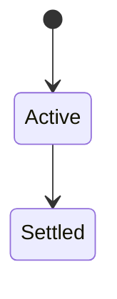
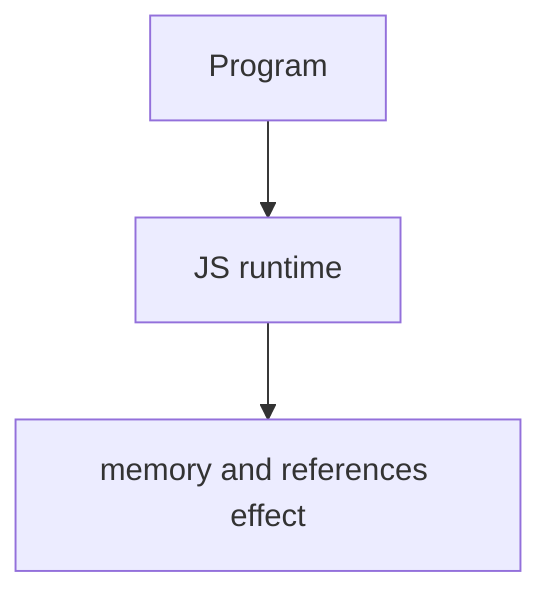

# Memory and References

<TopicMeta />

<Prerequisites />

::: tip Published
This page meets the handbook **published** bar: deep explanation, ≥10 common mistakes, and official references. Further engine-level errata welcome via PR.
:::

## Introduction

JS values are garbage-collected when **unreachable** from roots (stack, globals, DOM, closures). Objects are references; primitives copy. Leaks are usually forgotten listeners, retained closures, caches, or detached DOM trees still referenced from JS.

## Why does it exist?

SPA longevity means leaks accumulate. Understanding references prevents “it gets slow after an hour.”

## Historical Background

Mark-and-sweep GC engines; WeakMap/WeakRef tools for advanced cases.

## Mental Model

Ask: who still points at this object? Detached DOM + closure is classic. Clear intervals, abort fetches, drop references on navigation.

## Internal Workflow

1. Profile heap snapshots.
2. Remove listeners symmetrically.
3. Bound caches.
4. Prefer weak collections for metadata.

## Lifecycle

Lifecycle for memory and references:



## Browser Perspective

Browsers host the JS runtime; DevTools Sources/Console observe this topic at runtime.

## JavaScript Engine Perspective

Engines implement ECMAScript semantics (V8/JavaScriptCore/SpiderMonkey); optimize hot paths after correctness.

## React Perspective

Canceled effects must clear timers/subscriptions; stale closures can retain large props trees.

## Next.js Perspective

Next.js runs JS in Node/Edge and the browser; verify APIs exist in each runtime.

## Server Perspective

Node/Edge may implement the same language feature with different host APIs.

## Network Perspective

Not primarily a network feature unless combined with fetch/HTTP.

## Memory Perspective

This topic is about reachability, GC roots, and leak patterns.

## Performance

Measure with Performance panel / benchmarks before micro-optimizing.

## Production Example

Heap snapshots showed Detached HTMLDivElement retained by a module-level Map; switching to WeakMap + cleanup fixed growth.

## Code Examples

```js
// leaky pattern
const leak = new Map()
element.addEventListener('click', () => leak.set(element, data))
// fix: remove listener / weak keys / clear on teardown
```

## Diagrams



## Common Mistakes

1. Treating the feature as magic without the language rule behind it
2. Copying Stack Overflow snippets without edge cases
3. Confusing browser host APIs with ECMAScript language semantics
4. Optimizing before measuring
5. Ignoring strict mode / module differences
6. Module-level maps keyed by DOM nodes forever
7. setInterval without clearInterval
8. Missing a production edge case for 06-javascript.memory-and-references (#1)
9. Missing a production edge case for 06-javascript.memory-and-references (#2)
10. Missing a production edge case for 06-javascript.memory-and-references (#3)


## Best Practices

- Prefer language defaults and clear naming
- Write a failing test for the sharp edge you hit
- Use MDN + ECMA-262 for disagreements
- Keep examples small and runnable

## Anti-patterns

- Clever code that obscures control flow
- Polyfilling incorrectly and masking bugs
- Global mutable state as the default architecture

## Comparison

| Structure | Retention |
| --- | --- |
| Map(DOM→meta) | Strong |
| WeakMap | Weak keys |
| Listener on document | Until removed |

## Interview Questions

### Easy

**Q:** What is memory and references in JS?

**A:** Objects are referenced; GC frees unreachable objects. Leaks happen when references are unintentionally retained.

### Medium

**Q:** What is a detached DOM leak?

**A:** Nodes removed from document but still referenced from JS, so they cannot be collected.

### Hard

**Q:** How do you diagnose?

**A:** Take heap snapshots, compare retained sizes, look for Detached elements and growing arrays/maps.

## Summary

- memory and references has precise ECMAScript/host semantics
- Know failure modes and scope interactions
- Measure production impact
- Cross-link related handbook topics

## References

- [MDN: Memory management](https://developer.mozilla.org/en-US/docs/Web/JavaScript/Memory_management)
- [Chrome: Fix memory problems](https://developer.chrome.com/docs/devtools/memory-problems/)

<RelatedTopics />

Prev: [Strict Mode](/06-javascript/strict-mode/)
